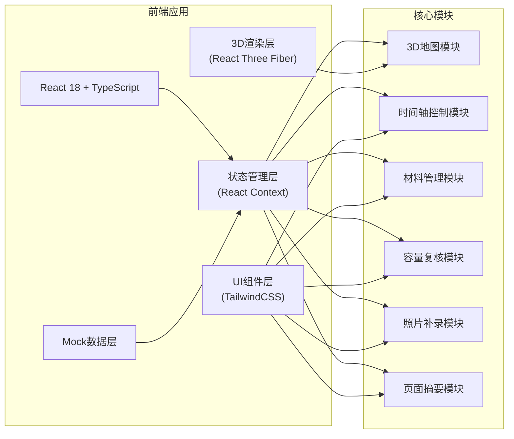
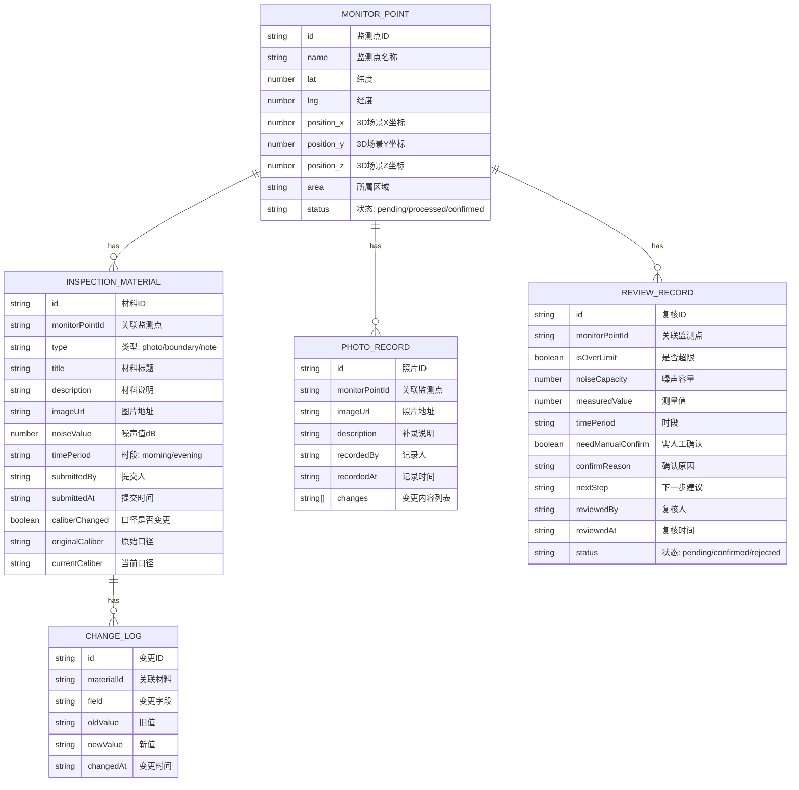

## 1. 架构设计



## 2. 技术描述

- **前端框架**：React@18 + TypeScript + Vite@5
- **3D渲染**：three@0.160 + @react-three/fiber@8 + @react-three/drei@9 + @react-three/postprocessing@2
- **样式方案**：tailwindcss@3 + postcss + autoprefixer
- **状态管理**：React Context + useReducer（轻量级，满足联动需求）
- **图标库**：lucide-react
- **初始化工具**：npm create vite@latest
- **后端**：无，使用Mock数据模拟
- **数据持久化**：localStorage 存储用户操作记录

## 3. 路由定义

| 路由 | 用途 |
|-------|---------|
| / | 主工作台 - 3D地图 + 时间轴 + 摘要面板 |
| /materials | 材料管理 - 巡检照片列表 + 口径变更检测 |
| /review | 容量复核 - 超限判断 + 人工确认 |
| /overview | 状态概览 - 已处理/待补证一览 |

## 4. 数据模型

### 4.1 数据模型定义



### 4.2 Mock数据说明

使用TypeScript定义类型，创建mock数据文件：
- 5个监测点，覆盖公园不同区域
- 每个监测点包含早晚高峰两组噪声数据
- 部分材料标记口径变更，用于演示检测功能
- 包含已处理、待补证、需确认三种状态样本

## 5. 核心组件结构

```
src/
├── components/
│   ├── layout/
│   │   ├── AppLayout.tsx      # 三栏布局容器
│   │   └── Header.tsx         # 顶部导航
│   ├── map3d/
│   │   ├── ParkScene.tsx      # 3D公园场景
│   │   ├── MonitorPoint3D.tsx # 3D监测点
│   │   └── SceneControls.tsx  # 相机控制
│   ├── timeline/
│   │   └── TimeSlider.tsx     # 时间轴控制器
│   ├── filters/
│   │   └── FilterBar.tsx      # 筛选器
│   ├── summary/
│   │   ├── SummaryPanel.tsx   # 页面摘要面板
│   │   └── StatusCard.tsx     # 状态卡片
│   ├── materials/
│   │   ├── MaterialList.tsx   # 材料列表
│   │   ├── MaterialCard.tsx   # 材料卡片
│   │   └── ChangeMarker.tsx   # 变更标记
│   ├── review/
│   │   ├── ReviewPanel.tsx    # 复核面板
│   │   └── OverlimitAlert.tsx # 超限提示
│   └── photo/
│       ├── PhotoUploader.tsx  # 照片上传
│       └── ChangeLogView.tsx  # 变更记录
├── context/
│   └── AppContext.tsx         # 全局状态管理
├── types/
│   └── index.ts               # TypeScript类型定义
├── mock/
│   └── data.ts                # Mock数据
├── utils/
│   └── helpers.ts             # 工具函数
├── pages/
│   ├── Dashboard.tsx          # 主工作台
│   ├── Materials.tsx          # 材料管理
│   ├── Review.tsx             # 容量复核
│   └── Overview.tsx           # 状态概览
└── App.tsx                    # 路由配置
```

## 6. 联动机制设计

1. **时间轴联动**：时间轴值变化 → 更新Context中timePeriod → 3D场景更新热点颜色/强度 → 摘要面板更新时段数据 → 材料列表筛选时段
2. **点选联动**：点击3D监测点 → 更新Context中selectedPoint → 材料列表过滤该点材料 → 摘要面板聚焦该点详情 → 复核面板加载该点数据
3. **筛选联动**：筛选条件变化 → 更新Context中filters → 3D场景隐藏/显示监测点 → 材料列表过滤 → 摘要面板统计更新
4. **照片补录联动**：上传照片 → 新增PhotoRecord → 更新监测点状态 → 3D场景更新点位样式 → 摘要面板新增变更记录 → 生成变更描述

## 7. 容量复核算法

1. 获取该监测点的容量阈值（来自边界样本）
2. 对比当前时段测量值与阈值
3. 若测量值 > 阈值 × 1.1：标记超限，需人工确认
4. 检查同监测点早晚高峰口径是否一致
5. 若口径不一致：高亮标记，加入人工确认原因
6. 生成下一步建议：补录现场照片 / 提交说明 / 已确认
