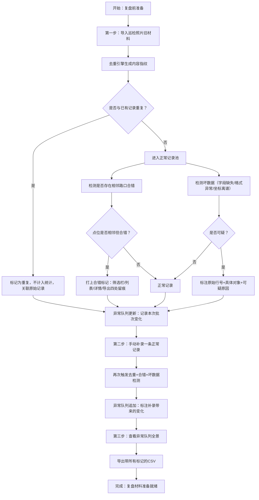

## 1. 产品概述
公园噪声投诉回放系统是为街道基层工作人员（周姐、现场老师）设计的投诉处理辅助工具。系统解决领导复盘时只能翻聊天记录、重复投诉被重复统计、相邻路口点位合错、合并反馈丢失原始说法等痛点。

- 核心价值：让投诉数据可回放、可溯源、可去重、可标记异常，复盘不再靠翻聊天
- 目标用户：街道投诉经办人员（周姐）、现场巡检老师、社区点位核对同事

## 2. 核心功能

### 2.1 用户角色
| 角色 | 使用场景 | 核心诉求 |
|------|----------|----------|
| 街道经办（周姐） | 复盘前整理数据、应对领导提问 | 数据能快速导入、重复投诉一眼识别、导出材料自带说明标记 |
| 现场巡检老师 | 与社区同事核点位 | 合并过的反馈能看到原始说法、合错点位有明确标记 |
| 复盘汇报者 | 第二天复盘会展示 | 异常队列清楚说明每次导入带来的变化 |

### 2.2 功能模块
1. **数据导入模块**：支持JSON格式批量导入巡检投诉记录（模拟照片识别结果），支持单条手动补录
2. **去重引擎**：基于内容指纹的重复投诉识别，同一条正常记录不会被算两次
3. **合错标记体系**：相邻路口合错标记贯穿筛选栏、列表行、详情面板、导出文件四处
4. **合并溯源面板**：展示合并后的反馈与原始说法的对应关系，可展开/折叠
5. **坏数据定位**：对可疑数据标注原始行号、具体对象字段、可疑原因
6. **异常队列**：按导入批次追踪变化（新增、重复、合错、坏数据），说清每次操作带来的影响
7. **导出功能**：带所有标记列的CSV导出，含去重状态、合错标记、合并溯源说明、坏数据标注

### 2.3 页面详情
| 页面名称 | 模块名称 | 功能描述 |
|----------|----------|----------|
| 主工作台 | 顶部状态栏 | 显示总记录数、去重后数量、合错标记数、坏数据数、异常待处理数 |
| 主工作台 | 左侧导入区 | 批次选择器、导入按钮、手动补录表单、批次历史时间线 |
| 主工作台 | 中间记录列表 | 多维度筛选（去重状态/合错标记/数据质量/批次）、行内状态标签、点击选中高亮 |
| 主工作台 | 右侧详情面板 | 记录完整信息、合并溯源展开区、坏数据定位说明、合错关联记录、操作日志 |
| 主工作台 | 底部异常队列 | 按批次分组的变化时间线，标注每条异常的类型、来源、处理建议 |

## 3. 核心流程
用户按真实复盘节奏操作：先导入旧材料 → 再补一条正常记录 → 查看异常队列变化

## 4. 用户界面设计

### 4.1 设计风格
- **主色调**：政务蓝（#1e40af）作为信任底色，警示橙（#ea580c）标记合错异常，去重灰（#6b7280）标记重复记录，坏数据红（#dc2626）标记数据质量问题
- **按钮风格**：圆角8px，实心主按钮带浅悬停浮起效果，次按钮描边
- **字体**：标题用思源黑体CN Bold，正文用思源黑体CN Regular，数据等宽用JetBrains Mono
- **布局风格**：三栏式工作台（左25% 中50% 右25%），底部异常队列可拉起/收起
- **图标风格**：Lucide轮廓图标，异常标签左侧配对应状态小圆点

### 4.2 页面设计概述
| 页面名称 | 模块名称 | UI要素 |
|----------|----------|--------|
| 主工作台 | 顶部状态栏 | 五组数据卡片带微渐变背景，悬停微放大，数值变化时高亮闪烁 |
| 主工作台 | 左侧导入区 | 批次卡片时间线（最新在上），导入按钮带拖拽区虚线框，补录表单折叠展开 |
| 主工作台 | 中间记录列表 | 斑马纹行，状态标签用胶囊形状，选中行左侧蓝色竖条，合错行橙色虚线边框 |
| 主工作台 | 右侧详情面板 | 分Tab（基本信息/合并溯源/坏数据说明/合错关联），原始说法用灰色引用框可展开 |
| 主工作台 | 底部异常队列 | 时间线节点配图标，批次分组折叠，变化类型用色点区分，hover显示详情气泡 |

### 4.3 响应式
桌面端优先（1440px+最佳），三栏固定宽度布局；1024-1440px压缩列宽；1024px以下改为上下堆叠，详情面板弹层显示。触摸设备优化按钮最小44px点击区。
