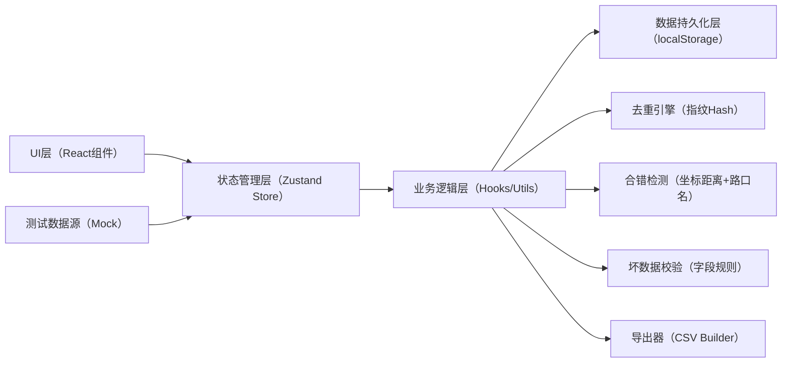
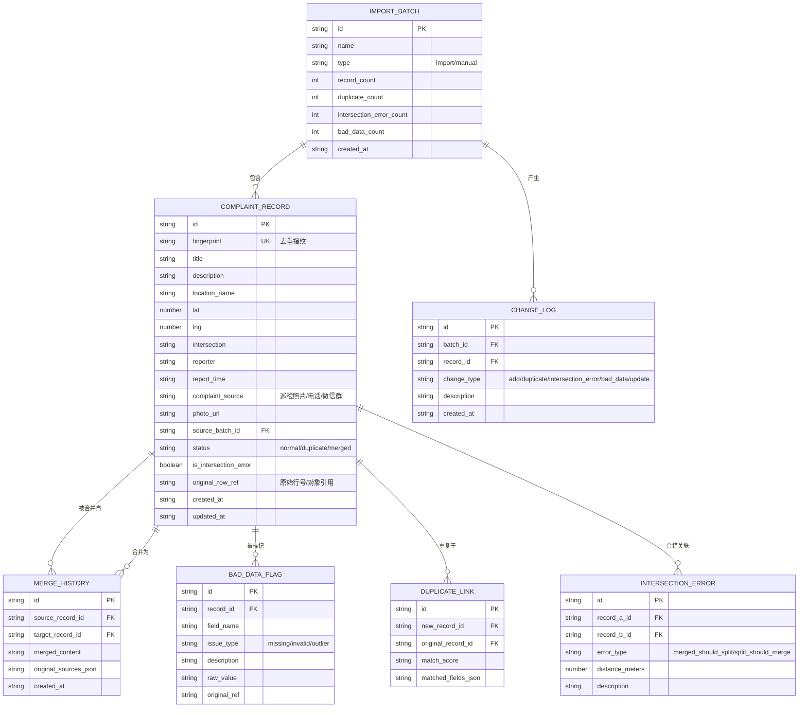

## 1. 架构设计
纯前端单页应用，数据本地持久化（localStorage），无需后端服务。通过 zustand 管理全局状态，所有业务逻辑在前端闭环完成。



## 2. 技术描述
- **前端框架**：React@18 + TypeScript@5 + Vite@5
- **样式方案**：Tailwind CSS@3
- **状态管理**：Zustand@4
- **路由**：react-router-dom@6（单页无多路由，仅作预留）
- **图标**：lucide-react
- **后端**：无
- **数据库**：localStorage（模拟持久化）
- **初始化工具**：vite-init

## 3. 路由定义
| 路由 | 用途 |
|------|------|
| / | 主工作台（唯一页面，包含所有功能模块） |

## 4. 数据模型

### 4.1 核心数据模型 ER 图



### 4.2 状态切片（Zustand Store）

```typescript
// 核心状态接口定义（伪代码，实际在 shared/types 中）
interface AppState {
  records: ComplaintRecord[]
  batches: ImportBatch[]
  mergeHistories: MergeHistory[]
  badDataFlags: BadDataFlag[]
  duplicateLinks: DuplicateLink[]
  intersectionErrors: IntersectionError[]
  changeLogs: ChangeLog[]
  selectedRecordId: string | null
  filterOptions: FilterOptions
  expandedQueue: boolean
}

interface AppActions {
  importBatch: (data: ComplaintRecord[], batchName: string) => ImportResult
  addManualRecord: (data: Partial<ComplaintRecord>) => AddResult
  selectRecord: (id: string | null) => void
  setFilter: (options: Partial<FilterOptions>) => void
  toggleQueue: () => void
  markIntersectionError: (recordIds: string[], type: ErrorType) => void
  mergeRecords: (sourceIds: string[], targetData: Partial<ComplaintRecord>) => void
  exportCSV: (filterOptions?: FilterOptions) => string
  generateFingerprint: (record: Partial<ComplaintRecord>) => string
  detectIntersectionErrors: (records: ComplaintRecord[]) => IntersectionError[]
  validateBadData: (record: ComplaintRecord) => BadDataFlag[]
  getBatchChangeSummary: (batchId: string) => ChangeSummary
}
```

## 5. 目录结构

```
/
├── src/
│   ├── components/
│   │   ├── StatusBar.tsx          # 顶部状态栏
│   │   ├── ImportPanel.tsx        # 左侧导入区
│   │   ├── RecordList.tsx         # 中间记录列表
│   │   ├── RecordDetail.tsx       # 右侧详情面板
│   │   ├── DetailTabs/
│   │   │   ├── BasicInfo.tsx      # 基本信息Tab
│   │   │   ├── MergeSource.tsx    # 合并溯源Tab
│   │   │   ├── BadDataInfo.tsx    # 坏数据说明Tab
│   │   │   └── RelatedErrors.tsx  # 合错关联Tab
│   │   ├── FilterBar.tsx          # 筛选栏（含合错标记筛选）
│   │   ├── AnomalyQueue.tsx       # 底部异常队列
│   │   ├── BatchTimeline.tsx      # 批次时间线
│   │   └── tags/                  # 状态标签组件
│   ├── store/
│   │   └── useAppStore.ts         # Zustand全局状态
│   ├── hooks/
│   │   ├── useDeduplicate.ts      # 去重逻辑Hook
│   │   ├── useIntersectionCheck.ts# 路口合错检测Hook
│   │   ├── useBadDataDetect.ts    # 坏数据检测Hook
│   │   └── useChangeTracker.ts    # 变化追踪Hook
│   ├── utils/
│   │   ├── fingerprint.ts         # 指纹生成工具
│   │   ├── csvExport.ts           # CSV导出工具
│   │   ├── geoDistance.ts         # 坐标距离计算
│   │   └── storage.ts             # localStorage封装
│   ├── data/
│   │   └── mockRecords.ts         # 贴近现场的测试数据
│   ├── types/
│   │   └── index.ts               # TypeScript类型定义
│   ├── App.tsx
│   ├── main.tsx
│   └── index.css
├── shared/
│   └── types.ts                   # 前后端共享类型（预留）
├── package.json
├── tsconfig.json
├── vite.config.ts
├── tailwind.config.js
└── postcss.config.js
```

## 6. 关键算法说明

### 6.1 去重指纹算法
- 组合字段：`reporter + report_time(精度到分钟) + location_name + 前20字description`
- 哈希：SHA-1简化版（使用32位FNV-1a哈希转十六进制，轻量）
- 匹配阈值：指纹完全相同时判定为重复，匹配分数 1.0；相似度>0.9时在详情中提示可能重复

### 6.2 相邻路口合错检测
- 触发条件：两条记录满足以下任一项
  - 坐标距离 < 150米 且 intersection 字段编辑距离 < 3
  - location_name 包含相同公园名 且 路口名仅有"东/南/西/北"方向词差异
- 标记体系：筛选栏有"仅看合错"开关；列表行橙色虚线框+合错标签；详情Tab显示关联记录；导出列 `is_intersection_error` 和 `related_error_ids`

### 6.3 坏数据检测规则
| 规则 | 触发条件 | 标注内容 |
|------|----------|----------|
| 必填缺失 | reporter/report_time/location_name 任一为空 | 字段名+原始行号+空值提示 |
| 坐标异常 | lat不在[18,54]或lng不在[73,135]（中国范围） | 具体坐标值+原始行号+范围说明 |
| 时间穿越 | report_time 晚于当前时间 | 时间值+原始行号+未来时间提示 |
| 描述过短 | description 字符数 < 5 | 原始内容+原始行号+过短提示 |

### 6.4 合并反馈的原始说法保留
- 合并时将 `sourceRecords` 数组序列化存入 `original_sources_json`
- UI中点击"查看原始说法"按钮，逐条展开各来源记录的 reporter + description
- 导出时在 `merged_from_sources` 列中以 `|` 分隔列出各来源的原始摘要
