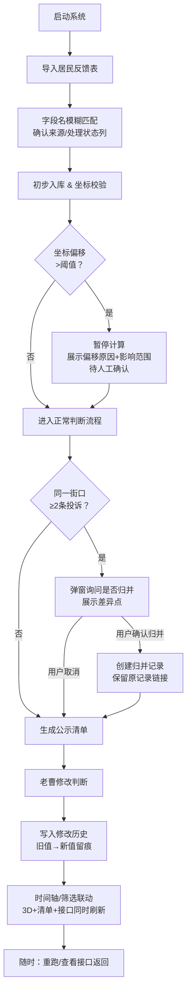

## 1. 产品概述
面向市政设计团队（核心用户：老曹）的公园噪声投诉处理可视化工具。通过 Web3D 场景将散落在各版本居民反馈表中的噪声投诉进行空间定位、时间追溯和处理链追踪，解决旧意见被新表覆盖、坐标偏移、同街重复投诉等日常痛点。

- 核心问题：居民反馈多表版本混乱、坐标不准、同街投诉重复、人工修改无痕迹
- 目标用户：市政设计工程师、项目经理、夜班交接同事
- 产品价值：一张 3D 地图讲清「谁何时在哪投诉过→怎么处理的→改了几次→现在到哪一步」

## 2. 核心功能

### 2.1 用户角色
| 角色 | 登录方式 | 核心权限 |
|------|----------|----------|
| 市政设计（老曹） | 本地启动 | 点选3D对象、调整判断、归并投诉、查看历史 |
| 项目经理 | 本地启动 | 导入居民反馈、查看接口返回原始数据 |
| 交接同事 | 本地启动 | 只读查看处理链与修改历史 |

### 2.2 功能模块
1. **主工作台（单页）**：左侧 Web3D 场景 + 右上筛选时间轴 + 右下投诉清单与详情
2. **居民反馈导入与字段映射**：项目经理交来的表字段名前后不一，自动/手动映射保住「来源」「处理状态」
3. **坐标异常拦截**：投诉点偏到隔壁街时暂停计算，给出「待确认原因 + 影响范围高亮」
4. **同街口归并提示**：同一街口≥2条投诉时弹窗询问是否归并，不自动合并
5. **处理链与修改历史**：每一次人工修改判断都留痕，展示「旧版→改了啥→谁改的→何时」时间线
6. **接口返回查看器**：原始接口 JSON 与解析后字段并排对比，支持重跑

### 2.3 页面详情
| 页面/模块 | 子模块 | 功能描述 |
|-----------|--------|----------|
| 主工作台 | Web3D 场景 | 三维俯瞰城市公园分布，可旋转/缩放/点选；投诉点用彩色地标展示，颜色映射处理状态 |
| 主工作台 | 时间轴筛选 | 横向滑块 + 分段刻度，拖动切换投诉时间窗口；与 3D 场景、清单、接口返回联动刷新 |
| 主工作台 | 状态/来源筛选 | 下拉多选：处理状态（待确认/处理中/已结案/已归并）、来源（12345/社区群/现场走访） |
| 主工作台 | 投诉清单 | 表格列：时间/街口/来源/状态/坐标标记；行点击联动 3D 场景聚焦 + 详情展开 |
| 主工作台 | 详情面板 | 单条投诉完整字段 + 处理链时间线 + 同街口归并建议 + 坐标异常提示 |
| 字段映射器 | 导入配置 | 上传/粘贴新表 → 自动模糊匹配字段 → 用户确认「来源列」「状态列」映射关系并保存 |
| 坐标异常面板 | 待确认区 | 列出偏移投诉：偏移距离（米）、疑似正确街口、受影响公园范围3D高亮、原因推断 |
| 归并对话框 | 归并操作 | 展示拟归并的 2+ 条投诉差异点，用户勾选确认后生成一条「已归并」记录并保留原记录链接 |
| 修改历史抽屉 | 处理链 | 以卡片时间线展示：旧值→新值、修改人（老曹/系统）、修改时间、备注 |
| 接口调试抽屉 | 启动/重跑/查看 | 三Tab：启动（首次拉取）、重跑（当前筛选条件重算）、查看（原始JSON+字段映射对照） |

## 3. 核心流程

用户启动后：导入居民反馈表 → 字段映射确认 → 系统初步入库 → 坐标异常拦截（暂停计算→人工确认）→ 同街口归并提示（询问而非自动）→ 人工修改判断（留痕）→ 时间轴/筛选联动 → 随时重跑接口或查看原始返回。

## 4. 用户界面设计

### 4.1 设计风格
- **主色调**：深空蓝 `#0f172a`（政府/市政专业感）+ 警示琥珀 `#f59e0b`（待确认高亮）+ 处理绿 `#10b981` + 驳回红 `#ef4444`
- **辅助色**：3D 地标高亮用荧光青 `#22d3ee`；同街口归并用紫 `#a855f7` 边框脉冲
- **字体**：标题用等宽 `JetBrains Mono`（工具感、工程感）；正文用 `Noto Sans SC` 中文清晰
- **按钮**：直角/微圆角 2px，按下有 2px 下沉阴影；主按钮深空蓝底琥珀描边
- **布局**：左右分栏（左 65% 3D 场景，右 35% 面板上下堆叠筛选+清单+详情）
- **图标**：Lucide 线性图标，状态色填充，与按钮风格一致

### 4.2 页面设计概览
| 模块 | UI 元素 |
|------|---------|
| 全局顶栏 | 系统名「公园噪声公示清单」等宽大字 + 右侧 启动/重跑/查看 三个胶囊按钮 |
| 3D 场景 | 暗色天空 + 简模城市块 + 公园半透明绿面 + 投诉点圆柱地标（颜色映射状态）+ 偏移区域半透明红罩 |
| 时间轴 | 横向深色底槽 + 琥珀滑块 + 刻度点（有投诉的日期加粗）+ 左右播放按钮 |
| 筛选条 | 多组深色下拉，选中项琥珀高亮，与时间轴同宽 |
| 投诉清单 | 斑马纹深色表格，行悬停琥珀描边，异常坐标行左侧琥珀竖条警示 |
| 详情面板 | 深色卡片 + 字段标签左对齐 + 处理链竖向时间线（每个节点可展开旧值对比） |
| 归并对话框 | 左右并排两张投诉卡片 + 中间双向箭头「拟归并」+ 底部 归并/取消 按钮 |
| 接口抽屉 | 左右分栏：左侧原始 JSON（代码等宽字体、语法高亮），右侧映射后字段表格 |

### 4.3 响应式
- Desktop-first：最小宽度 1440px，保证 3D 场景与面板互不挤压
- 缩放到 1024px：右面板改为 Tab 切换（清单/详情/历史），3D 场景占比扩大
- 移动端：不做优先适配，仅保证时间轴可横向拖动

### 4.4 3D 场景指导
- **环境**：纯深空蓝渐变背景 + 弱方向光（模拟市政夜景工作氛围），无 HDRI 避免喧宾夺主
- **灯光**：主光平行光冷白 + 环境光半球蓝紫；投诉点地标自发光对应状态色
- **相机**：初始 45° 俯瞰，轨道控制器禁用平移（避免迷路）；点选对象自动聚焦 + 阻尼动画
- **构成**：底层平面网格 → 公园多边形绿色半透明块 → 周边街区简模方块 → 投诉点圆柱地标（按状态着色）→ 偏移区域半透明红色体积
- **交互**：地标悬停放大 1.2x + 显示悬浮信息卡；点击聚焦并展开右侧详情；时间轴切换时地标淡入淡出
- **后期**：轻微 Bloom（仅作用于自发光地标）+ 暗角 vignette，突出中心区域
- **性能**：简模方块用 InstanceMesh，地标最多 500 个不做分块加载，60fps 目标
