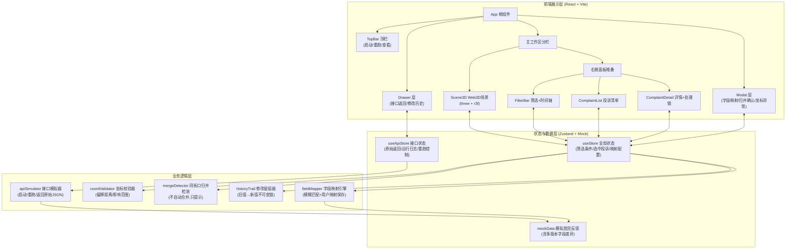
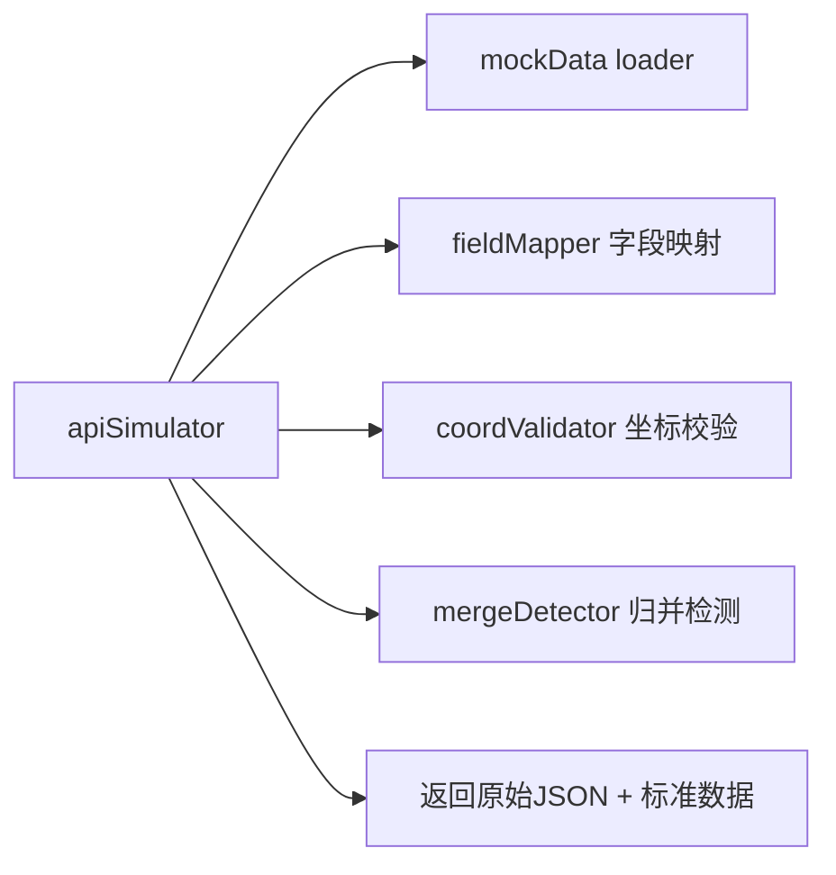
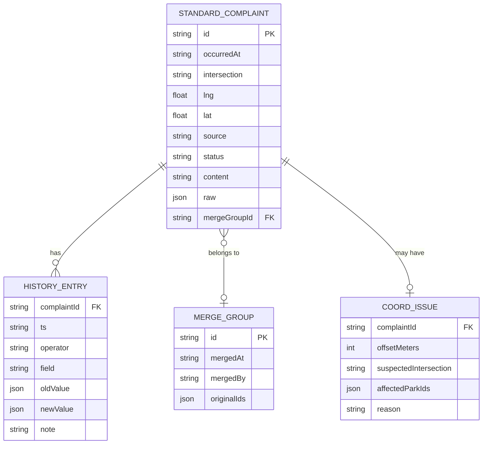

## 1. 架构设计



## 2. 技术描述
- **前端框架**：React@18 + TypeScript
- **构建工具**：Vite@5 + vite-init 脚手架
- **3D 引擎**：three@0.160 + @react-three/fiber@8 + @react-three/drei@9 + @react-three/postprocessing@2
- **样式方案**：TailwindCSS@3 + CSS 变量（主题色 token 化）
- **状态管理**：Zustand@4（双 store：业务状态 / 接口调试状态）
- **路由**：react-router-dom@6（单页应用，无多路由，仅用作基础壳）
- **图标**：lucide-react（线性图标，与整体市政工具感匹配）
- **后端**：无真实后端，用 `apiSimulator` 模拟接口返回（含启动/重跑/原始JSON三行为）
- **数据**：内置多版本居民反馈 Mock 数据，故意制造字段名差异（`feedback_source`/`来源渠道`/`投诉来源` 均指向同一含义）

## 3. 路由定义
| 路由 | 用途 |
|------|------|
| / | 主工作台（唯一页面，所有功能模块在同一页布局） |

## 4. API 定义（模拟接口）

### 4.1 TypeScript 核心类型
```typescript
// 居民反馈原始记录（字段名不统一，需经映射）
export type RawComplaint = Record<string, unknown> & {
  // 以下字段可能以不同键名出现，经 fieldMapper 统一
  _id: string;
  // 映射后标准字段：
  // occurredAt: string      (原字段可能是 投诉时间/发生时间/report_time)
  // intersection: string    (原字段可能是 街口/路口/location)
  // lng: number; lat: number
  // source: string          (原字段可能是 来源/渠道/feedback_source)
  // status: string          (原字段可能是 处理状态/state/status)
  // content: string
};

// 映射并校验后的标准化投诉
export interface StandardComplaint {
  id: string;
  occurredAt: string;          // ISO 时间
  intersection: string;        // 街口名
  lng: number;
  lat: number;
  source: '12345' | '社区群' | '现场走访' | '其他';
  status: '待确认' | '处理中' | '已结案' | '已归并' | '坐标异常';
  content: string;
  raw: RawComplaint;           // 保留原始记录用于"查看接口返回"
  coordIssue?: CoordIssue;     // 坐标异常时填充
  mergeGroupId?: string;       // 归并后的组ID
  history: HistoryEntry[];     // 不可变修改链
}

export interface CoordIssue {
  offsetMeters: number;        // 偏移距离
  suspectedIntersection: string; // 疑似正确街口
  affectedParkIds: string[];   // 受影响公园
  reason: string;              // 原因推断
}

export interface HistoryEntry {
  ts: string;
  operator: '老曹' | '系统' | '项目经理';
  field: string;               // 修改的字段
  oldValue: unknown;
  newValue: unknown;
  note?: string;
}

export interface FieldMapping {
  // 用户自定义映射：标准字段名 → 原始表中可能的列名候选
  occurredAt: string[];
  intersection: string[];
  lng: string[];
  lat: string[];
  source: string[];
  status: string[];
  content: string[];
}
```

### 4.2 模拟接口契约
| 方法 | 入参 | 返回 | 对应按钮 |
|------|------|------|----------|
| `api.start()` | `{ mapping: FieldMapping }` | `{ raw: RawComplaint[], standard: StandardComplaint[] }` | 启动 |
| `api.rerun()` | `{ filters: FilterState }` | `{ raw: RawComplaint[], standard: StandardComplaint[] }` | 重跑 |
| `api.view()` | `{ complaintId?: string }` | `{ rawJson: string, mappedTable: Record<string, unknown>[] }` | 查看 |

## 5. 服务端架构（无，模拟层）



## 6. 数据模型

### 6.1 ER 图


### 6.2 数据初始化策略
- `src/mock/complaints.ts` 内置 3 批 Mock 数据，字段名故意不统一：
  - 批次1（旧版）：`投诉时间`、`街口`、`经度`、`纬度`、`来源`、`处理状态`、`投诉内容`
  - 批次2（新版）：`report_time`、`location`、`lng`、`lat`、`feedback_source`、`state`、`content`
  - 批次3（项目经理版）：`发生时间`、`路口`、`lon`、`latitude`、`渠道`、`状态`、`描述`
- `src/mock/parks.ts` 内置 5 个公园多边形边界，用于影响范围高亮
- `src/mock/blocks.ts` 内置 80+ 街区简模（InstanceMesh 复用）
