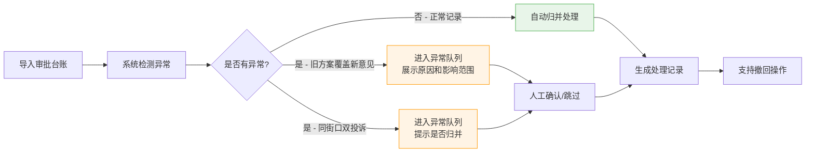

## 1. 产品概述

菜场卸货点位归并工具是一款面向市政设计人员的本地数据处理工具，解决审批台账中菜场卸货点位人工归并效率低、追溯难的问题。目标用户为市政设计老曹及其同事，核心价值是将散落的审批数据系统化，实现可追溯、可展示的点位归并流程。

## 2. 核心功能

### 2.1 用户角色

| 角色 | 注册方式 | 核心权限 |
|------|----------|----------|
| 市政设计人员 | 无需注册，本地使用 | 导入数据、归并操作、确认/撤回、查看异常队列、导出展示 |

### 2.2 功能模块

1. **审批台账视图**：展示导入的审批台账数据，支持导入、放样例、重跑操作
2. **处理记录视图**：展示点位归并的处理历史，支持撤回操作
3. **异常队列视图**：展示待确认的异常情况，支持确认归并/跳过

### 2.3 页面详情

| 页面名称 | 模块名称 | 功能描述 |
|----------|----------|----------|
| 主界面 | 顶部操作栏 | 放样例数据、导入文件、重跑归并、查看说明 |
| 主界面 | 标签切换区 | 审批台账/处理记录/异常队列三个视图切换 |
| 主界面 | 审批台账列表 | 展示所有导入的台账记录，状态标识，点位归并按钮 |
| 主界面 | 处理记录列表 | 展示归并历史，包含时间、操作人、归并结果、撤回按钮 |
| 主界面 | 异常队列列表 | 展示待确认异常，包含原因、影响范围、确认/跳过按钮 |
| 主界面 | 操作说明面板 | 放样例、重跑、查看异常队列三件事的简要说明 |

## 3. 核心流程

**主要用户流程**：
1. 老曹点击「放样例」按钮，系统载入贴近现场的测试数据（含1条正常记录、1条旧覆新、1条同街口双投诉）
2. 系统自动扫描数据，将正常记录直接归并，异常记录进入异常队列
3. 老曹在异常队列中查看每条异常的原因和影响范围，决定确认归并或跳过
4. 所有处理完成后，老曹可以在处理记录中查看完整历史，必要时撤回操作
5. 老曹可以将三个视图的内容展示给领导或同事查看

## 4. 用户界面设计

### 4.1 设计风格

- **主色调**：深蓝色（#1e3a5f）- 代表市政专业、稳重
- **辅助色**：橙色（#ff9800）- 异常提醒；绿色（#4caf50）- 正常状态；红色（#f44336）- 错误状态
- **按钮风格**：扁平化设计，圆角4px，悬停有轻微阴影
- **字体**：系统无衬线字体（-apple-system, BlinkMacSystemFont, "PingFang SC"），标题16px加粗，正文14px
- **布局风格**：三栏式卡片布局，顶部固定操作栏，下方标签页切换，数据表格为主
- **图标风格**：使用简洁的 SVG 图标，避免花哨的 emoji

### 4.2 页面设计概述

| 页面名称 | 模块名称 | UI 元素 |
|----------|----------|----------|
| 主界面 | 顶部操作栏 | 深蓝色背景，白色按钮（放样例、导入、重跑），右侧说明按钮 |
| 主界面 | 标签切换区 | 下划线式标签，选中时蓝色下划线，字体加粗 |
| 主界面 | 数据表格 | 斑马纹行，悬停高亮，状态标签带颜色标识 |
| 主界面 | 异常卡片 | 橙色边框，左侧图标，原因和影响范围分开展示 |
| 主界面 | 操作说明 | 模态弹窗，三步说明配图标，简洁明了 |

### 4.3 响应式

- 桌面端优先设计（1280px 及以上）
- 中等屏幕（768px-1280px）：表格可横向滚动，操作按钮缩小
- 移动端（<768px）：标签改为上下排列，卡片堆叠展示

### 4.4 数据状态标识

| 状态 | 颜色 | 说明 |
|------|------|------|
| 待处理 | 灰色 #9e9e9e | 刚导入未处理 |
| 已归并 | 绿色 #4caf50 | 正常归并完成 |
| 待确认 | 橙色 #ff9800 | 异常队列中 |
| 已撤回 | 红色 #f44336 | 处理记录被撤回 |
