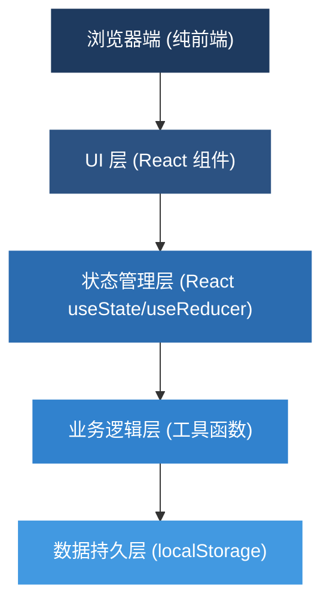
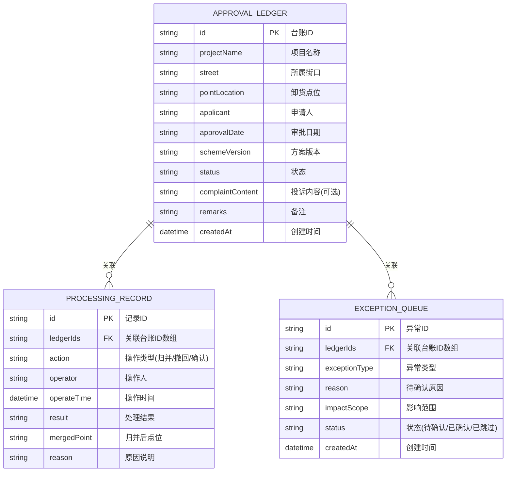

## 1. 架构设计



**架构说明**：纯前端单页应用，无需后端服务，所有数据存储在浏览器 localStorage 中，确保数据本地安全。

## 2. 技术描述

- **前端框架**：React@18 + TypeScript + Vite
- **样式方案**：TailwindCSS@3
- **状态管理**：React useState + useReducer（轻量级，无需 Redux）
- **数据持久化**：localStorage 存储三类核心数据
- **图标库**：Lucide React（简洁 SVG 图标）
- **初始化工具**：npm create vite@latest

## 3. 数据模型

### 3.1 ER 图



### 3.2 核心数据结构定义

```typescript
// 审批台账
interface ApprovalLedger {
  id: string;
  projectName: string;
  street: string;
  pointLocation: string;
  applicant: string;
  approvalDate: string;
  schemeVersion: string;
  status: 'pending' | 'merged' | 'pending_confirm' | 'withdrawn';
  complaintContent?: string;
  remarks?: string;
  createdAt: string;
}

// 处理记录
interface ProcessingRecord {
  id: string;
  ledgerIds: string[];
  action: 'merge' | 'withdraw' | 'confirm' | 'skip';
  operator: string;
  operateTime: string;
  result: string;
  mergedPoint?: string;
  reason?: string;
}

// 异常队列
interface ExceptionQueue {
  id: string;
  ledgerIds: string[];
  exceptionType: 'old_override_new' | 'same_street_complaints';
  reason: string;
  impactScope: string;
  status: 'pending' | 'confirmed' | 'skipped';
  createdAt: string;
}

// 应用状态
interface AppState {
  ledgers: ApprovalLedger[];
  records: ProcessingRecord[];
  exceptions: ExceptionQueue[];
  activeTab: 'ledger' | 'record' | 'exception';
}
```

## 4. 核心功能模块

### 4.1 模块划分

| 模块 | 文件路径 | 职责 |
|------|----------|------|
| 主应用 | `src/App.tsx` | 整体布局、标签切换、状态整合 |
| 审批台账列表 | `src/components/LedgerList.tsx` | 展示台账、导入、放样例、重跑 |
| 处理记录列表 | `src/components/RecordList.tsx` | 展示历史、撤回操作 |
| 异常队列列表 | `src/components/ExceptionList.tsx` | 展示异常、确认/跳过 |
| 操作说明弹窗 | `src/components/HelpModal.tsx` | 三步操作说明 |
| 业务逻辑 | `src/utils/mergeLogic.ts` | 归并检测、异常判断、操作处理 |
| 测试数据 | `src/data/mockData.ts` | 贴近现场的样例数据 |
| 本地存储 | `src/utils/storage.ts` | localStorage 读写封装 |

### 4.2 归并逻辑检测点

1. **旧方案覆盖新意见检测**：
   - 同项目、同点位，方案版本号递增
   - 旧版本审批日期晚于新版本（异常）
   - 输出：待确认原因 + 影响范围（涉及审批条数、涉及街口）

2. **同街口双投诉检测**：
   - 同街口、同点位
   - 存在两条及以上投诉记录
   - 输出：提示是否归并，展示两条投诉详情对比

## 5. 本地存储键定义

| 键名 | 数据类型 | 说明 |
|------|----------|------|
| `market_ledgers` | ApprovalLedger[] | 审批台账数据 |
| `market_records` | ProcessingRecord[] | 处理记录数据 |
| `market_exceptions` | ExceptionQueue[] | 异常队列数据 |

## 6. 测试数据设计

样例数据包含 5 条记录，贴近现场：

| 编号 | 类型 | 说明 |
|------|------|------|
| 1 | 正常记录 | 「城东菜场」点位，无投诉，方案版本一致 |
| 2 | 正常记录 | 「城西便民点」点位，无异常 |
| 3 | 旧方案覆盖新意见 | 「城南批发市场」方案 V2 先批，V1 后批 |
| 4 | 同街口双投诉 | 「城北老街口」同一街口两条投诉记录 |
| 5 | 同街口双投诉 | 同上，第二条投诉 |

**故意混入一条正常记录**，确保不是过分干净的演示包，符合用户要求。
