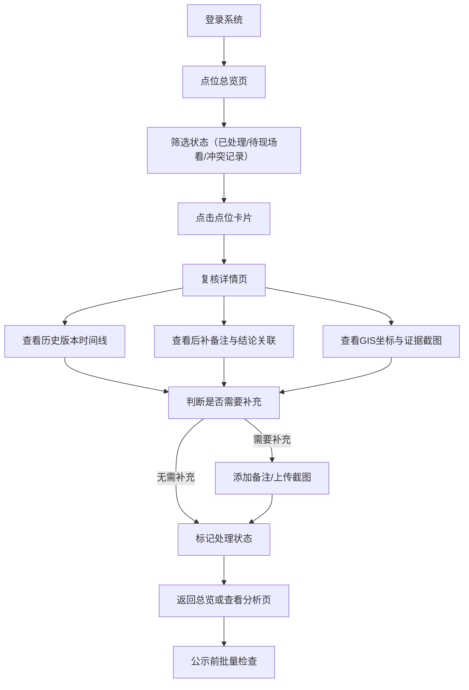

## 1. 产品概述

菜场卸货容量复核系统，面向街道管理人员（周姐）与交接同事，解决GIS点位复核中旧意见被新表覆盖、后补备注与结论脱节、历史版本混淆等问题。

核心目标：确保每个菜场卸货点位的复核过程可追溯、后补备注与结论强关联、旧方案覆盖新意见的冲突记录被独立标记，公示前可快速筛选待处理点位。

## 2. 核心功能

### 2.1 用户角色

| 角色 | 使用方式 | 核心权限 |
|------|----------|----------|
| 街道管理员（周姐） | 直接登录使用 | 查看全部点位、添加备注、标记处理状态、导出复核结果 |
| 交接同事 | 登录后接手 | 查看历史记录、追溯原始GIS信息、补充证据截图、确认处理结果 |

### 2.2 功能模块

1. **点位总览页**：GIS点位列表、状态筛选（已处理/待现场看/冲突记录）、搜索与排序
2. **复核详情页**：点位基础信息、历史版本时间线、后补备注与结论关联区、证据截图上传
3. **分析统计页**：朴素数据展示、各状态点位数量、冲突记录高亮、后补备注影响说明

### 2.3 页面详情

| 页面名称 | 模块名称 | 功能描述 |
|----------|----------|----------|
| 点位总览页 | 状态筛选栏 | 三态筛选按钮：已处理、待现场看、冲突记录；支持关键词搜索菜场名称 |
| 点位总览页 | GIS点位列表 | 卡片式展示，每个卡片显示菜场名称、地址、当前状态、最近更新时间、是否有后补备注标记 |
| 点位总览页 | 冲突记录独立区 | 置顶显示所有"旧方案覆盖新意见"的冲突点位，醒目标识 |
| 复核详情页 | 点位信息卡 | 展示GIS坐标、菜场名称、地址、设计卸货容量等基础信息 |
| 复核详情页 | 历史版本时间线 | 按时间倒序展示所有意见版本，明确区分旧方案与新意见，高亮被覆盖记录 |
| 复核详情页 | 后补备注关联区 | 每条后补备注与最终结论建立双向链接，说明备注如何影响结论 |
| 复核详情页 | 证据截图区 | 支持上传/查看现场照片、GIS截图，每张图配有文字说明 |
| 复核详情页 | 操作区 | 标记已处理/待现场看、添加新版意见、导出复核单 |
| 分析统计页 | 状态分布统计 | 柱状图展示各状态点位数量 |
| 分析统计页 | 后补备注影响说明 | 逐条列出带后补备注的点位，说明备注内容如何改变复核结论 |
| 分析统计页 | 公示前检查清单 | 列出所有待复核点位，按状态分组便于公示前排查 |

## 3. 核心流程

### 主要用户流程

街道周姐登录后，先在点位总览页通过筛选查看"待现场看"和"冲突记录"点位。进入详情页查看历史版本时间线，重点关注后补备注与结论的关联逻辑，确认证据截图是否齐全。处理完成后标记为"已处理"。交接同事接手时，同样从总览页按状态筛选，点击任意点位可从GIS坐标追溯原始说法，通过截图说明了解处理结果。冲突记录会被单独拎出，避免混入正常结果。

## 4. 用户界面设计

### 4.1 设计风格

- **主色**：深墨蓝 `#1e3a5f` 作为主色，体现政务系统的专业稳重
- **辅色**：琥珀橙 `#d97706` 标记冲突与待处理、苔原绿 `#15803d` 标记已处理、石板灰 `#64748b` 为中性色
- **按钮风格**：微圆角（4px）、扁平设计、状态色实心填充
- **字体**：标题使用"思源宋体"体现正式感，正文使用"思源黑体"保证可读性
- **布局风格**：顶部导航栏 + 左侧筛选区 + 右侧内容区的经典政务三栏布局
- **视觉标记**：冲突记录使用红色边框 + 斜纹背景醒目区分；后补备注使用黄色便签式卡片

### 4.2 页面设计概述

| 页面名称 | 模块名称 | UI元素 |
|----------|----------|--------|
| 点位总览页 | 状态筛选栏 | 三个大尺寸状态按钮，各自对应状态色，带计数角标 |
| 点位总览页 | GIS点位卡片 | 白底灰边卡片，右上角状态标签，底部显示最后更新人和时间 |
| 点位总览页 | 冲突记录独立区 | 浅红底色区域，标题"⚠ 冲突记录（旧方案覆盖新意见）"，卡片带红边和"被覆盖"角标 |
| 复核详情页 | 历史版本时间线 | 左侧竖线时间轴，每个节点带颜色圆点（绿=正常、橙=待确认、红=冲突），被覆盖记录加删除线并灰色半透明 |
| 复核详情页 | 后补备注关联区 | 黄色便签卡片，带虚线箭头指向结论区域，标注"此备注 → 影响结论" |
| 复核详情页 | 证据截图区 | 缩略图网格，悬停放大预览，每张图下方配说明文字 |
| 分析统计页 | 状态分布图 | 简洁柱状图，三根柱子对应三种状态颜色，数值直接显示在柱顶 |
| 分析统计页 | 后补备注影响列表 | 逐条展示，备注用黄色背景，结论用白色背景，中间用"→"箭头连接 |

### 4.3 响应式

桌面端优先（1280px及以上），左侧筛选区固定240px；平板端（768-1279px）筛选区可折叠；移动端（768px以下）筛选变为顶部标签栏，列表纵向排布。

### 4.4 动效细节

- 页面加载时，状态按钮与卡片逐个淡入（staggered reveal，间隔50ms）
- 冲突卡片入场带轻微左右抖动一次，吸引注意力
- 时间线节点悬停时，对应版本内容高亮放大
- 点击后补备注时，关联结论区域高亮闪烁一次（黄色脉冲）
