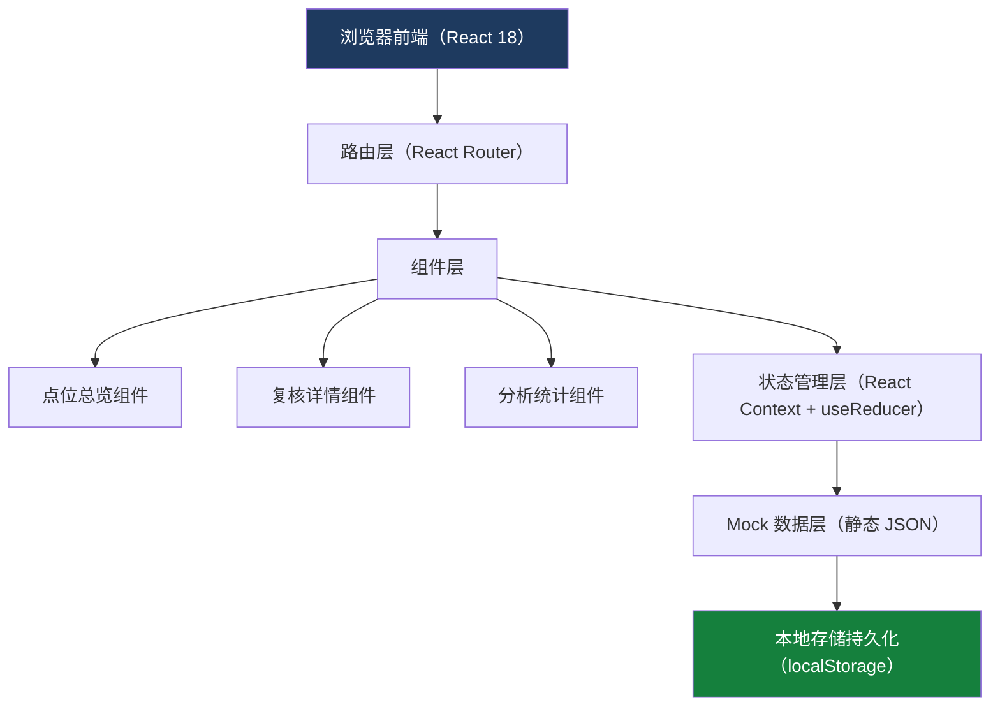
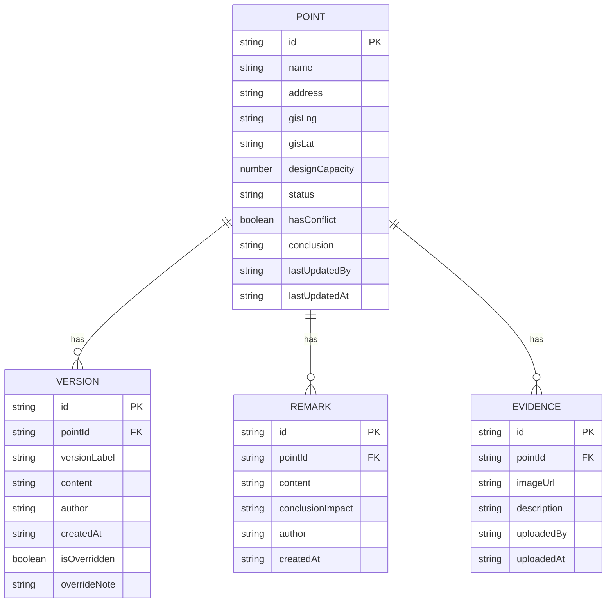

## 1. 架构设计



## 2. 技术描述

- **前端**：React@18 + TypeScript + Vite@5
- **样式**：TailwindCSS@3（原子化 CSS，快速构建政务风格界面）
- **路由**：React Router DOM@6
- **图表**：纯 SVG 绘制（避免引入重型图表库，保持朴素分析页风格）
- **状态管理**：React Context + useReducer（轻量，满足中小型应用需求）
- **数据**：前端内置 Mock 数据 + localStorage 持久化（无后端依赖）
- **初始化工具**：vite-init
- **字体**：Google Fonts 引入思源宋体（Noto Serif SC）与思源黑体（Noto Sans SC）

## 3. 路由定义

| 路由 | 页面用途 |
|------|----------|
| `/` | 点位总览页（默认首页） |
| `/point/:id` | 复核详情页（根据点位 ID 展示） |
| `/analysis` | 分析统计页 |

## 4. 数据模型

### 4.1 数据模型定义



### 4.2 数据字段说明

**POINT（点位）**：
- `status` 枚举：`processed`（已处理）、`pending_site`（待现场看）、`conflict`（冲突记录）
- `hasConflict`：是否存在旧方案覆盖新意见
- `conclusion`：最终复核结论

**VERSION（版本记录）**：
- `isOverridden`：是否被覆盖（旧方案）
- `overrideNote`：被覆盖原因说明

**REMARK（后补备注）**：
- `conclusionImpact`：备注如何影响结论的文字说明，用于建立关联

## 5. 组件结构

```
src/
├── main.tsx
├── App.tsx
├── index.css
├── data/
│   └── mockData.ts          # Mock 点位、版本、备注、证据数据
├── context/
│   └── ReviewContext.tsx    # 全局状态：点位筛选、详情数据
├── components/
│   ├── layout/
│   │   ├── TopNav.tsx       # 顶部导航
│   │   └── SideFilter.tsx   # 左侧筛选
│   ├── overview/
│   │   ├── StatusFilterBar.tsx    # 状态筛选按钮
│   │   ├── ConflictSection.tsx    # 冲突记录独立区
│   │   ├── PointCard.tsx          # 单个点位卡片
│   │   └── PointList.tsx          # 点位列表
│   ├── detail/
│   │   ├── PointInfoCard.tsx      # 点位基础信息
│   │   ├── VersionTimeline.tsx    # 历史版本时间线
│   │   ├── RemarkPanel.tsx        # 后补备注关联区
│   │   ├── EvidenceGallery.tsx    # 证据截图区
│   │   └── ActionBar.tsx          # 底部操作区
│   └── analysis/
│       ├── StatusChart.tsx        # 状态分布柱状图
│       ├── RemarkImpactList.tsx   # 后补备注影响列表
│       └── PrePublicChecklist.tsx # 公示前检查清单
└── pages/
    ├── OverviewPage.tsx
    ├── DetailPage.tsx
    └── AnalysisPage.tsx
```

## 6. 关键交互实现要点

1. **后补备注→结论关联**：点击备注项时，对结论区域添加 CSS 脉冲动画（`@keyframes pulse-highlight`），同时滚动到结论位置
2. **冲突记录抖动**：使用 CSS `@keyframes shake` 对冲突卡片入场时执行一次 300ms 抖动
3. **状态持久化**：所有状态变更通过 `localStorage.setItem` 同步，刷新后保留
4. **筛选联动**：左侧筛选与顶部按钮双向绑定，使用 Context 统一管理 `activeFilter` 状态
