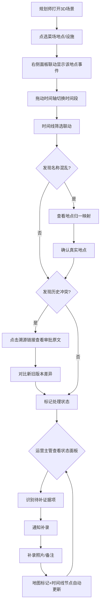

## 1. 产品概述

"菜场卸货投诉回放"是一个 Web3D 可视化工具，面向城市规划师和运营主管，用于回溯菜场卸货区的投诉事件全链路。核心解决审批台账中地点名称混乱、历史记录被覆盖、补录证据无法追溯三大痛点，让规划师快速定位争议源头、运营主管一眼看清处理进度。

- 目标用户：城市规划师（小赵等）、运营主管
- 核心价值：将断续的审批台账材料拼成可回放、可追溯、可审计的时空主线

## 2. 核心功能

### 2.1 用户角色

| 角色 | 典型场景 | 核心权限 |
|------|----------|----------|
| 规划师 | 审批台账梳理、地点归一、历史回溯 | 查看/筛选时间线、点选3D对象、追溯审批原文 |
| 运营主管 | 投诉处理状态总览、证据缺口识别 | 查看处理状态面板、导出待补证据清单 |

### 2.2 功能模块

1. **3D场景主页**：菜场卸货区3D模型，可点选地点/设施对象，联动时间轴和筛选面板
2. **历史时间线面板**：左侧时间轴，按事件逐条回放审批台账变更，保留所有历史版本（含补录备注和旧截图），支持追溯原始说法
3. **筛选与状态面板**：按投诉类型、处理状态、地点别名筛选；显示已处理/待补证据统计
4. **审批台账溯源面板**：点击任意历史节点，展示该时刻审批台账原文、补录标注、旧版本截图对比

### 2.3 页面详情

| 页面名称 | 模块名称 | 功能描述 |
|----------|----------|----------|
| 3D场景主页 | 3D菜场模型 | 菜场卸货区三维场景，可点选地点/设施，选中后高亮并联动右侧面板 |
| 3D场景主页 | 地点名称归一 | 同一地点的多种写法自动聚合（如"东门卸货区""东门卸货""东门区"归为同一地点），点选任一别名均定位到同一3D对象 |
| 3D场景主页 | 时间轴控制器 | 底部水平时间轴，拖动切换时间段；时间轴缩放支持年/月/日粒度 |
| 历史时间线面板 | 事件时间线 | 左侧垂直时间线，按时间倒序排列所有投诉事件及审批动作；每个节点标注来源（原始记录/补录/截图） |
| 历史时间线面板 | 版本保留 | 保留审批台账所有历史版本，补录备注和旧截图以"历史快照"形式存在，不覆盖最新值 |
| 历史时间线面板 | 溯源链接 | 点击任意历史节点，可跳转至审批台账该时刻原文；旧方案与新意见冲突时，双向链接可见 |
| 筛选与状态面板 | 筛选器 | 按投诉类型、处理状态、地点别名、来源类型筛选，筛选结果联动3D场景高亮和时间线过滤 |
| 筛选与状态面板 | 状态统计 | 显示已处理/待补证据/进行中数量，运营主管可快速识别需补证据项 |
| 审批台账溯源面板 | 台账原文展示 | 展示审批台账原始条目，含后来补的备注、旧版本截图缩略图 |
| 审批台账溯源面板 | 变更对比 | 补录前后对比视图，标注补录改了哪些字段（如地点名称修正、照片新增） |
| 审批台账溯源面板 | 照片补录标识 | 现场照片补入后，在地图点位加标记、时间线加节点，说明本次补录改了什么 |

## 3. 核心流程

规划师从审批台账梳理投诉事件：在3D场景中点选地点→时间轴定位→时间线查看事件链→发现名称混乱时查看归一映射→发现冲突时追溯审批原文→确认后标记处理状态。运营主管查看状态面板→识别待补证据项→通知补录→补录后系统自动更新时间线和地图标记。

## 4. 用户界面设计

### 4.1 设计风格

- 主色调：深靛蓝（#1a2744）配琥珀金（#d4a843）强调色，传达专业、可信赖的城市管理气质
- 辅助色：柔灰（#6b7280）做底，翠绿（#10b981）标记已处理，珊瑚红（#ef4444）标记待补证据
- 字体：标题使用 Noto Serif SC（宋体气质+屏幕可读），正文使用 Noto Sans SC
- 布局：左3D场景（60%宽）、右面板区（40%宽）分栏，底部时间轴横贯全宽
- 交互风格：3D对象悬停发光轮廓、选中金色高亮；时间线节点脉动动画；面板展开收起平滑过渡
- 图标：线性图标风格（Lucide），与深色主题搭配

### 4.2 页面设计概览

| 页面名称 | 模块名称 | UI元素 |
|----------|----------|--------|
| 3D场景主页 | 3D菜场模型 | 深色背景，建筑半透明线框，卸货区地面贴图，点选高亮金色轮廓 |
| 3D场景主页 | 时间轴控制器 | 底部半透明深色条，圆形节点+竖线，可拖拽滑块，缩放按钮组 |
| 历史时间线面板 | 事件时间线 | 左侧竖向时间线，节点图标区分来源（文件/相机/笔），悬停展开摘要 |
| 历史时间线面板 | 版本快照 | 卡片式展示，旧版本灰度+删除线标注，新版本正常显示，蓝色箭头连接 |
| 筛选与状态面板 | 筛选器 | 下拉菜单+标签选择器，筛选结果数量实时显示 |
| 筛选与状态面板 | 状态统计 | 环形进度图+数字，已处理绿/进行中蓝/待补红 |
| 审批台账溯源面板 | 台账原文 | 仿纸质卡片样式，手写体标注补录内容，截图缩略图可放大 |
| 审批台账溯源面板 | 变更对比 | 左右分栏对比，变更字段高亮黄色底纹 |

### 4.3 响应式设计

- 桌面优先（1920×1080 基准），3D场景与面板并排
- 平板适配（1024×768）：面板改为可折叠抽屉，点击展开
- 不做手机适配（3D操作需要精确交互）

### 4.4 3D场景指引

- 环境：城市街区场景，清晨暖光，低角度日照，柔和阴影
- 灯光：主方向光（暖白色，模拟清晨阳光）+ 环境光（淡蓝）+ 点光源（卸货区区域强调）
- 相机：45度俯视等距视角，可旋转/缩放，聚焦卸货区
- 构图：菜场建筑为中心，卸货区在前景，周边街道作背景
- 交互：鼠标悬停→对象发光轮廓；点击→金色高亮+信息弹窗；双击→相机聚焦
- 后处理：柔和辉光（Bloom），边缘描线
- 资产来源：程序化几何体生成建筑和卸货区，无需外部模型
