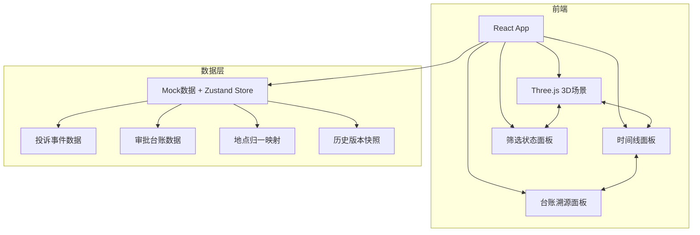
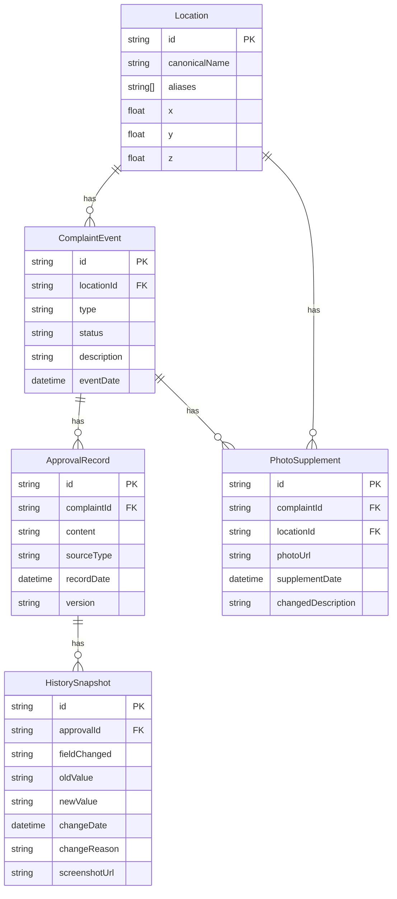

## 1. 架构设计



## 2. 技术说明

- 前端框架：React 18 + TypeScript + Vite
- 3D引擎：three + @react-three/fiber + @react-three/drei + @react-three/postprocessing
- 样式：Tailwind CSS 3
- 状态管理：Zustand（轻量、支持时间旅行快照）
- 动画：@react-spring（面板展开/收起/过渡动画）
- 数据：纯前端 Mock 数据，无需后端服务
- 初始化工具：Vite

## 3. 路由定义

| 路由 | 用途 |
|------|------|
| / | 主页面：3D场景 + 时间线 + 筛选面板 + 台账溯源，单页应用所有功能集成 |

## 4. 数据模型

### 4.1 数据模型定义



### 4.2 数据定义

#### Location（地点）

| 字段 | 类型 | 说明 |
|------|------|------|
| id | string | 地点唯一ID |
| canonicalName | string | 规范名称（如"东门卸货区"） |
| aliases | string[] | 别名列表（如["东门卸货","东门区","东门卸货平台"]） |
| x/y/z | float | 3D场景坐标 |

#### ComplaintEvent（投诉事件）

| 字段 | 类型 | 说明 |
|------|------|------|
| id | string | 事件唯一ID |
| locationId | string | 关联地点ID |
| type | string | 投诉类型：噪音/占道/卫生/时段 |
| status | string | 处理状态：processed/pending/evidence_needed |
| description | string | 事件描述 |
| eventDate | datetime | 事件日期 |

#### ApprovalRecord（审批记录）

| 字段 | 类型 | 说明 |
|------|------|------|
| id | string | 记录唯一ID |
| complaintId | string | 关联投诉ID |
| content | string | 台账原文内容 |
| sourceType | string | 来源类型：original/supplement/screenshot |
| recordDate | datetime | 记录日期 |
| version | string | 版本号 |

#### HistorySnapshot（历史快照）

| 字段 | 类型 | 说明 |
|------|------|------|
| id | string | 快照唯一ID |
| approvalId | string | 关联审批记录ID |
| fieldChanged | string | 变更字段名 |
| oldValue | string | 旧值 |
| newValue | string | 新值 |
| changeDate | datetime | 变更日期 |
| changeReason | string | 变更原因 |
| screenshotUrl | string | 旧版本截图URL |

#### PhotoSupplement（照片补录）

| 字段 | 类型 | 说明 |
|------|------|------|
| id | string | 补录唯一ID |
| complaintId | string | 关联投诉ID |
| locationId | string | 关联地点ID |
| photoUrl | string | 照片URL |
| supplementDate | datetime | 补录日期 |
| changedDescription | string | 补录改了什么 |

## 5. 核心交互联动机制

### 5.1 点选联动

```
点选3D对象 → 更新 selectedLocationId → 时间线过滤该地点事件 → 筛选面板同步地点 → 台账面板显示该地点最新审批
```

### 5.2 时间轴联动

```
拖动时间轴 → 更新 currentTimeRange → 时间线过滤时间范围内事件 → 3D场景仅高亮该时间段内活跃地点 → 筛选面板统计数更新
```

### 5.3 筛选联动

```
选择筛选条件 → 更新 filterState → 时间线过滤 → 3D场景高亮匹配对象 → 状态统计更新
```

### 5.4 历史时间线联动

```
点击时间线节点 → 更新 selectedEventId → 3D相机聚焦对应地点 → 台账面板展示该事件审批详情 → 若有快照则显示变更对比
```

## 6. 组件结构

```
src/
├── App.tsx                    # 根组件，布局
├── stores/
│   └── useAppStore.ts         # Zustand全局状态
├── components/
│   ├── Scene3D/
│   │   ├── MarketScene.tsx     # 3D菜场主场景
│   │   ├── Building.tsx        # 建筑物组件
│   │   ├── UnloadingZone.tsx   # 卸货区组件
│   │   └── LocationMarker.tsx  # 地点标记（可点选）
│   ├── Timeline/
│   │   ├── TimeAxis.tsx        # 底部时间轴控制器
│   │   ├── EventTimeline.tsx   # 左侧事件时间线
│   │   └── TimelineNode.tsx    # 时间线节点
│   ├── Panels/
│   │   ├── FilterPanel.tsx     # 筛选面板
│   │   ├── StatusPanel.tsx     # 状态统计面板
│   │   ├── ApprovalPanel.tsx   # 审批台账溯源面板
│   │   └── VersionDiff.tsx     # 版本变更对比
│   └── Layout/
│       └── AppLayout.tsx       # 主布局
├── data/
│   └── mockData.ts             # Mock数据
└── types/
    └── index.ts                # TypeScript类型定义
```
