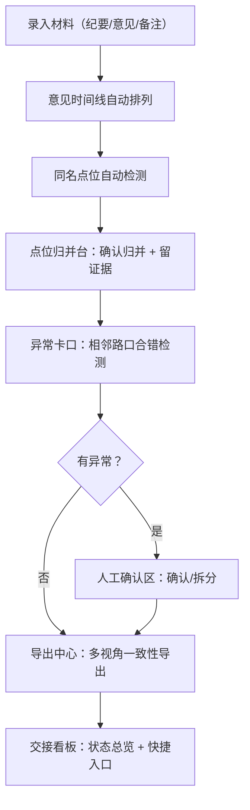

## 1. 产品概述

菜场卸货方案比选管理系统——为城市规划师打造的结构化方案比选工作台。解决材料碎片化、旧意见被新表覆盖、多视角导出不一致、同一地点不同写法归并无证据链、交接不清晰等核心痛点。目标是让比选过程可追溯、可导出、可交接，算法值班人接手即知"哪里放材料、哪里看异常、哪里重新导出"。

- 目标用户：城市规划师、方案审核人、算法值班人
- 核心价值：将散落在会议纪要、意见表、备注中的方案信息统一归集，形成有证据链、有状态追踪、可多视角一致性导出的比选档案

## 2. 核心功能

### 2.1 用户角色

| 角色 | 进入方式 | 核心权限 |
|------|----------|----------|
| 规划师 | 直接使用 | 录入/编辑方案材料、标注场景、归并点位、导出报告 |
| 审核人 | 直接使用 | 审核归并结果、补充证据、标记异常 |
| 算法值班人 | 直接使用 | 查看处理状态、定位异常、重新导出 |

### 2.2 功能模块

1. **方案工作台**：方案总览看板、材料录入区、意见时间线（旧意见不会被新表覆盖，而是按时间线排列）
2. **点位归并台**：同一地点不同写法的自动识别与人工归并，归并证据留痕
3. **异常卡口**：相邻路口合错检测，需要人工确认时给出原因和下一步操作建议
4. **导出中心**：多视角一致性导出（场景标注、侧边说明、页面摘要始终是同一套话）
5. **交接看板**：已处理/待补证据/需人工确认的状态总览，接手人一眼定位

### 2.3 页面详情

| 页面名称 | 模块名称 | 功能描述 |
|----------|----------|----------|
| 方案工作台 | 方案总览看板 | 展示所有方案的卡片列表，每张卡片显示方案名、关键结论、材料完整度、状态标签 |
| 方案工作台 | 材料录入区 | 支持录入会议纪要片段、意见表、后补备注，自动打时间戳，保留原始来源 |
| 方案工作台 | 意见时间线 | 按时间线展示所有意见和备注，旧意见始终可见不会被新表覆盖，后补备注与最终结论之间有可视化连线 |
| 点位归并台 | 同名点位识别 | 自动检测同一地点的两种写法（如"XX路XX口"与"XX路口"），列在归并候选区 |
| 点位归并台 | 归并操作与证据留痕 | 人工确认归并后，保留两条原始写法 + 归并原因 + 操作人 + 时间，形成证据链 |
| 异常卡口 | 相邻路口合错检测 | 检测归并时是否将相邻但不同的路口错误合并，标记为异常，给出原因说明和下一步建议 |
| 异常卡口 | 人工确认区 | 展示待确认异常列表，支持"确认归并"或"拆分回退"操作 |
| 导出中心 | 多视角导出 | 支持按"场景标注"、"侧边说明"、"页面摘要"三种视角导出，三种视角的内容来源统一，不会变成三套话 |
| 导出中心 | 后补备注联动 | 导出时后补备注与最终结论自动串联，确保结论有据可查 |
| 交接看板 | 状态总览 | 展示所有方案的已处理/待补证据/需人工确认数量，按优先级排序 |
| 交接看板 | 快捷入口 | "哪里放材料"→跳转材料录入；"哪里看异常"→跳转异常卡口；"哪里重新导出"→跳转导出中心 |

## 3. 核心流程

1. 规划师在**方案工作台**录入会议纪要片段、意见表、后补备注，系统自动打时间戳形成意见时间线
2. 录入时系统自动检测同一地点的不同写法，推送到**点位归并台**的归并候选区
3. 规划师在**点位归并台**确认归并，系统保留两条原始写法及归并证据
4. 归并完成后，**异常卡口**自动检测相邻路口是否被错误合并，标记异常并给出原因和建议
5. 审核人在**异常卡口**处理异常（确认归并或拆分回退）
6. 规划师在**导出中心**选择视角导出，三种视角内容来源统一，后补备注与结论自动串联
7. 算法值班人通过**交接看板**一眼掌握全局状态，快速跳转到对应工作区

## 4. 用户界面设计

### 4.1 设计风格

- 主色调：深青色（#0F4C54）+ 暖橙色点缀（#E8742C），体现"规划严谨 + 行动明确"的气质
- 辅助色：浅灰底（#F5F5F0）+ 深灰文字（#2D2D2D）
- 按钮风格：圆角矩形（8px），主操作用实心暖橙色，次操作用描边深青色
- 字体：标题用 Noto Serif SC（衬线，体现正式感），正文用 Noto Sans SC（无衬线，阅读舒适）
- 布局风格：左侧固定导航栏 + 右侧内容区，卡片式布局
- 图标风格：线性图标（Lucide），与整体简洁风格统一

### 4.2 页面设计概览

| 页面名称 | 模块名称 | UI 元素 |
|----------|----------|---------|
| 方案工作台 | 方案总览看板 | 卡片网格布局，每卡含方案名、状态徽章、完整度进度条、关键结论预览 |
| 方案工作台 | 材料录入区 | 表单面板：来源类型下拉、内容文本区、自动时间戳、提交按钮 |
| 方案工作台 | 意见时间线 | 垂直时间线，左侧时间戳，右侧意见卡片，后补备注与结论间有虚线连接 |
| 点位归并台 | 同名点位识别 | 左右分栏：左侧候选列表（高亮差异文字），右侧归并详情面板 |
| 点位归并台 | 归并操作与证据留痕 | 底部操作栏：归并原因输入、确认按钮，确认后展示证据条目 |
| 异常卡口 | 相邻路口合错检测 | 异常卡片列表，每卡含异常原因、涉及点位、操作建议按钮 |
| 异常卡口 | 人工确认区 | 双按钮操作："确认归并"（绿色）+"拆分回退"（红色） |
| 导出中心 | 多视角导出 | 三个视角标签页切换，实时预览面板，导出按钮 |
| 导出中心 | 后补备注联动 | 结论卡片下方展示关联的后补备注，有来源链接 |
| 交接看板 | 状态总览 | 顶部统计条（已处理/待补/需确认），下方方案列表按优先级排序 |
| 交接看板 | 快捷入口 | 三个快捷图标入口，hover 显示说明文字 |

### 4.3 响应式设计

- 桌面优先设计，核心操作区域宽度 ≥ 1200px
- 平板端：侧边栏折叠为汉堡菜单，卡片网格从3列变2列
- 移动端：单列布局，时间线简化为紧凑模式

### 4.4 3D 场景指引

- 不适用
