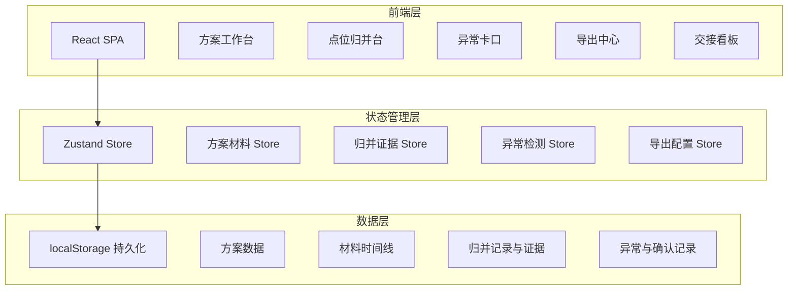
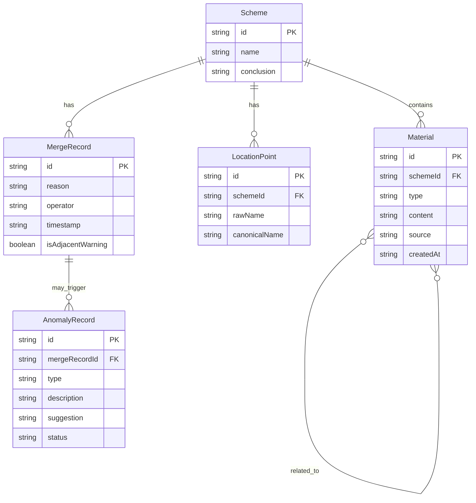

## 1. 架构设计



## 2. 技术说明

- 前端：React@18 + TypeScript + Tailwind CSS@3 + Vite
- 初始化工具：vite-init（react-ts 模板）
- 状态管理：Zustand（轻量、无 Provider、支持持久化中间件）
- 路由：react-router-dom v6
- 数据持久化：localStorage（通过 zustand/middleware 的 persist 中间件）
- 后端：无（纯前端，数据存储在浏览器本地）
- 图标：lucide-react

## 3. 路由定义

| 路由 | 用途 |
|------|------|
| / | 方案工作台：方案总览看板、材料录入、意见时间线 |
| /merge | 点位归并台：同名点位识别、归并操作与证据留痕 |
| /check | 异常卡口：相邻路口合错检测、人工确认区 |
| /export | 导出中心：多视角一致性导出、后补备注联动 |
| /handover | 交接看板：状态总览、快捷入口 |

## 4. API 定义

无后端 API，所有数据通过 Zustand Store + localStorage 在前端管理。

### 4.1 核心数据类型

```typescript
interface Material {
  id: string;
  schemeId: string;
  type: "meeting_minutes" | "opinion_form" | "supplementary_note" | "conclusion";
  content: string;
  source: string;
  createdAt: string;
  relatedMaterialIds: string[];
}

interface LocationPoint {
  id: string;
  rawName: string;
  canonicalName: string;
  schemeId: string;
  mergedFrom: string[];
}

interface MergeRecord {
  id: string;
  pointIds: string[];
  reason: string;
  operator: string;
  timestamp: string;
  isAdjacentWarning: boolean;
  evidenceSnapshot: { originalA: string; originalB: string };
}

interface AnomalyRecord {
  id: string;
  mergeRecordId: string;
  type: "adjacent_mismatch";
  description: string;
  suggestion: string;
  status: "pending" | "confirmed" | "reverted";
  handledBy?: string;
  handledAt?: string;
}

interface Scheme {
  id: string;
  name: string;
  conclusion?: string;
  materials: Material[];
  locationPoints: LocationPoint[];
  mergeRecords: MergeRecord[];
  anomalies: AnomalyRecord[];
}
```

## 5. 服务器架构图

无后端服务器。

## 6. 数据模型

### 6.1 数据模型定义



### 6.2 数据定义语言

使用 localStorage 存储，数据以 JSON 格式持久化。初始数据包含演示用的"菜场卸货方案比选"示例方案，含3条会议纪要材料、2个同名点位、1条归并记录、1条相邻路口异常。
