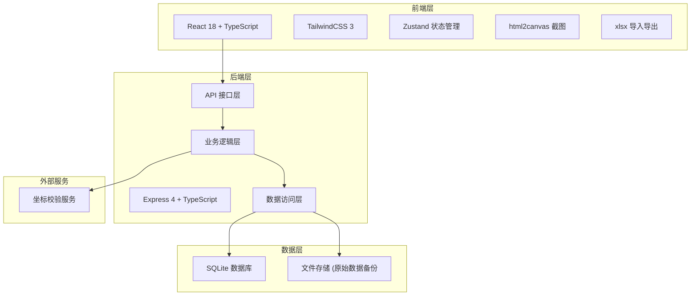
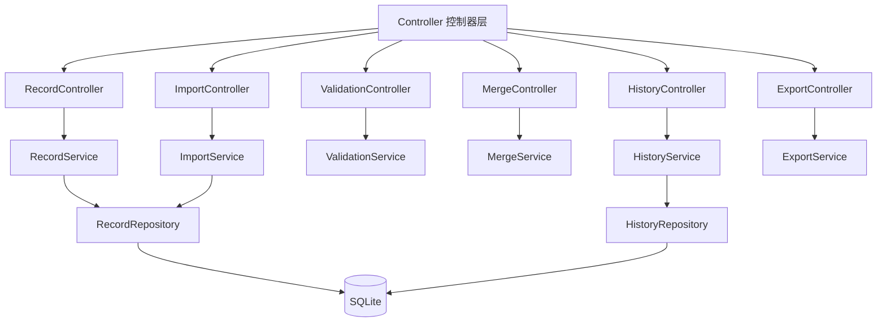
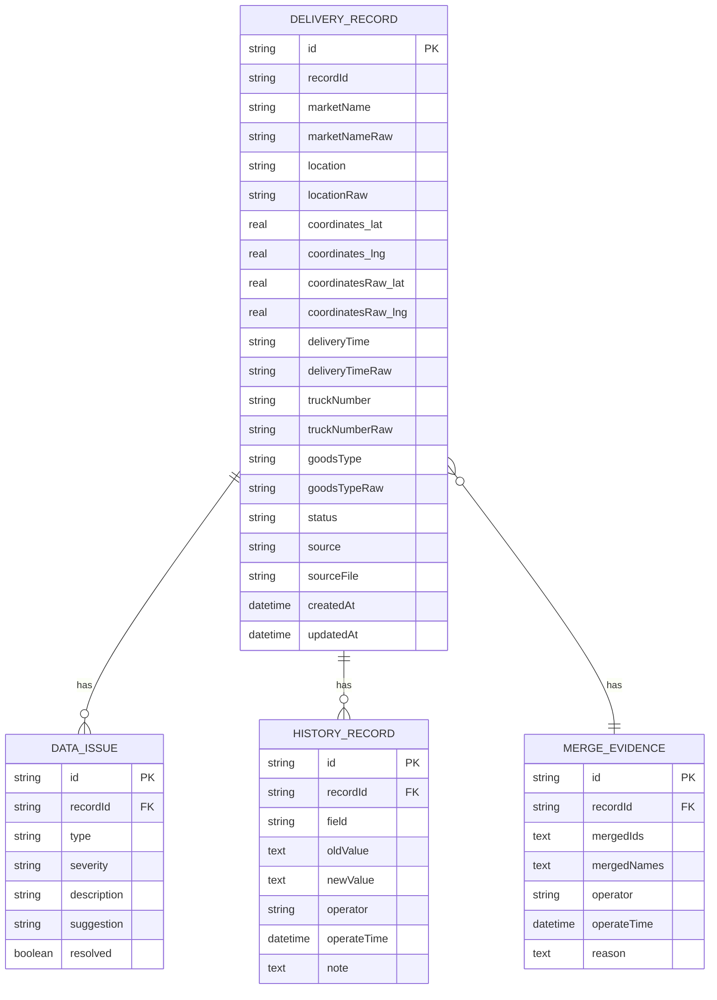

## 1. 架构设计



## 2. 技术描述

- **前端**：React@18 + TypeScript + TailwindCSS@3 + Vite
- **初始化工具**：vite-init
- **后端**：Express@4 + TypeScript
- **数据库**：SQLite（本地存储，无需额外部署）
- **状态管理**：Zustand
- **Excel处理**：xlsx库
- **截图功能**：html2canvas
- **图标库**：lucide-react

## 3. 路由定义

| 路由 | 页面 | 描述 |
|------|------|------|
| / | 数据导入页 | 首页，默认跳转至导入页 |
| /import | 数据导入页 | Excel/CSV导入、手工录入 |
| /cleaning | 数据清洗页 | 脏数据标记、坐标校验、地点归并 |
| /list | 清单列表页 | 筛选查询、冲突标记 |
| /history | 历史追溯页 | 操作日志、版本对比 |
| /export | 导出页 | 截图生成、Excel导出 |

## 4. API 定义

```typescript
// 卸货记录类型
interface DeliveryRecord {
  id: string;
  recordId: string;
  marketName: string;
  marketNameRaw: string; // 保留原始名称
  location: string;
  locationRaw: string; // 保留原始地点
  coordinates: {
    lat: number;
    lng: number;
  };
  coordinatesRaw: {
    lat: number;
    lng: number;
  };
  deliveryTime: string;
  deliveryTimeRaw: string;
  truckNumber: string;
  truckNumberRaw: string;
  goodsType: string;
  goodsTypeRaw: string;
  status: 'pending' | 'cleaned' | 'conflict' | 'merged';
  source: string; // 数据来源：'excel' | 'manual';
  sourceFile?: string; // 原始文件名或会议纪要名称
  mergeEvidence?: MergeEvidence; // 归并证据
  issues: DataIssue[];
  createdAt: string;
  updatedAt: string;
}

// 数据问题类型
interface DataIssue {
  id: string;
  type: 'coordinate_offset' | 'location_inconsistent' | 'name_inconsistent' | 'missing_data' | 'time_conflict';
  severity: 'warning' | 'error';
  description: string;
  suggestion: string; // 可操作的下一步建议
  resolved: boolean;
}

// 归并证据
interface MergeEvidence {
  mergedIds: string[];
  mergedNames: string[];
  operator: string;
  operateTime: string;
  reason: string;
}

// 历史记录
interface HistoryRecord {
  id: string;
  recordId: string;
  field: string;
  oldValue: any;
  newValue: any;
  operator: string;
  operateTime: string;
  note?: string;
}

// API接口定义
// GET /api/records - 获取卸货记录列表
// POST /api/records - 创建卸货记录
// PUT /api/records/:id - 更新卸货记录
// DELETE /api/records/:id - 删除卸货记录
// POST /api/import/excel - 导入Excel文件
// POST /api/validate/coordinates - 校验坐标
// POST /api/merge/locations - 归并地点
// GET /api/history/:recordId - 获取单条记录历史
// POST /api/export/excel - 导出Excel
// POST /api/export/screenshot - 生成截图数据
```

## 5. 服务端架构图



## 6. 数据模型

### 6.1 数据模型定义



### 6.2 数据定义语言

```sql
-- 卸货记录表
CREATE TABLE delivery_record (
  id TEXT PRIMARY KEY,
  record_id TEXT NOT NULL UNIQUE,
  market_name TEXT NOT NULL,
  market_name_raw TEXT NOT NULL,
  location TEXT NOT NULL,
  location_raw TEXT NOT NULL,
  coordinates_lat REAL NOT NULL,
  coordinates_lng REAL NOT NULL,
  coordinates_raw_lat REAL NOT NULL,
  coordinates_raw_lng REAL NOT NULL,
  delivery_time TEXT,
  delivery_time_raw TEXT,
  truck_number TEXT,
  truck_number_raw TEXT,
  goods_type TEXT,
  goods_type_raw TEXT,
  status TEXT NOT NULL DEFAULT 'pending',
  source TEXT NOT NULL,
  source_file TEXT,
  created_at DATETIME NOT NULL DEFAULT CURRENT_TIMESTAMP,
  updated_at DATETIME NOT NULL DEFAULT CURRENT_TIMESTAMP
);

CREATE INDEX idx_record_status ON delivery_record(status);
CREATE INDEX idx_record_source ON delivery_record(source);

-- 数据问题表
CREATE TABLE data_issue (
  id TEXT PRIMARY KEY,
  record_id TEXT NOT NULL,
  type TEXT NOT NULL,
  severity TEXT NOT NULL,
  description TEXT NOT NULL,
  suggestion TEXT NOT NULL,
  resolved INTEGER NOT NULL DEFAULT 0,
  created_at DATETIME NOT NULL DEFAULT CURRENT_TIMESTAMP,
  FOREIGN KEY (record_id) REFERENCES delivery_record(id) ON DELETE CASCADE
);

CREATE INDEX idx_issue_record ON data_issue(record_id);
CREATE INDEX idx_issue_type ON data_issue(type);

-- 历史记录表
CREATE TABLE history_record (
  id TEXT PRIMARY KEY,
  record_id TEXT NOT NULL,
  field TEXT NOT NULL,
  old_value TEXT,
  new_value TEXT,
  operator TEXT NOT NULL,
  operate_time DATETIME NOT NULL DEFAULT CURRENT_TIMESTAMP,
  note TEXT,
  FOREIGN KEY (record_id) REFERENCES delivery_record(id) ON DELETE CASCADE
);

CREATE INDEX idx_history_record ON history_record(record_id);
CREATE INDEX idx_history_time ON history_record(operate_time DESC);

-- 归并证据表
CREATE TABLE merge_evidence (
  id TEXT PRIMARY KEY,
  record_id TEXT NOT NULL,
  merged_ids TEXT NOT NULL,
  merged_names TEXT NOT NULL,
  operator TEXT NOT NULL,
  operate_time DATETIME NOT NULL DEFAULT CURRENT_TIMESTAMP,
  reason TEXT NOT NULL,
  FOREIGN KEY (record_id) REFERENCES delivery_record(id) ON DELETE CASCADE
);

-- 初始测试数据
INSERT INTO delivery_record (id, record_id, market_name, market_name_raw, location, location_raw, coordinates_lat, coordinates_lng, coordinates_raw_lat, coordinates_raw_lng, delivery_time, delivery_time_raw, truck_number, truck_number_raw, goods_type, goods_type_raw, status, source, source_file)
VALUES 
('rec_001', 'X2024001', '东风菜市场', '東風菜市場', '东风路123号', '東風路123號', 31.2304, 121.4737, 31.2304, 121.4737, '2024-06-15 06:00', '6月15日早上6点', '沪A12345', '沪A·12345', '蔬菜', '蔬菜类', 'pending', 'excel', '6月会议纪要.xlsx'),
('rec_002', 'X2024002', '南山农贸市场', '南山農貿市場', '南山街456号', '南山街456號', 31.2350, 121.4800, 31.2350, 121.4800, '2024-06-15 07:30', '15号7点半', '沪B67890', '沪B67890', '水果', '水果', 'pending', 'manual', '手工录入');
