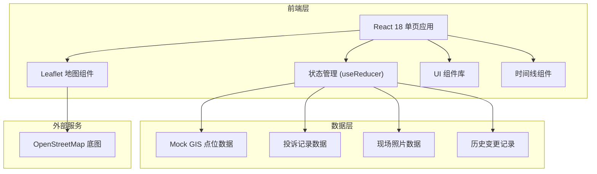
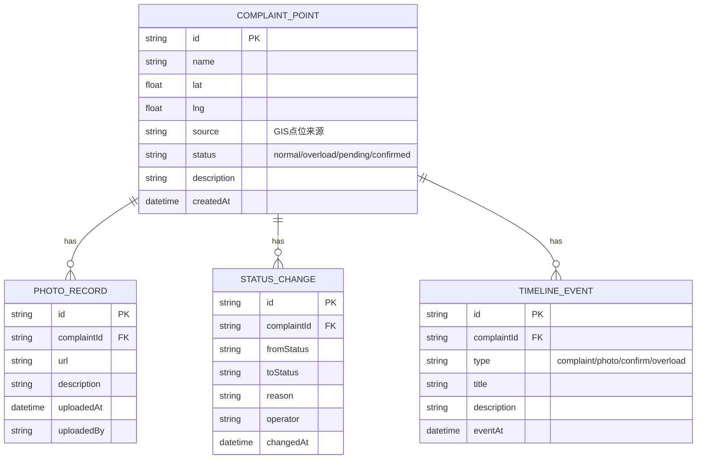

# 慢行桥坡道投诉回放 - 技术架构文档

## 1. 架构设计



## 2. 技术描述

- **前端框架**：React 18 + TypeScript + Vite
- **样式方案**：TailwindCSS 3 + CSS 自定义属性（主题变量）
- **GIS 地图**：Leaflet 1.9 + OpenStreetMap 瓦片（免费、轻量）
- **状态管理**：React useReducer + Context（轻量场景，不引入 Redux）
- **图标**：Lucide React
- **动画**：CSS Keyframes + Framer Motion（复杂交互）
- **数据**：前端 Mock 数据，模拟后端接口返回
- **初始化工具**：Vite 脚手架

## 3. 路由定义

| 路由 | 用途 |
|------|------|
| / | 主页面（地图 + 列表 + 详情 + 时间线） |

单页应用，所有功能在同一页面通过组件切换和面板展示完成。

## 4. 数据模型

### 4.1 数据模型定义



### 4.2 数据类型定义 (TypeScript)

```typescript
// 投诉点位状态
type ComplaintStatus = 'normal' | 'overload' | 'pending' | 'confirmed';

// GIS点位来源
type PointSource = 'system_import' | 'chat_record' | 'field_survey' | 'citizen_report';

// 投诉点位
interface ComplaintPoint {
  id: string;
  name: string;
  lat: number;
  lng: number;
  source: PointSource;
  status: ComplaintStatus;
  description: string;
  capacity?: number;       // 设计容量
  actualLoad?: number;     // 实际承载量
  createdAt: string;
  address?: string;
}

// 现场照片
interface PhotoRecord {
  id: string;
  complaintId: string;
  url: string;
  description: string;
  uploadedAt: string;
  uploadedBy: string;
}

// 状态变更记录
interface StatusChange {
  id: string;
  complaintId: string;
  fromStatus: ComplaintStatus;
  toStatus: ComplaintStatus;
  reason: string;
  operator: string;
  changedAt: string;
}

// 时间线事件
type TimelineEventType = 'complaint' | 'photo' | 'confirm' | 'overload' | 'update';

interface TimelineEvent {
  id: string;
  complaintId: string;
  type: TimelineEventType;
  title: string;
  description: string;
  eventAt: string;
}

// 数据包
interface DataPacket {
  id: string;
  name: string;
  description: string;
  pointCount: number;
  overloadCount: number;
}
```

### 4.3 演示数据包

演示数据包含 5 条记录，特意设计为"不太干净"：

| 序号 | 点位名称 | 状态 | 特点 |
|------|----------|------|------|
| 1 | 人民广场慢行桥-北坡道 | 正常 (normal) | 标准正常记录 |
| 2 | 滨江公园慢行桥-东坡道 | 容量超限 (overload) | 超限率 135%，含聊天记录来源 |
| 3 | 中央公园步行桥-西坡道 | 待确认 (pending) | 人工确认中，有现场照片补录 |
| 4 | 科技园慢行桥-南坡道 | 容量超限 (overload) | 超限率 162%，多轮状态变更 |
| 5 | 文化广场天桥-东坡道 | 已确认 (confirmed) | 人工确认完成，完整历史链路 |

## 5. 核心模块划分

```
src/
├── components/
│   ├── MapPanel/          # 地图面板（Leaflet封装）
│   ├── PointList/         # 左侧点位列表面板
│   ├── DetailPanel/       # 右侧详情面板
│   ├── Timeline/          # 底部时间线
│   ├── Header/            # 顶部标题栏
│   └── PhotoGallery/      # 照片轮播组件
├── data/
│   ├── mockPoints.ts      # Mock 点位数据
│   ├── mockPhotos.ts      # Mock 照片数据
│   └── mockTimeline.ts    # Mock 时间线数据
├── hooks/
│   ├── useComplaints.ts   # 投诉数据管理 hook
│   └── useTimeline.ts     # 时间线控制 hook
├── types/
│   └── index.ts           # TypeScript 类型定义
├── App.tsx
├── main.tsx
└── index.css
```

## 6. 关键技术决策

1. **Leaflet 替代重型地图库**：功能足够、体积极小、OSM瓦片免费，符合"模型不用精细"的定位
2. **前端全 Mock**：无后端依赖，数据内置，方便演示和交接
3. **状态分层**：正常 / 容量超限 / 待确认 / 已确认，超限记录在 UI 上完全独立分组
4. **时间线驱动**：所有状态变更、照片补录都沉淀为时间线事件，可回放可追溯
5. **深色主题**：GIS 地图在深色背景下视觉效果更佳，符合科技感定位
