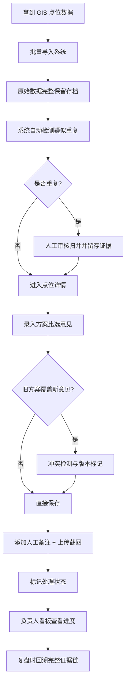

## 1. 产品概述

慢行桥坡道方案比选系统是为街道办打造的内部工作管理工具，解决 GIS 点位数据零散、方案比选过程无留痕、人工备注与截图分散在聊天记录中、负责人无法快速掌握处理进度等痛点。

- 解决的核心问题：数据来源不清、处理过程无据可查、同地异名归并困难、状态跟踪缺失
- 目标用户：街道周姐（数据录入/方案管理员）、分管负责人（进度查看/审核）
- 产品价值：将散落的聊天记录、截图、GIS 点位数据统一纳入结构化管理，实现"每一条比选都有来源、每一次修改都有痕迹、每一个点位都有状态"

## 2. 核心功能

### 2.1 用户角色

| 角色 | 登录方式 | 核心权限 |
|------|---------|---------|
| 方案管理员（周姐） | 本地应用直接使用 | 导入 GIS 点位、录入比选方案、添加人工备注/截图、执行点位归并、标记处理状态 |
| 负责人 | 本地应用直接使用 | 查看全部点位、筛选待处理项、查看归并证据、审核方案比选结果 |

### 2.2 功能模块

1. **总览看板页**：处理进度统计、状态分类卡片、快速筛选入口
2. **点位列表页**：GIS 点位表格、多条件筛选、批量操作、状态标记
3. **点位详情页**：方案比选对比、原始数据展示、版本历史、人工备注、截图附件、归并证据链
4. **点位归并页**：疑似重复点位检测、归并预览、归并操作与证据留存
5. **数据导入页**：GIS 数据批量导入、原始数据预览、脏数据标记

### 2.3 页面详情

| 页面名称 | 模块名称 | 功能描述 |
|---------|---------|-----------|
| 总览看板 | 进度统计卡片 | 显示总数、已处理、待补证据、待归并四类统计，支持点击跳转筛选 |
| 总览看板 | 最近动态时间线 | 展示最近的备注、状态变更、归并操作记录 |
| 总览看板 | 快速筛选区 | 按处理状态、来源、是否有冲突快速筛选 |
| 点位列表 | 数据表格 | 展示点位名称、地址、坐标、处理状态、方案数、最近更新时间 |
| 点位列表 | 多条件筛选 | 按状态、来源渠道、有无备注、有无截图、日期范围筛选 |
| 点位列表 | 批量操作 | 批量标记状态、批量归并检测 |
| 点位详情 | 方案比选对比 | 左右/上下分栏展示多个方案，高亮差异项，支持版本切换 |
| 点位详情 | 原始数据区 | 完整展示导入时的原始 JSON/字段，标记已修正字段与修正值，不隐藏脏数据 |
| 点位详情 | 人工备注 | 富文本备注区，支持 @引用点位、时间戳自动记录、编辑人留痕 |
| 点位详情 | 截图附件 | 多图上传、缩略图预览、点击放大、图片说明文字 |
| 点位详情 | 版本历史 | 记录每一次修改的时间、修改人、修改前后对比 |
| 点位详情 | 归并关系 | 展示该点位与其他点位的归并关系，显示归并证据（名称相似度、地理距离） |
| 点位归并 | 疑似重复检测 | 基于名称相似度 + 地理距离阈值自动检测疑似重复点位组 |
| 点位归并 | 归并预览 | 展示归并前后数据对比，选择主点位、保留字段策略 |
| 点位归并 | 归并执行 | 执行归并并自动生成归并证据记录（不删除原始数据，仅做关联标记） |
| 数据导入 | 文件上传 | 支持 CSV/JSON 格式 GIS 点位数据批量上传 |
| 数据导入 | 数据预览 | 上传后展示原始数据预览表，标记空值、格式异常、疑似脏数据 |
| 数据导入 | 导入执行 | 确认导入，数据入库并保留原始来源快照 |

## 3. 核心流程

用户（周姐）拿到 GIS 点位数据 → 批量导入系统（原始数据完整保留）→ 系统自动检测疑似重复点位 → 人工审核归并（归并证据留存）→ 录入方案比选意见（支持多版本、覆盖冲突检测）→ 添加人工备注和截图 → 标记处理状态（已处理/待补证据）→ 负责人打开看板查看进度 → 点击进入详情查看完整证据链 → 复盘时快速回溯每个点位的处理全过程

## 4. 用户界面设计

### 4.1 设计风格

**政务工具·证据优先风格**

- 主色调：深蓝 `#1e3a5f`（沉稳可信），辅助色：琥珀 `#d97706`（待补证据预警）、墨绿 `#166534`（已处理完成）
- 按钮风格：直角矩形，2px 边框，悬停时背景色加深 10%
- 字体：标题使用 "Noto Serif SC" 衬线体体现正式感，正文使用 "Noto Sans SC" 无衬线体保证可读性
- 布局风格：顶部导航 + 左侧筛选 + 右侧主内容的三栏政务系统布局，数据表格为核心展示形式
- 图标：使用线性图标，与政务工具气质匹配，避免过度拟物化

### 4.2 页面设计概述

| 页面名称 | 模块名称 | UI 元素 |
|---------|---------|---------|
| 总览看板 | 进度统计卡片 | 深蓝渐变背景 + 大号数字 + 状态色小图标 + 悬停微动效 |
| 总览看板 | 最近动态时间线 | 左侧竖线时间轴 + 不同状态色节点 + 操作人头像 |
| 点位列表 | 数据表格 | 斑马纹行、状态色标签列、悬停高亮行、固定表头 |
| 点位详情 | 方案比选对比 | 分栏卡片布局、差异项黄色高亮背景、版本选择下拉 |
| 点位详情 | 原始数据区 | 灰色边框代码块样式、修正字段红色删除线 + 绿色新值对比展示 |
| 点位详情 | 截图附件 | 瀑布流缩略图、悬停显示说明、点击灯箱放大 |
| 点位归并 | 疑似重复列表 | 卡片组展示、相似度百分比进度条、地理距离数值 |

### 4.3 响应式

桌面端优先（1440px 基准），支持 1024px 平板自适应。筛选侧栏在小屏下可折叠为抽屉。核心数据表格支持横向滚动。

### 4.4 地图展示

- 嵌入高德地图 JS API，中心点定位到街道辖区
- 点位按状态用不同颜色标记（绿=已处理、黄=待补证据、红=待处理）
- 点击地图标记弹出点位摘要卡片，可跳转详情
- 疑似归并点位用连线高亮显示
