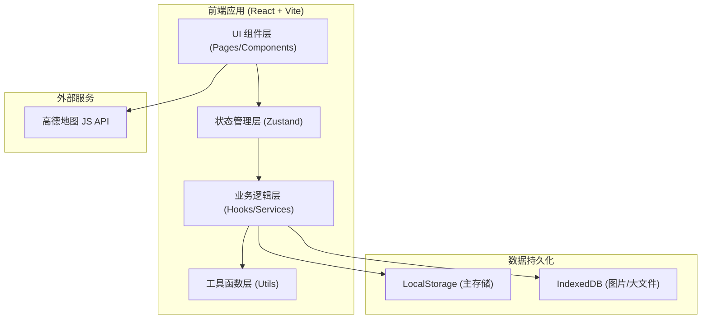
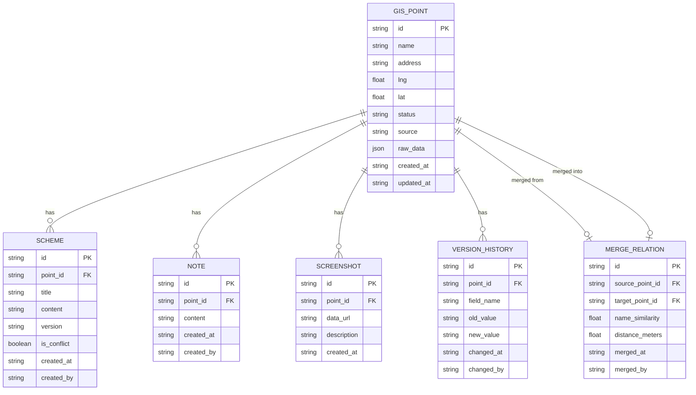

## 1. 架构设计



## 2. 技术说明

- 前端框架：React 18 + TypeScript 5 + Vite 5
- 样式方案：Tailwind CSS 3
- 状态管理：Zustand 4（含 persist 中间件做 LocalStorage 持久化）
- 路由：React Router DOM 6
- 图标库：Lucide React
- 数据持久化：Zustand persist（结构化数据）+ IndexedDB（图片附件）
- 地图服务：高德地图 JS API 2.0
- 初始化工具：vite-init（react-ts 模板）
- 后端：无（纯前端 MVP 方案）
- 数据库：无（使用浏览器本地存储）

## 3. 路由定义

| 路由路径 | 页面组件 | 用途说明 |
|---------|---------|---------|
| `/` | DashboardPage | 总览看板，进度统计 + 最近动态 |
| `/points` | PointListPage | 点位列表，多条件筛选 + 批量操作 |
| `/points/:id` | PointDetailPage | 点位详情，方案比选 + 原始数据 + 备注截图 |
| `/merge` | MergePage | 点位归并，疑似重复检测 + 归并操作 |
| `/import` | ImportPage | 数据导入，CSV/JSON 上传 + 预览 |

## 4. 数据模型

### 4.1 实体关系图



### 4.2 数据状态枚举

```typescript
// 点位处理状态
type PointStatus = 'pending' | 'processing' | 'evidence_needed' | 'completed';
// pending: 待处理
// processing: 处理中
// evidence_needed: 待补证据
// completed: 已处理完成

// 方案版本状态
type SchemeStatus = 'active' | 'superseded' | 'conflict';
```

### 4.3 Store 切片设计

```typescript
// Zustand Store 结构
interface AppState {
  // 点位数据
  points: GisPoint[];
  // 方案数据
  schemes: Scheme[];
  // 备注数据
  notes: Note[];
  // 截图数据（元数据，图片本体存 IndexedDB）
  screenshots: ScreenshotMeta[];
  // 版本历史
  versionHistory: VersionRecord[];
  // 归并关系
  mergeRelations: MergeRelation[];
  // 筛选状态（持久化到 URL + LocalStorage）
  filters: FilterState;
  // 操作方法
  actions: {
    addPoint: (point: GisPoint) => void;
    updatePoint: (id: string, updates: Partial<GisPoint>) => void;
    addScheme: (scheme: Scheme) => void;
    addNote: (note: Note) => void;
    addScreenshot: (screenshot: ScreenshotMeta) => void;
    mergePoints: (sourceId: string, targetId: string, evidence: MergeEvidence) => void;
    setFilters: (filters: Partial<FilterState>) => void;
    importPoints: (points: GisPoint[]) => void;
  };
}
```

## 5. 核心模块说明

### 5.1 原始数据保留机制

- `GisPoint.raw_data` 字段完整保存导入时的原始 JSON，永不修改
- 展示层提供「原始数据 / 修正数据」切换视图
- 修正字段通过 `VersionHistory` 记录 `old_value` → `new_value` 变化链
- UI 上修正字段用红色删除线 + 绿色新值对比展示

### 5.2 筛选状态持久化

- 使用 Zustand `persist` 中间件将 `filters` 状态持久化到 LocalStorage
- 同时同步关键筛选参数到 URL query string，刷新/分享链接后可恢复
- 页面加载时优先从 URL 恢复，URL 无参数时从 LocalStorage 恢复

### 5.3 冲突检测机制

- 新增 Scheme 时检查同一点位是否存在「更新时间晚于当前方案但版本号更低」的记录
- 检测到冲突时标记 `is_conflict = true`，UI 用黄色横幅提示"存在旧方案覆盖新意见"
- 冲突方案并排展示，人工确认保留策略

### 5.4 点位归并算法

- **名称相似度**：使用 Levenshtein 编辑距离算法计算名称相似度（阈值 ≥ 0.7）
- **地理距离**：使用 Haversine 公式计算两点间大圆距离（阈值 ≤ 50 米）
- 双重条件同时满足才判定为疑似重复
- 归并操作不删除源点位，仅通过 `MergeRelation` 建立关联，源点位标记 `status = 'merged'`
- 归并证据（相似度数值、距离数值、操作人、时间）完整记录

### 5.5 图片存储方案

- 小截图（< 500KB）：转 Base64 直接存入 Zustand（自动持久化到 LocalStorage）
- 大截图：使用 IndexedDB（Dexie.js 封装）存储图片 Blob，元数据存 Zustand
- 导入导出时提供 JSON + 图片 Zip 的打包方案

## 6. 项目目录结构

```
src/
├── components/          # 可复用组件
│   ├── layout/         # 布局组件（Sidebar, Header, Layout）
│   ├── ui/             # 基础 UI 组件（Button, Card, Table, Tag, Modal）
│   ├── point/          # 点位相关组件（PointCard, SchemeCompare, RawDataViewer）
│   └── map/            # 地图相关组件（AmapWrapper, PointMarker）
├── pages/              # 页面组件
│   ├── DashboardPage.tsx
│   ├── PointListPage.tsx
│   ├── PointDetailPage.tsx
│   ├── MergePage.tsx
│   └── ImportPage.tsx
├── hooks/              # 自定义 Hooks
│   ├── useFilters.ts   # 筛选状态管理
│   ├── useMergeDetect.ts # 归并检测
│   └── usePersistence.ts # 持久化同步
├── store/              # Zustand Store
│   └── index.ts
├── types/              # TypeScript 类型定义
│   └── index.ts
├── utils/              # 工具函数
│   ├── similarity.ts   # 文本相似度算法
│   ├── geo.ts          # 地理距离计算
│   ├── storage.ts      # IndexedDB 封装
│   └── csv.ts          # CSV 解析
├── data/               # Mock 数据
│   └── mockPoints.ts
├── App.tsx
├── main.tsx
└── index.css
```
