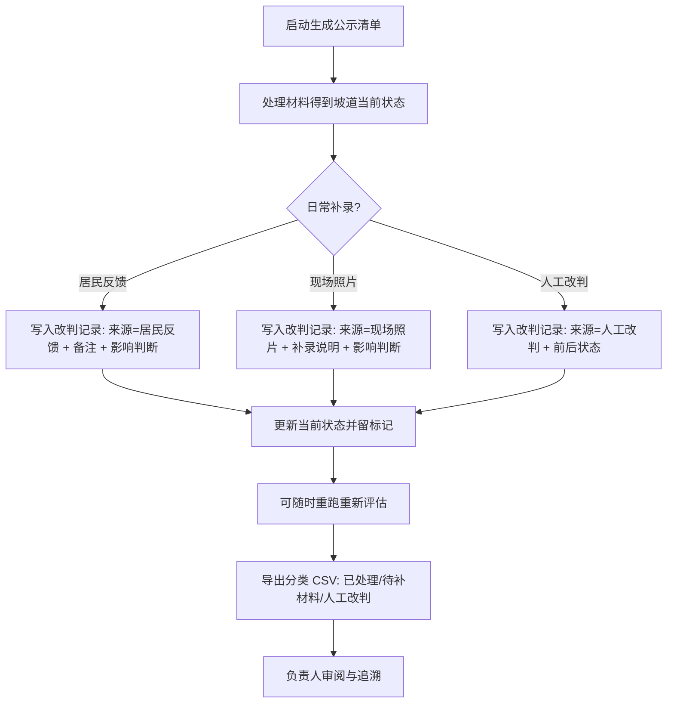

# 慢行桥坡道公示清单 — 产品需求文档

## 1. 产品概述

面向社区运营人员（如阿宁）与负责人的「慢行桥坡道公示清单」管理系统，解决月底靠翻聊天记录核账、改判无来源、旧方案覆盖新意见混入正常材料、现场照片补录无说明、CSV 无法分类等问题。

- 核心价值：每一次判断改判都能查到来源与当前状态；清单的筛选、详情、导出全程留标记；收尾 CSV 分清已处理 / 待补材料 / 人工改判。
- 目标用户：社区运营（日常补录与核账）、负责人（月底审阅分类明细与追溯来源）。

## 2. 核心功能

### 2.1 用户角色

| 角色 | 说明 | 核心权限 |
|------|------|----------|
| 社区运营 | 如阿宁，日常核账与补录 | 录入居民反馈、补录现场照片、人工改判、重跑、导出 CSV |
| 负责人 | 月底审阅 | 查看分类 CSV 明细、地图总览、追溯改判来源与影响 |

### 2.2 功能模块

1. **公示清单主页**：清单表格、来源/状态/覆盖筛选、来源标记、当前状态、启动生成、重跑处理、导出分类 CSV。
2. **桥坡道详情**：改判时间线（来源、前一状态→当前状态、备注、改变了哪些判断）、地图点位、补录居民反馈/现场照片/人工改判操作。
3. **地图总览**：所有坡道点位按状态着色，标注现场照片补录与改判影响。

### 2.3 页面详情

| 页面 | 模块 | 功能描述 |
|------|------|----------|
| 公示清单 | 筛选区 | 按来源（正常材料/旧方案覆盖/居民反馈/现场照片/人工改判）、状态（已处理/待补材料/人工改判）、是否覆盖筛选 |
| 公示清单 | 清单表格 | 显示坡道、所属慢行桥、来源标记、当前状态、最近改判来源与时间，覆盖项高亮 |
| 公示清单 | 操作栏 | 启动生成、重跑处理、导出 CSV（已处理/待补材料/人工改判 三段分类） |
| 桥坡道详情 | 改判时间线 | 每条记录：来源、前一状态→当前状态、备注（居民反馈备注）、改变了哪些判断、操作人、时间 |
| 桥坡道详情 | 地图点位 | 单点定位，标注本次现场照片补录改了什么 |
| 桥坡道详情 | 补录操作 | 录入居民反馈备注（灰度开关）、补录现场照片、人工改判，均写入改判记录并更新当前状态 |
| 地图总览 | 点位图层 | 按状态着色，hover 显示最近变更来源与时间，补录/覆盖点位带标记 |
| 地图总览 | 图例 | 状态图例、补录/覆盖标记图例、改判计数 |

## 3. 核心流程

社区运营启动生成公示清单后，系统处理材料得到坡道当前状态；日常补录居民反馈、现场照片或人工改判时，系统写入改判记录（来源 + 前后状态 + 备注 + 影响哪些判断）并更新当前状态；可随时重跑重新评估；收尾时导出三段分类 CSV 供负责人审阅。后端每次变更都不止返回"成功"，而是返回本次改判来源、前后状态与影响的判断。

## 4. 用户界面设计

### 4.1 设计风格

- 主色：深青墨（市政/档案感）#0F4C5C；强调信号橙 #C44536 用于改判/覆盖告警。
- 中性基色：暖纸 #F5F2EC 底、墨色 #1C1B17 文字、边线 #E0DACD。
- 状态色：已处理 #3A7D44、待补材料 #B8860B、人工改判 #9B2226。
- 字体：标题用 Bricolage Grotesque（英文/数字）+ 中文系统字体；正文用 Hanken Grotesk + 系统中文；数据/坐标/ID 用 JetBrains Mono。
- 布局：栅格 + 技术制图风网格底纹，卡片化信息块，状态 chip，时间线左轴。
- 图标：lucide-react 线性图标，统一描边。

### 4.2 页面设计概览

| 页面 | 模块 | UI 元素 |
|------|------|---------|
| 公示清单 | 筛选区 + 表格 + 操作栏 | 顶部技术制图标题条，筛选 chip 组，表格行内来源标记与状态 chip，覆盖行左侧信号橙竖条，底部操作按钮 |
| 桥坡道详情 | 时间线 + 地图 + 补录面板 | 左侧改判时间线（来源徽标 + 状态箭头），右上小地图点位，下方补录/改判操作卡 |
| 地图总览 | 自定义 SVG 地图 + 图例 | 暖纸底网格地图，按状态着色圆点，补录/覆盖环标，右侧图例与计数 |

### 4.3 响应式

桌面优先，三栏/双栏自适应；移动端折叠侧栏，表格横向滚动，地图等比缩放。

### 4.4 3D 场景

不适用。
