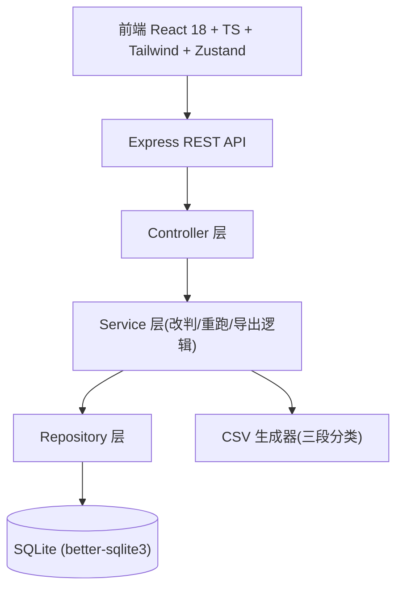
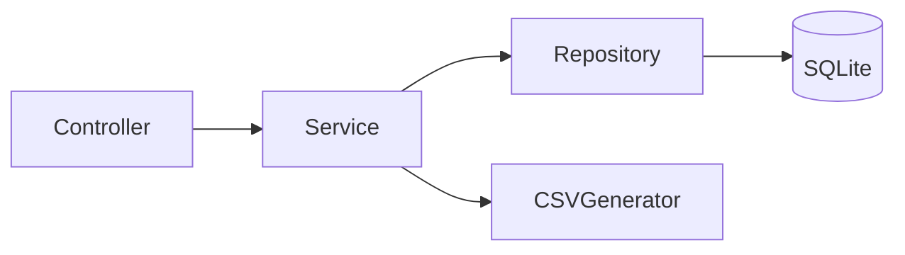
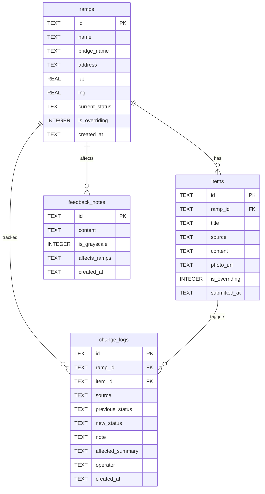

# 慢行桥坡道公示清单 — 技术架构文档

## 1. 架构设计

前端 React 单页应用通过 REST 调用 Express 后端；后端使用 Service/Repository 分层，数据持久化到本地 SQLite；CSV 明细在后端生成并按三段分类返回。地图采用自定义 SVG 点位图，零外部瓦片服务、完全可控设计。



## 2. 技术说明

- 前端：React@18 + TypeScript + tailwindcss@3 + Vite + react-router-dom + zustand
- 初始化工具：vite-init（模板 react-express-ts）
- 后端：Express@4 + TypeScript（ESM）
- 数据库：SQLite（better-sqlite3，文件本地存储，零外部服务）
- 地图：自定义 SVG/Canvas 点位图（无外部瓦片与 API Key）

## 3. 路由定义

| 路由 | 用途 |
|------|------|
| `/` | 公示清单主页：筛选、来源标记、当前状态、启动/重跑/导出 |
| `/ramps/:id` | 桥坡道详情：改判时间线、地图点位、补录与改判操作 |
| `/map` | 地图总览：全部坡道点位，按状态着色与补录/改判标记 |

## 4. API 定义

> 后端每次变更都返回改判来源、前一状态→当前状态、备注与影响的判断，而非仅"成功"。

```ts
// 来源类型
type Source = 'normal' | 'old_plan_override' | 'resident_feedback' | 'on_site_photo' | 'manual_override';
// 当前状态
type RampStatus = 'processed' | 'pending' | 'overridden';

// 清单项
interface RampListItem {
  id: string; name: string; bridgeName: string; address: string;
  lat: number; lng: number; status: RampStatus;
  sources: Source[];            // 涉及的来源集合（用于筛选/标记）
  isOverriding: boolean;        // 旧方案覆盖新意见标记
  lastChangeAt: string; lastChangeSource: Source;
}

// 改判记录
interface ChangeLog {
  id: string; rampId: string; source: Source;
  previousStatus: RampStatus | null; newStatus: RampStatus;
  note: string;                  // 居民反馈备注等
  affectedSummary: string;      // 改变了哪些判断（人可读）
  operator: string; createdAt: string;
}

GET    /api/ramps?source=&status=&overriding=   // 清单（含筛选）
GET    /api/ramps/:id                             // 详情（含材料、改判时间线、点位）
POST   /api/ramps/:id/changes                     // 写改判记录并更新当前状态
       body: { source, newStatus, note, affectedSummary, operator, itemId? }
POST   /api/ramps/:id/feedback                     // 居民反馈备注（灰度）
       body: { content, isGrayscale, affectsRamps }
POST   /api/ramps/:id/photos                       // 现场照片补录（写改判记录）
       body: { title, content, photoUrl, note, affectedSummary, operator }
POST   /api/list/generate                          // 启动生成
POST   /api/list/rerun                            // 重跑处理
GET    /api/export/csv?status=                     // 导出分类CSV（processed/pending/overridden）
```

## 5. 服务架构图



## 6. 数据模型

### 6.1 数据模型定义



### 6.2 数据定义语言

```sql
CREATE TABLE IF NOT EXISTS ramps (
  id TEXT PRIMARY KEY,
  name TEXT NOT NULL,
  bridge_name TEXT NOT NULL,
  address TEXT,
  lat REAL NOT NULL,
  lng REAL NOT NULL,
  current_status TEXT NOT NULL,   -- processed | pending | overridden
  is_overriding INTEGER NOT NULL DEFAULT 0,
  created_at TEXT NOT NULL,
  updated_at TEXT NOT NULL
);

CREATE TABLE IF NOT EXISTS items (
  id TEXT PRIMARY KEY,
  ramp_id TEXT NOT NULL REFERENCES ramps(id) ON DELETE CASCADE,
  title TEXT NOT NULL,
  source TEXT NOT NULL,            -- normal | old_plan_override | resident_feedback | on_site_photo | manual_override
  content TEXT,
  photo_url TEXT,
  is_overriding INTEGER NOT NULL DEFAULT 0,
  submitted_at TEXT NOT NULL
);
CREATE INDEX IF NOT EXISTS idx_items_ramp ON items(ramp_id);

CREATE TABLE IF NOT EXISTS change_logs (
  id TEXT PRIMARY KEY,
  ramp_id TEXT NOT NULL REFERENCES ramps(id) ON DELETE CASCADE,
  item_id TEXT REFERENCES items(id) ON DELETE SET NULL,
  source TEXT NOT NULL,
  previous_status TEXT,
  new_status TEXT NOT NULL,
  note TEXT,
  affected_summary TEXT,
  operator TEXT NOT NULL,
  created_at TEXT NOT NULL
);
CREATE INDEX IF NOT EXISTS idx_logs_ramp ON change_logs(ramp_id);
CREATE INDEX IF NOT EXISTS idx_logs_created ON change_logs(created_at);

CREATE TABLE IF NOT EXISTS feedback_notes (
  id TEXT PRIMARY KEY,
  content TEXT NOT NULL,
  is_grayscale INTEGER NOT NULL DEFAULT 0,
  affects_ramps TEXT,              -- JSON 数组
  created_at TEXT NOT NULL
);
```
