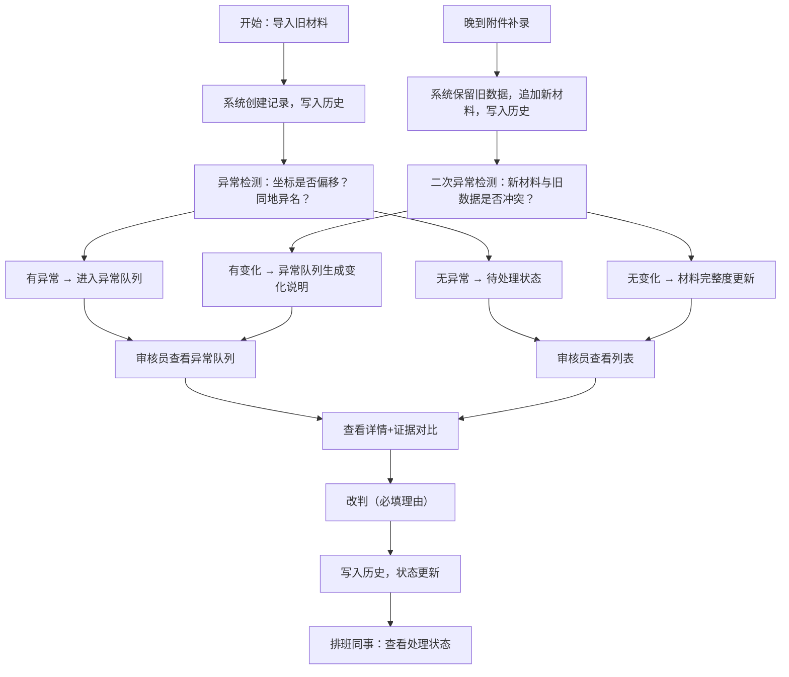

## 1. 产品概述

面向街道办基层工作人员的"口袋公园座椅公示清单"管理系统。解决材料分批到达、GIS点位不完整、异常坐标混入、同地异名等真实业务痛点，确保处理留痕、改判有据、异常可追溯。

- 核心用户：街道周姐（审核员）、排班同事（执行者）
- 核心价值：让零散材料可追踪、异常记录不混同、归并结果留证据、处理状态一目了然

## 2. 核心功能

### 2.1 用户角色

| 角色 | 描述 | 核心权限 |
|------|------|----------|
| 审核员 | 街道周姐，负责材料审核、改判 | 查看列表/详情、改判、导入材料、补录附件、查看异常队列、查看历史 |
| 执行者 | 排班同事，负责实际落地 | 查看处理状态、筛选待处理/待补证记录 |

### 2.2 功能模块

1. **清单列表页**：公示清单总览、状态筛选、快速查看、异常标记
2. **详情页**：单条记录全貌、GIS点位、材料附件、处理时间线
3. **改判功能**：修改判定结果、强制标注异常、填写改判理由
4. **历史面板**：所有操作留痕（导入、改判、补录、归并），不可删除
5. **异常队列**：坐标偏移、同地异名、材料冲突、晚到附件等异常记录集中展示
6. **材料导入**：支持导入旧材料（含GIS点位），分批导入不覆盖旧数据
7. **附件补录**：支持晚到附件追加，自动触发异常检测

### 2.3 页面详情

| 页面名称 | 模块名称 | 功能描述 |
|-----------|-------------|---------------------|
| 清单列表页 | 顶部筛选栏 | 按状态筛选（待处理/已通过/异常/待补证）、按街道筛选、关键词搜索 |
| 清单列表页 | 数据表格 | 显示编号、地点、GIS坐标、材料完整度、当前状态、最近操作时间、操作按钮 |
| 清单列表页 | 统计卡片 | 待处理数、异常数、待补证数、已通过数 |
| 详情页 | 基本信息区 | 编号、地点名称、街道、当前判定状态 |
| 详情页 | GIS点位区 | 显示所有批次的坐标记录，标注异常坐标（隔壁街等） |
| 详情页 | 材料附件区 | 分批次展示导入的材料和附件，显示导入时间和来源 |
| 详情页 | 操作时间线 | 完整历史记录时间轴 |
| 详情页 | 改判操作区 | 改判状态选择、理由填写、异常标记开关 |
| 改判弹窗 | 状态选择 | 通过/异常退回/待补证/疑似同地异名 |
| 改判弹窗 | 理由输入 | 必须填写改判理由 |
| 异常队列页 | 异常分类标签 | 坐标偏移/同地异名/材料冲突/晚到附件 |
| 异常队列页 | 异常列表 | 异常类型、关联记录、检测时间、处理状态、对比证据 |
| 历史面板 | 时间线组件 | 所有操作按时间倒序展示，操作人、操作类型、变更前后对比 |

## 3. 核心流程

用户（街道周姐）按下午换班前的真实节奏操作：先导入旧材料（GIS点位分批到达），系统自动生成待处理记录并检测异常；期间晚到附件补录，系统自动比对旧数据并在异常队列中生成变化说明；周姐查看异常队列了解变化，处理后改判；排班同事最终看到清晰的处理状态。

## 4. 用户界面设计

### 4.1 设计风格

- 主色调：深墨绿 `#1f4d3a`（政务感、稳重），配合暖橙 `#e87d3e` 作为异常警示色
- 辅助色：米白背景 `#faf7f2`，营造纸质档案般的踏实感
- 按钮风格：方中带圆（圆角4px），实线边框，点击有微下沉效果
- 字体：正文用 "Source Serif Pro" 衬线体（政务文书感），数据数字用 "JetBrains Mono" 等宽体
- 布局风格：顶部导航 + 左侧状态标签 + 主内容表格，参考老式档案管理系统但更清爽
- 图标风格：lucide-react 线性图标，异常用实心橙色图标突出

### 4.2 页面设计概述

| 页面名称 | 模块名称 | UI元素 |
|-----------|-------------|-------------|
| 清单列表页 | 统计卡片 | 4个带数字的方块卡片，异常卡用橙色边框，有轻微纸张纹理背景 |
| 清单列表页 | 数据表格 | 斑马纹行，异常行整行浅橙底色，鼠标悬停行左边缘出现深色竖条 |
| 详情页 | 时间线 | 左侧深绿竖线，每个节点是圆点，异常节点用橙色空心圆 |
| 详情页 | GIS点位 | 坐标列表，异常坐标卡片右上角贴橙色"偏·隔壁街"小标签 |
| 异常队列页 | 对比卡片 | 左右分栏对比，中间竖箭头"→"连接，变化字段用黄色高亮 |
| 改判弹窗 | 表单 | 理由输入框下方显示"此操作将永久留痕"灰色小字提醒 |

### 4.3 响应性

- Desktop-first 设计，最小宽度 1280px
- 表格列宽可拖动调整，长内容省略号截断，悬停显示完整 tooltip
- 侧边状态标签在窗口缩窄时自动变为顶部横向标签

### 4.4 动效与微交互

- 列表行 hover：0.15s 渐入左侧深绿竖条标记
- 改判成功：弹窗关闭后详情页时间线从顶部滑入新节点，带轻微"盖章"音效感的缩放动效
- 异常队列新记录：卡片从右侧滑入，橙色边框闪烁2次
- 页面切换：0.2s 淡入淡出
