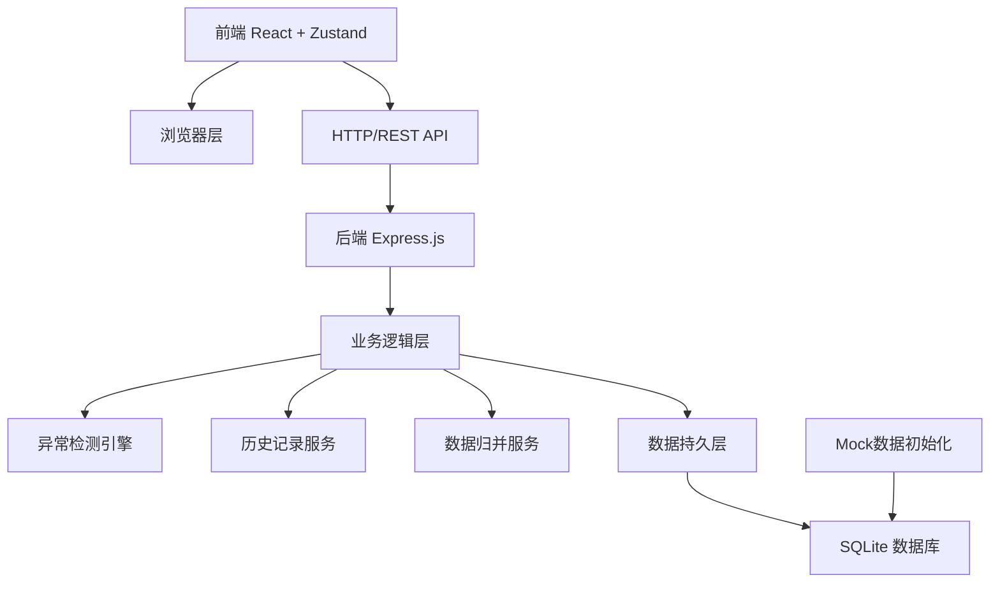
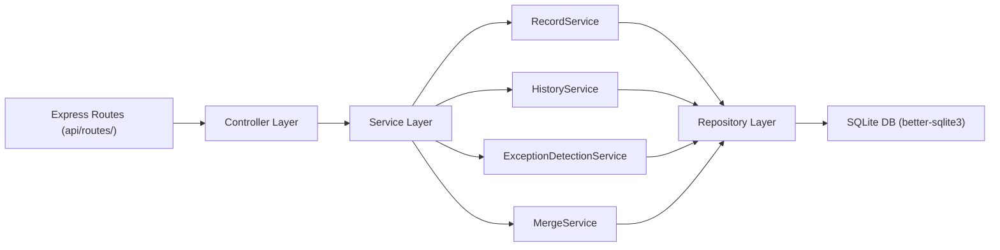
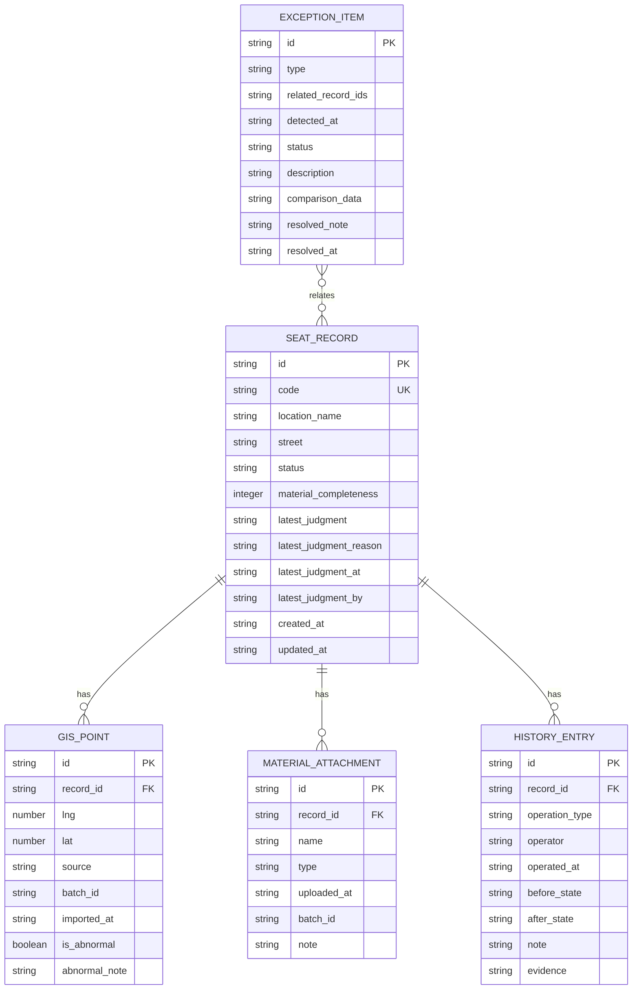

## 1. 架构设计



## 2. 技术描述

- 前端：React@18 + TypeScript + Vite + TailwindCSS@3 + Zustand + React Router DOM@6 + lucide-react
- 后端：Express@4 + TypeScript
- 数据库：SQLite（better-sqlite3），零配置、文件级存储，适合本地演示
- 状态管理：Zustand 管理前端状态，历史变更通过后端API持久化
- 图标：lucide-react

## 3. 路由定义

### 前端路由

| 路由 | 页面 | 用途 |
|-------|---------|---------|
| / | 清单列表页 | 查看所有公示清单记录，筛选、搜索 |
| /record/:id | 详情页 | 查看单条记录详情、GIS点位、材料、历史时间线 |
| /exceptions | 异常队列页 | 查看所有异常记录及对比证据 |
| /import | 材料导入页 | 导入旧材料、补录晚到附件（演示入口） |

### 后端API路由

| 方法 | 路由 | 用途 |
|-------|---------|---------|
| GET | /api/records | 获取清单列表（支持筛选、分页） |
| GET | /api/records/:id | 获取单条记录详情 |
| POST | /api/records | 创建新记录（导入材料） |
| PATCH | /api/records/:id/judgment | 改判记录状态（必填理由） |
| POST | /api/records/:id/attachments | 补录附件 |
| GET | /api/records/:id/history | 获取记录历史时间线 |
| GET | /api/exceptions | 获取异常队列列表 |
| PATCH | /api/exceptions/:id/status | 标记异常处理状态 |
| GET | /api/stats | 获取统计数据 |
| POST | /api/import/batch | 批量导入旧材料（演示用） |
| POST | /api/import/demo-late-attachment | 导入演示用晚到附件 |

## 4. API定义（TypeScript类型）

```typescript
// 共享类型 shared/types.ts

export type RecordStatus = 'pending' | 'approved' | 'exception' | 'need_evidence' | 'suspected_duplicate';

export type ExceptionType = 'coordinate_offset' | 'duplicate_location' | 'material_conflict' | 'late_attachment';

export type ExceptionStatus = 'open' | 'reviewed' | 'resolved';

export type OperationType = 'create' | 'import' | 'judgment_change' | 'attachment_add' | 'merge' | 'exception_detected';

export interface GisPoint {
  id: string;
  lng: number;
  lat: number;
  source: string;
  batchId: string;
  importedAt: string;
  isAbnormal?: boolean;
  abnormalNote?: string;
}

export interface MaterialAttachment {
  id: string;
  name: string;
  type: string;
  uploadedAt: string;
  batchId: string;
  note?: string;
}

export interface SeatRecord {
  id: string;
  code: string;
  locationName: string;
  street: string;
  status: RecordStatus;
  points: GisPoint[];
  attachments: MaterialAttachment[];
  materialCompleteness: number; // 0-100
  latestJudgment?: string;
  latestJudgmentReason?: string;
  latestJudgmentAt?: string;
  latestJudgmentBy?: string;
  createdAt: string;
  updatedAt: string;
}

export interface HistoryEntry {
  id: string;
  recordId: string;
  operationType: OperationType;
  operator: string;
  operatedAt: string;
  beforeState?: any;
  afterState?: any;
  note?: string;
  evidence?: string;
}

export interface ExceptionItem {
  id: string;
  type: ExceptionType;
  relatedRecordIds: string[];
  detectedAt: string;
  status: ExceptionStatus;
  description: string;
  comparisonData?: {
    before?: any;
    after?: any;
    changedFields?: string[];
  };
  resolvedNote?: string;
  resolvedAt?: string;
}

export interface JudgmentChangeRequest {
  status: RecordStatus;
  reason: string;
  markAsException?: boolean;
  operator: string;
}

export interface AttachmentUploadRequest {
  name: string;
  type: string;
  note?: string;
  gisPoints?: Omit<GisPoint, 'id' | 'importedAt'>[];
}

export interface StatsData {
  pending: number;
  approved: number;
  exception: number;
  needEvidence: number;
  total: number;
}
```

## 5. 服务端架构图



## 6. 数据模型

### 6.1 数据模型ER图



### 6.2 DDL

```sql
-- 口袋公园座椅公示清单 数据库初始化

CREATE TABLE IF NOT EXISTS seat_record (
    id TEXT PRIMARY KEY,
    code TEXT UNIQUE NOT NULL,
    location_name TEXT NOT NULL,
    street TEXT NOT NULL,
    status TEXT NOT NULL DEFAULT 'pending',
    material_completeness INTEGER NOT NULL DEFAULT 0,
    latest_judgment TEXT,
    latest_judgment_reason TEXT,
    latest_judgment_at TEXT,
    latest_judgment_by TEXT,
    created_at TEXT NOT NULL,
    updated_at TEXT NOT NULL
);

CREATE TABLE IF NOT EXISTS gis_point (
    id TEXT PRIMARY KEY,
    record_id TEXT NOT NULL,
    lng REAL NOT NULL,
    lat REAL NOT NULL,
    source TEXT NOT NULL,
    batch_id TEXT NOT NULL,
    imported_at TEXT NOT NULL,
    is_abnormal INTEGER NOT NULL DEFAULT 0,
    abnormal_note TEXT,
    FOREIGN KEY (record_id) REFERENCES seat_record(id)
);

CREATE TABLE IF NOT EXISTS material_attachment (
    id TEXT PRIMARY KEY,
    record_id TEXT NOT NULL,
    name TEXT NOT NULL,
    type TEXT NOT NULL,
    uploaded_at TEXT NOT NULL,
    batch_id TEXT NOT NULL,
    note TEXT,
    FOREIGN KEY (record_id) REFERENCES seat_record(id)
);

CREATE TABLE IF NOT EXISTS history_entry (
    id TEXT PRIMARY KEY,
    record_id TEXT NOT NULL,
    operation_type TEXT NOT NULL,
    operator TEXT NOT NULL,
    operated_at TEXT NOT NULL,
    before_state TEXT,
    after_state TEXT,
    note TEXT,
    evidence TEXT,
    FOREIGN KEY (record_id) REFERENCES seat_record(id)
);

CREATE TABLE IF NOT EXISTS exception_item (
    id TEXT PRIMARY KEY,
    type TEXT NOT NULL,
    related_record_ids TEXT NOT NULL,
    detected_at TEXT NOT NULL,
    status TEXT NOT NULL DEFAULT 'open',
    description TEXT NOT NULL,
    comparison_data TEXT,
    resolved_note TEXT,
    resolved_at TEXT
);

CREATE INDEX IF NOT EXISTS idx_record_status ON seat_record(status);
CREATE INDEX IF NOT EXISTS idx_record_street ON seat_record(street);
CREATE INDEX IF NOT EXISTS idx_gis_point_record ON gis_point(record_id);
CREATE INDEX IF NOT EXISTS idx_attachment_record ON material_attachment(record_id);
CREATE INDEX IF NOT EXISTS idx_history_record ON history_entry(record_id);
CREATE INDEX IF NOT EXISTS idx_exception_status ON exception_item(status);
```
