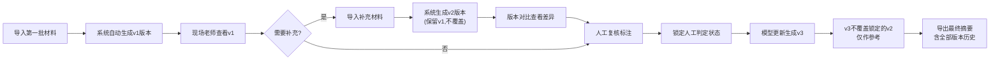
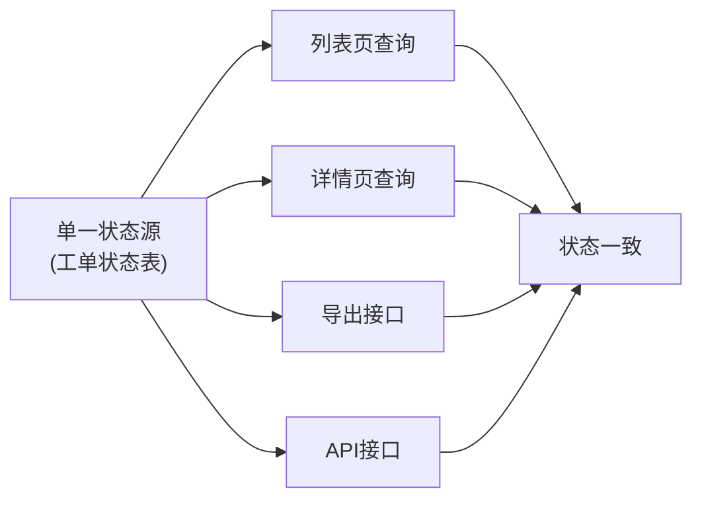

## 1. 产品概述

客服摘要证据复核系统，解决人工兜底效率低、状态不一致、历史判断被覆盖等核心问题。通过版本控制机制确保人工判断永不被自动覆盖，状态在接口明细和导出页面间保持一致，为现场老师提供清晰的处理进度和差异对比视图。

- **核心问题**：人工修正被新结果覆盖、状态不一致、后补材料无声覆盖、样本泄漏无标记、历史版本丢失、进度不清晰
- **目标用户**：现场老师（主要使用者）、标注负责人（周姐，人工复核）
- **核心价值**：版本可控、状态一致、差异可见、标记清晰、进度明确

## 2. 核心 Features

### 2.1 User Roles

| Role | 说明 | 核心权限 |
|------|------|----------|
| 现场老师 | 主要使用者，负责查看复核结果、补充证据、对比差异 | 查看工单列表、详情、版本对比、导入材料、导出摘要、标记处理状态 |
| 标注负责人 | 人工复核兜底，最终判定 | 上述权限 + 人工复核判定、锁定状态 |

### 2.2 Feature Module

1. **工单列表页**：进度看板、筛选过滤、状态标记、版本信息
2. **工单详情页**：版本时间线、证据明细、复核状态、操作记录、样本泄漏标记
3. **版本对比页**：两次复核结果差异对比、高亮变化、变更摘要
4. **导入导出**：材料导入（支持分批）、摘要导出（含版本标记和状态）

### 2.3 Page Details

| 页面名称 | 模块名称 | Feature description |
|---------|---------|---------------------|
| 工单列表页 | 进度看板 | 分栏展示：待处理 / 已处理 / 需补充证据，数字统计卡片 |
| 工单列表页 | 筛选过滤 | 按状态、日期、是否含样本泄漏、是否有人工标记筛选 |
| 工单列表页 | 工单卡片 | 工单编号、客户问题、当前状态、最新版本号、最后操作时间、标记徽章 |
| 工单列表页 | 批量操作 | 批量导出、批量标记待处理 |
| 工单详情页 | 版本时间线 | 垂直时间线展示所有历史版本，人工锁定版本有特殊标识 |
| 工单详情页 | 证据明细 | 逐条展示证据，含来源标记（导入/补充/自动）、样本泄漏红色标记 |
| 工单详情页 | 复核操作区 | 人工判定按钮、补充证据入口、锁定/解锁状态 |
| 工单详情页 | 操作日志 | 完整记录每一次操作的人员、时间、内容 |
| 版本对比页 | 版本选择 | 下拉选择两个版本进行对比 |
| 版本对比页 | 差异高亮 | 新增/删除/修改的证据用不同颜色高亮 |
| 版本对比页 | 变更摘要 | 自动生成变更说明：新增X条、修改X条、删除X条 |
| 导入导出 | 材料导入 | 支持JSON/CSV导入，自动识别批次，创建新版本而非覆盖 |
| 导入导出 | 摘要导出 | 导出PDF/Excel，包含完整版本信息、状态、标记、变更历史 |

## 3. 核心 Process

### 主流程：分批导入 + 复核 + 导出

### 状态一致性保证

## 4. User Interface Design

### 4.1 Design Style

**设计方向：专业严谨的政务/企业级风格**

- **主色调**：深海蓝 `#1e3a5f`（专业、可信）
- **辅助色**：
  - 琥珀橙 `#f59e0b`（待处理、需补充）
  - 翡翠绿 `#10b981`（已处理、正常）
  - 警示红 `#ef4444`（样本泄漏、错误）
  - 锁定紫 `#8b5cf6`（人工锁定、不可覆盖）
- **中性色**： slate 色系（`#f8fafc` 背景、`#334155` 正文、`#94a3b8` 次要文字）
- **按钮风格**：直角、细边框、实心填充主按钮、幽灵次按钮，2px圆角
- **字体**：
  - 标题：思源黑体 Heavy / `PingFang SC` - 粗体、字间距收紧
  - 正文：思源黑体 Regular / `PingFang SC` - 常规字重、行高1.6
  - 数字：`JetBrains Mono` - 等宽字体保证对齐
- **布局风格**：卡片式网格 + 清晰分割线 + 充足留白
- **图标风格**：线性图标（Lucide），统一16px/20px尺寸

### 4.2 Page Design Overview

| 页面名称 | 模块名称 | UI Elements |
|---------|---------|-------------|
| 工单列表页 | 进度看板 | 顶部3张统计卡片，数字用等宽字体大号显示，卡片底部有进度条微动画 |
| 工单列表页 | 筛选栏 | 贴顶固定，标签式筛选器，选中态有底部蓝色指示条 |
| 工单列表页 | 工单列表 | 左对齐密度布局，每行左侧有状态色条，右侧有操作按钮组，hover高亮 |
| 工单详情页 | 版本时间线 | 左侧垂直时间线，节点用不同颜色区分状态，锁定版本加锁图标 |
| 工单详情页 | 证据表格 | 斑马纹表格，样本泄漏行整行浅红底色+红色三角标记 |
| 工单详情页 | 操作区 | 底部固定操作栏，人工判定按钮突出显示 |
| 版本对比页 | 对比视图 | 左右分栏布局，中间有联动滚动，差异行背景色区分 |
| 导入导出 | 模态框 | 半透明磨砂玻璃效果，拖拽上传区有虚线边框，hover变实线 |

### 4.3 交互动效

- **页面加载**：内容区域从上到下渐入，卡片逐个延迟100ms出现
- **状态切换**：状态标签变化时有颜色过渡动画（300ms ease）
- **版本展开**：时间线节点点击展开时，内容区域高度平滑过渡
- **表格行hover**：背景色过渡 + 左侧色条加宽效果
- **按钮点击**：轻微缩放（scale: 0.97）+ 涟漪效果

### 4.4 Responsiveness

- Desktop-first 设计，主内容区固定宽度1280px居中
- 平板端（≥768px）：卡片改为2列布局，时间线保持垂直
- 移动端（<768px）：简化为单列，筛选栏折叠为下拉菜单
