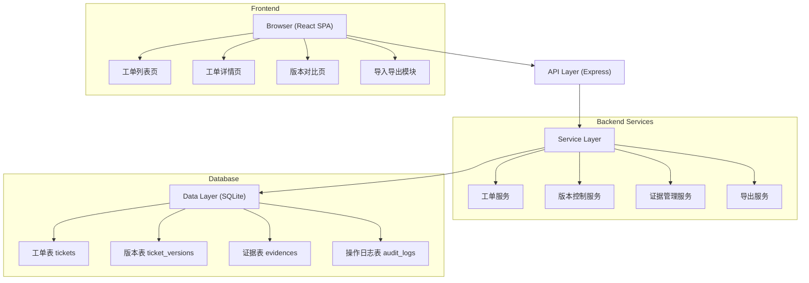
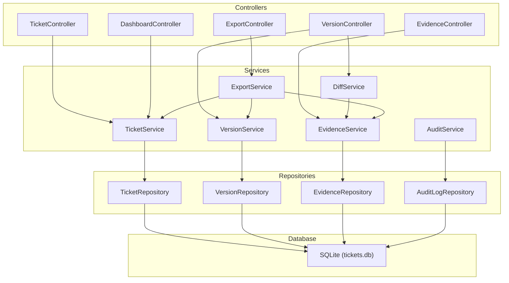
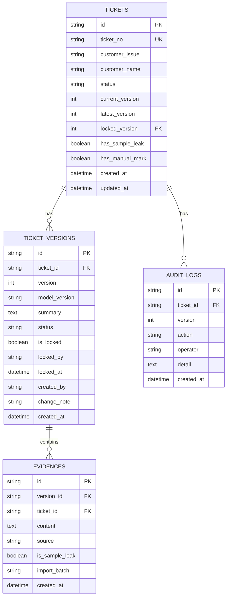

## 1. Architecture Design



## 2. Technology Description

- **Frontend**: React@18 + TypeScript + tailwindcss@3 + vite@5 + React Router@6
- **状态管理**: Zustand（轻量，适合中小规模应用）
- **UI组件**: Lucide React（图标）+ 自定义组件
- **初始化工具**: vite-init
- **Backend**: Express@4 + TypeScript
- **Database**: SQLite（文件型，无需额外服务，内置mock数据）
- **HTTP客户端**: Axios

## 3. Route Definitions

| Route | 页面 | Purpose |
|-------|------|---------|
| `/` | 工单列表页 | 展示所有工单、进度看板、筛选过滤 |
| `/ticket/:id` | 工单详情页 | 版本时间线、证据明细、复核操作 |
| `/ticket/:id/compare` | 版本对比页 | 两个版本的差异对比 |
| `/import` | 导入页 | 材料批量导入 |

## 4. API Definitions

### TypeScript 类型定义

```typescript
// 工单状态
type TicketStatus = 'pending' | 'processing' | 'need_evidence' | 'completed' | 'locked';

// 证据来源
type EvidenceSource = 'import' | 'supplement' | 'auto' | 'manual';

// 工单
interface Ticket {
  id: string;
  ticketNo: string;
  customerIssue: string;
  customerName: string;
  status: TicketStatus;
  currentVersion: number;
  latestVersion: number;
  lockedVersion: number | null;
  hasSampleLeak: boolean;
  hasManualMark: boolean;
  createdAt: string;
  updatedAt: string;
}

// 工单版本
interface TicketVersion {
  id: string;
  ticketId: string;
  version: number;
  modelVersion: string;
  summary: string;
  status: TicketStatus;
  isLocked: boolean;
  lockedBy: string | null;
  lockedAt: string | null;
  evidences: Evidence[];
  createdAt: string;
  createdBy: string;
  changeNote: string;
}

// 证据
interface Evidence {
  id: string;
  versionId: string;
  ticketId: string;
  content: string;
  source: EvidenceSource;
  isSampleLeak: boolean;
  importBatch: string;
  createdAt: string;
}

// 操作日志
interface AuditLog {
  id: string;
  ticketId: string;
  version: number;
  action: string;
  operator: string;
  detail: string;
  createdAt: string;
}

// 差异对比结果
interface DiffResult {
  added: Evidence[];
  removed: Evidence[];
  modified: Evidence[];
  unchanged: Evidence[];
  summary: {
    addedCount: number;
    removedCount: number;
    modifiedCount: number;
    unchangedCount: number;
  };
}
```

### API 接口

| Method | Path | Description | Request | Response |
|--------|------|-------------|---------|----------|
| GET | `/api/tickets` | 获取工单列表 | `{ status?, hasSampleLeak?, hasManualMark?, page?, pageSize? }` | `{ data: Ticket[], total: number }` |
| GET | `/api/tickets/:id` | 获取工单详情 | - | `Ticket` |
| GET | `/api/tickets/:id/versions` | 获取工单所有版本 | - | `TicketVersion[]` |
| GET | `/api/tickets/:id/versions/:version` | 获取指定版本详情 | - | `TicketVersion` |
| POST | `/api/tickets/:id/versions` | 创建新版本（导入/补充材料） | `{ evidences: Omit<Evidence, 'id'>[], changeNote: string, modelVersion?: string }` | `TicketVersion` |
| GET | `/api/tickets/:id/compare` | 版本对比 | `{ v1: number, v2: number }` | `DiffResult` |
| POST | `/api/tickets/:id/lock` | 锁定人工判定版本 | `{ version: number, operator: string }` | `{ success: boolean, lockedVersion: number }` |
| POST | `/api/tickets/:id/unlock` | 解锁 | - | `{ success: boolean }` |
| PATCH | `/api/tickets/:id/status` | 更新工单状态 | `{ status: TicketStatus, operator: string }` | `Ticket` |
| POST | `/api/tickets/import` | 批量导入工单 | `File (JSON/CSV)` | `{ imported: number, tickets: Ticket[] }` |
| GET | `/api/tickets/:id/export` | 导出工单摘要 | `{ format: 'pdf' \| 'excel' }` | 文件流 |
| GET | `/api/tickets/:id/audit-logs` | 获取操作日志 | - | `AuditLog[]` |
| GET | `/api/dashboard/stats` | 获取看板统计 | - | `{ pending: number, processing: number, needEvidence: number, completed: number }` |

## 5. Server Architecture Diagram



## 6. Data Model

### 6.1 ER Diagram



### 6.2 DDL + 初始数据

```sql
-- 工单表
CREATE TABLE tickets (
  id TEXT PRIMARY KEY,
  ticket_no TEXT UNIQUE NOT NULL,
  customer_issue TEXT NOT NULL,
  customer_name TEXT NOT NULL,
  status TEXT NOT NULL DEFAULT 'pending',
  current_version INTEGER NOT NULL DEFAULT 1,
  latest_version INTEGER NOT NULL DEFAULT 1,
  locked_version INTEGER,
  has_sample_leak BOOLEAN NOT NULL DEFAULT 0,
  has_manual_mark BOOLEAN NOT NULL DEFAULT 0,
  created_at DATETIME NOT NULL DEFAULT CURRENT_TIMESTAMP,
  updated_at DATETIME NOT NULL DEFAULT CURRENT_TIMESTAMP
);

-- 版本表
CREATE TABLE ticket_versions (
  id TEXT PRIMARY KEY,
  ticket_id TEXT NOT NULL,
  version INTEGER NOT NULL,
  model_version TEXT,
  summary TEXT,
  status TEXT NOT NULL DEFAULT 'pending',
  is_locked BOOLEAN NOT NULL DEFAULT 0,
  locked_by TEXT,
  locked_at DATETIME,
  created_by TEXT NOT NULL,
  change_note TEXT,
  created_at DATETIME NOT NULL DEFAULT CURRENT_TIMESTAMP,
  FOREIGN KEY (ticket_id) REFERENCES tickets(id),
  UNIQUE(ticket_id, version)
);

-- 证据表
CREATE TABLE evidences (
  id TEXT PRIMARY KEY,
  version_id TEXT NOT NULL,
  ticket_id TEXT NOT NULL,
  content TEXT NOT NULL,
  source TEXT NOT NULL DEFAULT 'import',
  is_sample_leak BOOLEAN NOT NULL DEFAULT 0,
  import_batch TEXT NOT NULL,
  created_at DATETIME NOT NULL DEFAULT CURRENT_TIMESTAMP,
  FOREIGN KEY (version_id) REFERENCES ticket_versions(id),
  FOREIGN KEY (ticket_id) REFERENCES tickets(id)
);

-- 操作日志表
CREATE TABLE audit_logs (
  id TEXT PRIMARY KEY,
  ticket_id TEXT NOT NULL,
  version INTEGER,
  action TEXT NOT NULL,
  operator TEXT NOT NULL,
  detail TEXT,
  created_at DATETIME NOT NULL DEFAULT CURRENT_TIMESTAMP,
  FOREIGN KEY (ticket_id) REFERENCES tickets(id)
);

-- 索引
CREATE INDEX idx_tickets_status ON tickets(status);
CREATE INDEX idx_tickets_updated ON tickets(updated_at DESC);
CREATE INDEX idx_versions_ticket ON ticket_versions(ticket_id, version DESC);
CREATE INDEX idx_evidences_version ON evidences(version_id);
CREATE INDEX idx_evidences_leak ON evidences(is_sample_leak);
CREATE INDEX idx_audit_ticket ON audit_logs(ticket_id, created_at DESC);
```

### 6.3 核心业务规则（防覆盖机制）

1. **版本号单调递增**：每次导入/补充材料创建新版本，version + 1，永不覆盖旧版本
2. **锁定版本保护**：`is_locked = true` 的版本，任何自动操作（模型更新等）不能修改
3. **人工判定优先**：`locked_version` 存在时，列表/详情/导出默认展示该版本内容
4. **新版本不自动覆盖**：模型更新生成新版本后，`latest_version` 更新但 `current_version` 保持锁定值
5. **变更记录强制**：每次创建新版本必须填写 `change_note`，记录变更原因
6. **单一状态源**：所有状态查询统一走工单表的 `status` 字段，接口和导出使用同一数据源
