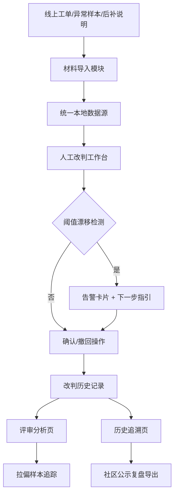

## 1. 产品概述

"客服摘要人工改判"是面向标注团队、算法值班人员的内部质检工具，用于处理客服摘要模型输出的改判复核工作。系统解决阈值调整后旧结论追溯困难、材料分散管理、改判历史不可溯、异常样本难以定位的核心痛点。

- 目标用户：标注负责人（周姐）、标注员、算法值班人员
- 核心价值：将导入、确认、撤回、截图说明统一到同一份本地数据源，降低沟通成本，提供可解释的改判追溯链路

## 2. 核心功能

### 2.1 用户角色

| 角色 | 注册方式 | 核心权限 |
|------|----------|----------|
| 标注员 | 内部账号 | 导入材料、人工改判确认/撤回、上传截图说明 |
| 标注负责人 | 内部账号 | 全部标注员权限、批量审核、阈值配置、导出汇总 |
| 算法值班人 | 内部账号 | 查看总指标、追踪拉偏样本、复盘历史、重新导出 |

### 2.2 功能模块

1. **工作台总览页**：核心指标卡片、阈值漂移告警、待办列表、快速导航
2. **材料导入与管理页**：工单导入、异常样本录入、后补说明补充、本地数据统一管理
3. **人工改判工作台**：逐条审阅、结论确认/撤回、截图说明上传、阈值漂移提示与下一步指引
4. **评审分析页**：总指标看板、拉偏样本追踪、样本影响分析
5. **历史追溯页**：改判前后对比、变更时间线、社区公示复盘材料导出

### 2.3 页面详情

| 页面名称 | 模块名称 | 功能描述 |
|----------|----------|----------|
| 工作台总览 | 指标卡片区 | 今日改判量、确认率、撤回率、阈值健康度四项核心数字 |
| 工作台总览 | 阈值漂移告警条 | 红色醒目提示当前阈值漂移，附人可读的下一步操作指引 |
| 工作台总览 | 快速导航区 | 算法值班人视角三入口：材料位置、异常分析、重新导出 |
| 工作台总览 | 待办列表 | 按优先级排列的待改判、待复核任务 |
| 材料导入管理 | 工单导入区 | 支持线上工单批量导入，导入后进入本地统一数据源 |
| 材料导入管理 | 异常样本登记 | 录入名称不一致的材料，标记为"异常样本"标签 |
| 材料导入管理 | 后补说明管理 | 补充后加的说明文档，关联到对应工单记录 |
| 人工改判工作台 | 左侧样本列表 | 按标签分类（线上工单/异常样本/后补说明）的待处理列表 |
| 人工改判工作台 | 中间详情区 | 工单原文、模型摘要、对比视图、截图说明面板 |
| 人工改判工作台 | 右侧操作区 | 确认改判、撤回、阈值漂移提示卡片、下一步可执行指引 |
| 评审分析页 | 总指标看板 | 总体准确率、改判前后对比趋势、各标签分布 |
| 评审分析页 | 拉偏样本列表 | 按影响度排序的样本清单，标注每条对总结论的拉偏权重 |
| 评审分析页 | 样本影响分析 | 可视化展示单条样本如何影响整体结论分布 |
| 历史追溯页 | 变更时间线 | 每条记录的确认/撤回/修改操作时间轴，含操作人 |
| 历史追溯页 | 前后对比视图 | 人工确认前后的摘要文本高亮对比，截图说明联动展示 |
| 历史追溯页 | 复盘导出区 | 一键导出社区公示用的材料包（含解释说明文档） |

## 3. 核心流程

**主流程**：标注员从线上导入工单 → 系统统一存入本地数据源 → 标注员逐条审阅并确认/撤回改判，必要时附截图说明 → 系统自动记录变更历史 → 算法值班人查看评审分析，追踪拉偏样本 → 社区公示前从历史追溯页导出复盘材料包。

**阈值漂移触发流程**：系统检测到阈值调整 → 标记受影响的旧结论记录 → 在改判工作台弹出告警卡片 → 展示人可照着执行的具体步骤（如：① 优先处理近7天高权重样本 ② 对比调整前后阈值区间 ③ 确认完成后导出差异清单）。

## 4. 用户界面设计

### 4.1 设计风格

- **主色调**：深海蓝 `#1e3a5f`（专业、稳重，契合内部质检工具定位）
- **辅助色**：琥珀橙 `#e8922d`（告警/阈值漂移高亮）、苔绿 `#3f7d58`（确认通过）、赤红 `#c8423a`（撤回/异常）
- **中性色**：冷灰阶为主，区分层级
- **按钮风格**：圆角 8px，微立体阴影，主按钮使用深海蓝实色填充，危险操作赤红描边+浅色底
- **字体**：标题使用 "Noto Serif SC"（衬线，增强正式感），正文使用 "Noto Sans SC"（无衬线，保证长文本可读性）
- **字号梯度**：大标题 28px / 副标题 20px / 正文 14px / 辅助说明 12px
- **布局风格**：三栏式工作台为主，顶部全局导航 + 左侧分类列表 + 中间内容区 + 右侧操作/信息面板
- **图标风格**：线性描边图标（Lucide 风格），统一 1.5px 线宽，避免彩色 emoji
- **背景氛围**：极淡的噪点纹理叠加 + 顶部微弱渐变光晕，避免纯白单调

### 4.2 页面设计概述

| 页面名称 | 模块名称 | UI 元素 |
|----------|----------|---------|
| 工作台总览 | 指标卡片区 | 4 张悬浮卡片带轻微投影，大数字 + 趋势小箭头，背景用微渐变区分 |
| 工作台总览 | 阈值漂移告警条 | 琥珀橙描边 + 浅橙背景，左侧大感叹号图标，右侧分步指引用有序列表 |
| 工作台总览 | 快速导航区 | 3 张大色块按钮（材料=蓝/异常=橙/导出=绿），图标+标题+副标题说明 |
| 人工改判工作台 | 样本列表 | 左侧 280px 固定宽，标签过滤器用胶囊形，列表项悬停背景色变化 |
| 人工改判工作台 | 中间详情 | 工单原文与模型摘要上下并排或左右对比，差异文本用背景色高亮 |
| 人工改判工作台 | 右侧操作区 | 确认/撤回按钮上下排列，阈值漂移卡片折叠式展开 |
| 评审分析页 | 拉偏样本 | 表格 + 影响度进度条（红到绿渐变），可点击展开详情 |
| 历史追溯页 | 时间线 | 垂直时间线，确认用绿点、撤回用红点、修改用蓝点，悬停显示操作人 |

### 4.3 响应式

- 桌面优先设计（最低支持 1440×900）
- 平板端（≥1024px）：三栏压缩为两栏，右侧操作区改为底部抽屉
- 移动端（<768px）：单栏堆叠，标签过滤器改为横向滚动

### 4.4 视觉细节

- **卡片悬浮**：所有可交互卡片加 `hover:translateY(-2px)` 微动效，过渡 200ms
- **数据高亮**：阈值漂移的数字用脉冲动画（`opacity` 80%↔100% 循环）
- **入场动画**：页面加载时各模块按 80ms 间隔错位淡入 + 上移
- **确认反馈**：点击确认后按钮出现绿勾动画，记录项滑入"已完成"列表
