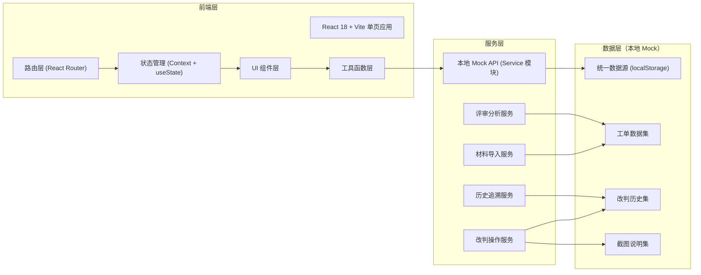
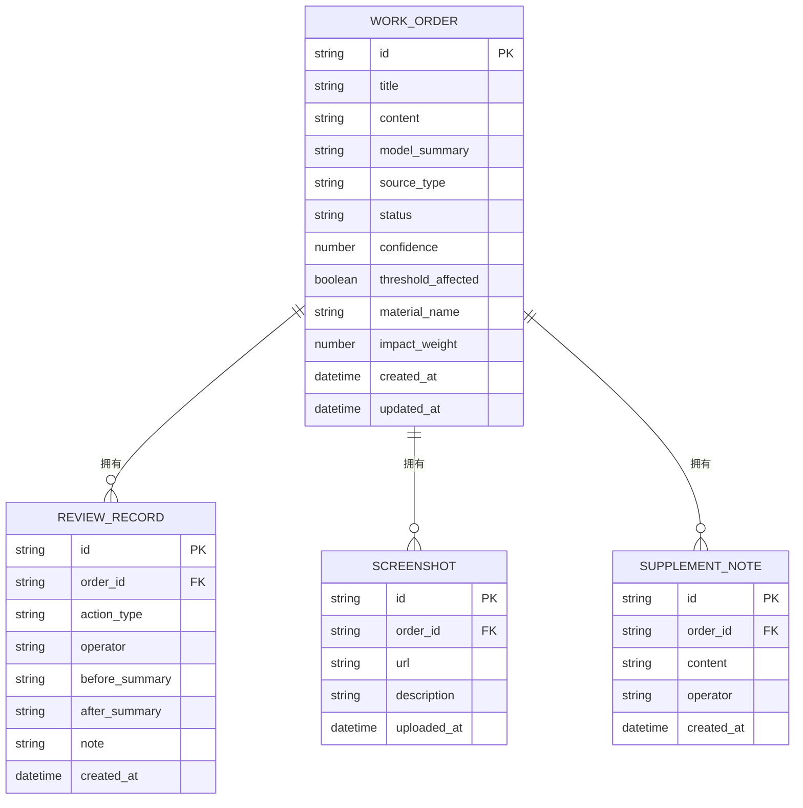

## 1. 架构设计



## 2. 技术描述

- **前端框架**：React@18 + React Router DOM@6
- **构建工具**：Vite@5
- **样式方案**：TailwindCSS@3（原子化样式）+ 自定义 CSS Variables（设计 token）
- **图标库**：lucide-react（线性描边图标，契合设计风格）
- **状态管理**：React Context（应用级状态）+ 组件级 useState/useReducer
- **持久化**：localStorage 模拟本地数据源，初始化时注入 Mock 数据
- **后端**：无后端，全部使用本地 Mock 数据 + Service 层封装
- **初始化工具**：npm create vite@latest

## 3. 路由定义

| 路由路径 | 页面名称 | 用途 |
|----------|----------|------|
| `/` | 工作台总览 | 核心指标、阈值告警、快速导航、待办列表 |
| `/materials` | 材料导入管理 | 工单导入、异常样本登记、后补说明管理 |
| `/workbench` | 人工改判工作台 | 逐条审阅、确认/撤回、截图说明、阈值指引 |
| `/review` | 评审分析页 | 总指标看板、拉偏样本追踪、影响分析 |
| `/history` | 历史追溯页 | 变更时间线、前后对比、复盘导出 |

## 4. 数据模型

### 4.1 数据模型定义（ER 图）



### 4.2 Mock 数据规范

**工单数据 (WORK_ORDER)**：至少 12 条样本，包含：
- 7 条线上工单（source_type = "online_ticket"）
- 2 条名称不一致的异常样本（source_type = "anomaly"，material_name 故意与 title 不一致）
- 3 条带后补说明的工单（关联 SUPPLEMENT_NOTE）
- 4 条标记为 threshold_affected = true（受阈值漂移影响）
- impact_weight 范围 0.1-2.5，按影响度排序

**改判历史 (REVIEW_RECORD)**：预置 5 条已确认 + 2 条已撤回记录，含操作人（周姐、标注员A/B、算法值班人）

**截图说明 (SCREENSHOT)**：预置 3 条关联记录，使用占位图 URL

## 5. 项目目录结构

```
src/
├── assets/              # 静态资源（全局 CSS、图标等）
│   └── index.css        # Tailwind 入口 + 自定义 design tokens
├── components/          # 通用可复用组件
│   ├── Layout/          # 布局组件（导航、侧边栏）
│   ├── MetricCard/      # 指标卡片
│   ├── ThresholdAlert/  # 阈值漂移告警组件
│   ├── QuickNav/        # 快速导航卡片
│   ├── OrderList/       # 工单列表组件
│   ├── StatusTag/       # 状态标签
│   └── Timeline/        # 时间线组件
├── data/                # Mock 数据
│   └── mockData.js      # 工单、历史、截图、后补说明
├── pages/               # 页面组件（对应路由）
│   ├── Dashboard.jsx    # 工作台总览
│   ├── Materials.jsx    # 材料导入管理
│   ├── Workbench.jsx    # 人工改判工作台
│   ├── Review.jsx       # 评审分析页
│   └── History.jsx      # 历史追溯页
├── services/            # 业务服务层
│   ├── orderService.js  # 工单 CRUD、导入
│   ├── reviewService.js # 改判操作、历史查询
│   └── storage.js       # localStorage 封装
├── utils/               # 工具函数
│   └── helpers.js       # 格式化、计算影响度等
├── App.jsx              # 路由入口
└── main.jsx             # 应用入口
```

## 6. 关键交互实现要点

1. **统一数据源**：所有模块通过 `services/storage.js` 读写 localStorage，key 为 `cs_judgement_data`，初始化时从 `data/mockData.js` 注入，确保导入/确认/撤回/截图指向同一份数据。
2. **阈值漂移提示**：在 Workbench 中检测当前工单的 `threshold_affected`，为 true 时渲染 `ThresholdAlert` 组件，展示 3 步可执行指引：① 优先处理高权重样本 ② 对比阈值区间 ③ 导出差异清单。
3. **拉偏样本追踪**：Review 页按 `impact_weight` 降序排列，每条展示影响度进度条（颜色从赤红→苔绿映射），点击展开显示该样本如何改变总结论分布的计算逻辑。
4. **历史追溯**：History 页渲染垂直 Timeline，按时间倒序展示所有 REVIEW_RECORD，关联 before/after 摘要高亮对比，点击导出按钮生成包含所有解释材料的 JSON 下载。
5. **算法值班人快速导航**：Dashboard 顶部固定 3 张大色块按钮："材料位置"（跳转 /materials）、"异常分析"（跳转 /review 并自动过滤高权重异常）、"重新导出"（跳转 /history 并自动定位导出区）。
