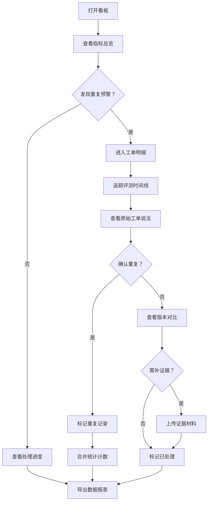

## 1. 产品概述

客服摘要指标看板是面向AI模型评测团队的内部工具，核心解决线上工单重复评测导致的数据统计失真问题。通过对工单评测记录的去重追踪、版本留存和证据链管理，确保评测指标的准确性和可追溯性。

- 主要解决：同一条工单样本因后补备注、重复提交等原因被多次评测，导致指标统计重复计数
- 目标用户：AI模型评测负责人、数据质量管理员
- 产品价值：建立可信的评测数据链，支持模型迭代的效果验证

## 2. 核心功能

### 2.1 用户角色

| 角色 | 注册方式 | 核心权限 |
|------|----------|----------|
| 评测负责人 | 企业账号登录 | 查看看板、标记异常、导出数据、管理证据材料 |
| 数据管理员 | 企业账号登录 | 上传工单、标记后补备注、处理重复记录 |

### 2.2 功能模块

1. **指标总览页**：核心指标卡片、重复评测预警、处理进度统计
2. **工单明细页**：工单列表、重复评测追踪、版本对比、证据链展示
3. **异常处理页**：重复记录标记、后补备注识别、证据材料管理
4. **数据导出页**：多维度筛选、导出配置、历史导出记录

### 2.3 页面详情

| 页面名称 | 模块名称 | 功能描述 |
|---------|----------|----------|
| 指标总览页 | 指标卡片区 | 展示评测总量、去重后有效量、重复率、后补备注占比等核心指标 |
| 指标总览页 | 重复预警区 | 高亮显示重复评测工单，点击可追溯原始工单说法 |
| 指标总览页 | 处理进度区 | 已处理/待处理/需补证据的工单数量及占比 |
| 工单明细页 | 工单列表区 | 展示工单ID、问题描述、模型版本、人工判断、评测时间 |
| 工单明细页 | 重复追踪区 | 同一工单的多次评测记录时间线，区分正常评测与重复评测 |
| 工单明细页 | 版本对比区 | 不同模型版本下的人工判断对比，旧版本判断永久留存 |
| 工单明细页 | 证据链区 | 后补备注原文、原始工单链接、评测操作日志 |
| 异常处理页 | 重复标记区 | 手动标记重复记录，合并统计计数 |
| 异常处理页 | 后补备注区 | 识别并标记后补备注工单，防止重复计数 |
| 异常处理页 | 材料上传区 | 上传补充证据材料，关联到对应工单 |
| 数据导出页 | 筛选配置区 | 按时间、模型版本、处理状态等维度筛选数据 |
| 数据导出页 | 导出记录区 | 历史导出文件列表，支持重新下载 |

## 3. 核心流程

评测负责人打开看板，首先在总览页了解整体指标和异常预警。发现重复评测问题后，点击进入工单明细页，查看同一工单的多次评测时间线，追溯原始工单说法。确认重复后在异常处理页标记重复记录，合并统计。对于模型版本变更的工单，可在版本对比区查看新旧人工判断，旧判断不会被覆盖。需要补充证据的工单可上传材料，最后通过数据导出页生成报表。

## 4. 用户界面设计

### 4.1 设计风格
- **主色调**：深海蓝 #165DFF 作为主色，代表专业可信；搭配珊瑚橙 #FF7D00 作为异常预警色
- **辅助色**：成功绿 #00B42A、警告黄 #FF7D00、错误红 #F53F3F
- **按钮风格**：圆角8px，悬浮时有轻微上浮效果，点击有按压反馈
- **字体**：标题使用思源黑体 Bold，正文使用思源黑体 Regular，数字使用等宽字体增强可读性
- **布局风格**：卡片式布局，信息层级分明，关键数据突出显示
- **图标风格**：线性图标，保持简洁统一，异常状态使用填充图标增强警示

### 4.2 页面设计概述

| 页面名称 | 模块名称 | UI元素 |
|---------|----------|--------|
| 指标总览页 | 指标卡片区 | 大字号数字、趋势箭头、环形进度条、卡片悬浮动效 |
| 指标总览页 | 重复预警区 | 红色警示标签、时间线展开动画、原始工单链接高亮 |
| 指标总览页 | 处理进度区 | 堆叠条形图、状态标签、进度百分比 |
| 工单明细页 | 工单列表区 | 斑马纹表格、行悬浮高亮、可展开详情行 |
| 工单明细页 | 重复追踪区 | 垂直时间线、不同颜色节点区分评测类型、连线动画 |
| 工单明细页 | 版本对比区 | 左右分栏对比、差异高亮、旧版本标签不可删除 |
| 工单明细页 | 证据链区 | 文件缩略图、上传时间戳、材料类型标签 |
| 异常处理页 | 重复标记区 | 复选框批量选择、确认弹窗、操作成功提示 |
| 异常处理页 | 后补备注区 | 特殊标记徽章、备注原文展开、原始工单引用 |
| 异常处理页 | 材料上传区 | 拖拽上传区域、上传进度条、文件预览 |
| 数据导出页 | 筛选配置区 | 下拉选择器、日期范围选择器、条件堆叠 |
| 数据导出页 | 导出记录区 | 文件列表、下载按钮、导出时间戳 |

### 4.3 响应式
- 采用桌面优先设计，最小支持1280px宽度
- 侧边栏在小屏幕可收起，内容区自适应调整
- 表格在窄屏可横向滚动，关键列固定
- 触控区域不小于44x44px，支持平板设备操作

### 4.4 交互细节
- 页面加载采用交错动画，指标卡片依次淡入
- 时间线展开时有平滑的高度过渡动画
- 重复预警有呼吸灯效果，吸引注意力
- 版本对比区差异内容有高亮闪烁提示
- 导出进度有环形进度动画，完成后有成功动效
