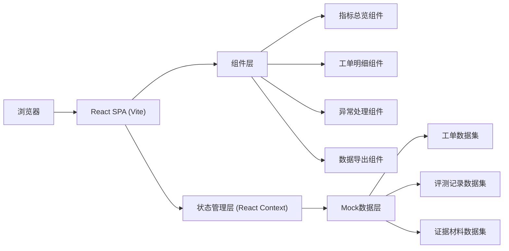
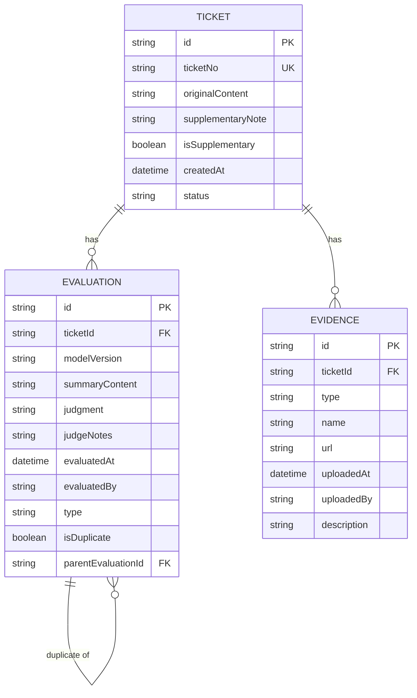

## 1. 架构设计

本项目为纯前端单页应用，采用React组件化架构，通过Mock数据模拟线上工单场景，实现评测指标看板的完整功能。



## 2. 技术描述

- **前端框架**：React@18 + TypeScript + Vite@5
- **样式方案**：TailwindCSS@3 + 自定义CSS变量主题
- **状态管理**：React Context + useReducer（轻量级，适合中小规模应用）
- **路由方案**：React Router@6
- **图表库**：Recharts（React生态友好的图表库）
- **图标库**：Lucide React（线性图标，符合设计风格）
- **数据模拟**：内置Mock数据，包含贴近现场的线上工单样本，混入后补备注和重复评测场景
- **构建工具**：Vite@5，提供快速开发体验和优化的生产构建

## 3. 路由定义

| Route | 页面名称 | 用途 |
|-------|----------|------|
| / | 指标总览页 | 展示核心指标、重复预警、处理进度 |
| /tickets | 工单明细页 | 工单列表、重复追踪、版本对比、证据链 |
| /exceptions | 异常处理页 | 重复标记、后补备注识别、材料管理 |
| /export | 数据导出页 | 筛选配置、导出记录 |

## 4. 类型定义

```typescript
// 工单状态
type TicketStatus = 'pending' | 'processed' | 'need_evidence' | 'duplicate';

// 评测类型
type EvaluationType = 'normal' | 'supplementary' | 'duplicate' | 'version_update';

// 人工判断结果
type JudgmentResult = 'correct' | 'incorrect' | 'uncertain';

// 工单信息
interface Ticket {
  id: string;
  ticketNo: string;
  originalContent: string;
  supplementaryNote?: string;
  isSupplementary: boolean;
  createdAt: string;
  status: TicketStatus;
  evaluations: Evaluation[];
  evidence: Evidence[];
}

// 评测记录
interface Evaluation {
  id: string;
  ticketId: string;
  modelVersion: string;
  summaryContent: string;
  judgment: JudgmentResult;
  judgeNotes?: string;
  evaluatedAt: string;
  evaluatedBy: string;
  type: EvaluationType;
  isDuplicate: boolean;
  parentEvaluationId?: string;
}

// 证据材料
interface Evidence {
  id: string;
  ticketId: string;
  type: 'screenshot' | 'log' | 'document' | 'other';
  name: string;
  url: string;
  uploadedAt: string;
  uploadedBy: string;
  description?: string;
}

// 统计指标
interface DashboardMetrics {
  totalEvaluations: number;
  validEvaluations: number;
  duplicateRate: number;
  supplementaryRate: number;
  correctRate: number;
  processedCount: number;
  pendingCount: number;
  needEvidenceCount: number;
  duplicateCount: number;
}

// 重复评测记录
interface DuplicateRecord {
  ticketId: string;
  ticketNo: string;
  originalContent: string;
  evaluations: Evaluation[];
  detectedAt: string;
}
```

## 5. 数据模型

### 5.1 实体关系图



### 5.2 Mock数据设计

- **工单数量**：12条贴近现场的线上工单
- **后补备注**：1条工单包含后补备注（混入正常数据中）
- **重复评测**：3条工单存在重复评测记录（含同一条后补备注被重复提交的场景）
- **模型版本**：包含v1.0、v1.1、v1.2三个版本的评测记录
- **处理状态**：已处理6条、待处理3条、需补证据2条、已标记重复1条

### 5.3 关键业务规则

1. **去重逻辑**：通过工单ID + 评测内容哈希检测重复评测，后补备注工单通过`isSupplementary`标记单独处理，同一后补备注不重复计数
2. **版本留存**：不同模型版本的评测记录永久保存，新版本评测不覆盖旧版本人工判断
3. **证据链追踪**：每条重复评测记录关联原始工单链接，支持一键追溯原始说法
4. **状态流转**：待处理 → 标记重复/需补证据 → 已处理，状态变更有操作日志
