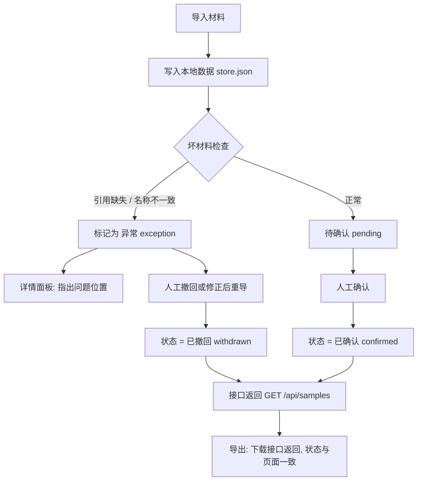

# 病历问答指标看板 · 产品需求文档（PRD）

## 1. 产品概述
病历问答指标看板是面向 AI 产品团队（典型使用者：AI 产品经理"阿宁"）的内部评测工具。它把病历问答模型评测过程中的"导入、确认、撤回、接口返回"四类操作统一收口到同一份本地数据，替代过去"靠模型输出硬拼 + 手工核对"的方式，避免阈值改过后旧结论说不清、坏材料被当成正常通过等问题。

- 解决的问题：模型输出手工核对成本高；阈值变更后旧结论不可追溯；引用缺失 / 名称不一致等坏材料被写成"通过"。
- 目标用户：AI 产品经理、评测人员。
- 价值：月底复盘不再被"阈值改过、旧结论说不清"拖住；每条材料到结论可追溯；坏材料一眼可见、绝不显示为"通过"。

## 2. 核心功能

### 2.1 用户角色
| 角色 | 注册方式 | 核心权限 |
|------|----------|----------|
| 评测员 | 本地免登录 | 导入材料、确认、撤回、查看接口返回、导出 |

### 2.2 功能模块
1. **指标看板主页**：汇总指标条、过滤器与搜索、样本列表
2. **样本详情面板**：材料→结论链路、引用核验、改判说明、确认 / 撤回操作
3. **导入与导出**：导入材料、导出接口返回

### 2.3 页面详情
| 页面 / 区块 | 模块 | 功能描述 |
|-------------|------|----------|
| 指标看板主页 | 指标条 | 总数 / 已确认 / 已撤回 / 待确认 / 异常(坏材料) 计数 |
| 指标看板主页 | 过滤器 | 按状态、坏材料标记(引用缺失 / 名称不一致)、阈值版本筛选；关键字搜索 |
| 指标看板主页 | 样本列表 | 展示 ID、材料名称、状态徽标、坏材料徽标、结论摘要、阈值版本、时间；点击展开详情 |
| 样本详情面板 | 材料区 | 材料名称(录入) vs 规范名称，名称不一致高亮 |
| 样本详情面板 | 引用区 | 引用列表；引用缺失时显式标注"引用缺失"，不可显示为通过 |
| 样本详情面板 | 结论区 | 模型输出 → 最后结论 的链路；改判样本展示旧判定、改判原因、阈值版本 |
| 样本详情面板 | 操作区 | 确认 / 撤回按钮；异常记录禁用"确认" |
| 导入与导出 | 导入 | 粘贴 / 上传 JSON，预览后提交，写入同一份本地数据 |
| 导入与导出 | 导出 | 下载接口返回；文件内状态与页面一致 |

## 3. 核心流程
自然语言：评测员导入材料 → 写入本地数据并做坏材料检查（引用缺失 / 名称不一致 → 标记异常）→ 正常材料进入待确认 → 人工在详情面板核对材料→结论链路、引用、改判说明 → 确认或撤回 → 所有状态汇入接口返回 → 导出接口返回（状态与页面一致）。

## 4. 用户界面设计

### 4.1 设计风格
- 风格定位：临床档案 / 实验室台账（editorial × 精密仪器）。严肃、可追溯、值得信赖。
- 主色：深墨青 `#2D5A4F`（确认 / 主操作）；纸色背景 `#F4F1EA`；墨色文本 `#1B1A17`。
- 信号色：异常 / 坏材料 红 `#B33A3A`；警示 / 待确认 琥珀 `#B07A1F`；已确认 深绿 `#3F6B4E`。
- 字体：标题 Fraunces（衬线，编辑感）；正文 Hanken Grotesk；数据 / ID / 阈值 JetBrains Mono。
- 布局：顶部指标条 + 过滤工具条 + 主列表，右侧抽屉式详情面板；卡片化、留白克制。
- 状态用徽标 + 颜色双编码；异常记录带警示边框，绝不与"通过"同色。

### 4.2 页面设计概览
| 页面 | 模块 | UI 元素 |
|------|------|---------|
| 指标看板主页 | 顶栏 | 标题"病历问答指标看板"、副标题、阈值版本切换、导入 / 导出按钮 |
| 指标看板主页 | 指标条 | 5 个计数卡片（总数 / 已确认 / 已撤回 / 待确认 / 异常），异常卡用红色描边 |
| 指标看板主页 | 过滤器 | 状态、坏材料标记、阈值版本下拉 + 搜索框 |
| 指标看板主页 | 样本列表 | 表格行：ID(mono)、材料名称、状态徽标、坏材料徽标、结论摘要、阈值版本(mono)、时间 |
| 样本详情面板 | 抽屉 | 材料名称对比、引用列表(缺失高亮)、模型输出→结论链路、改判说明、确认 / 撤回、历史时间线 |
| 导入弹窗 | 模态 | JSON 文本框 + 预览表 + 提交；预览即标注将产生的异常 |
| 导出 | 动作 | 一键下载接口返回 JSON；与页面状态一致 |

### 4.3 响应式
桌面优先（评测员在桌面工作）；窄屏时列表转纵向卡片、详情抽屉变全屏。
