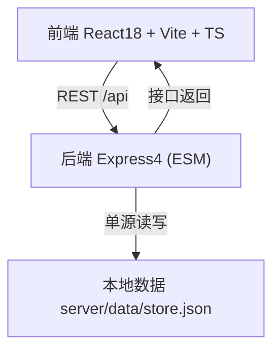
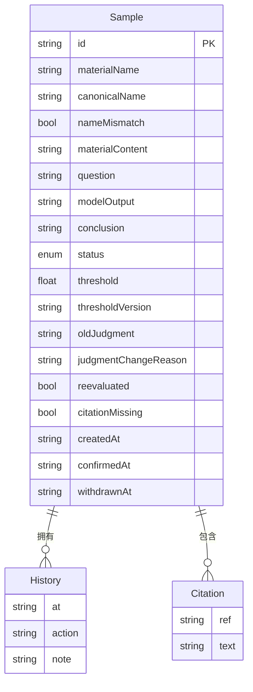

# 病历问答指标看板 · 技术架构

## 1. 架构设计
原则：导入、确认、撤回、接口返回四类操作全部读写同一份本地数据文件，单源一致；接口数量收着做。



## 2. 技术说明
- 前端：React@18 + TypeScript + Vite + TailwindCSS@3
- 后端：Express@4（Node ESM，无构建步骤，直接 `node` 运行）
- 数据：本地 JSON 文件 `server/data/store.json`（唯一真相源）；无外部数据库
- 字体：Google Fonts（Fraunces / Hanken Grotesk / JetBrains Mono）

## 3. 路由定义（前端）
| 路由 | 用途 |
|------|------|
| `/` | 指标看板主页（列表 + 详情抽屉 + 导入 / 导出） |

## 4. API 定义（接口数量收着做，共 3 个）
| 方法 | 路径 | 用途 | 说明 |
|------|------|------|------|
| GET | `/api/samples` | 接口返回 | 读取同一份本地数据，返回全部样本（页面与导出均用此数据） |
| POST | `/api/samples/import` | 导入材料 | 校验 + 坏材料检查后写入同一份本地数据 |
| PATCH | `/api/samples/:id` | 确认 / 撤回 | `body: { action: "confirm" \| "withdraw" }`；异常记录禁止 `confirm` |

TypeScript 类型（前后端共享形状）：

```ts
type SampleStatus = "pending" | "confirmed" | "withdrawn" | "exception";

interface Sample {
  id: string;                       // 样本 ID（mono 展示）
  materialName: string;             // 材料名称（录入）
  canonicalName?: string;           // 规范名称（核对一致性）
  nameMismatch: boolean;            // 名称不一致标记
  materialContent: string;          // 材料正文
  question: string;                 // 病历问答问题
  citations: { ref: string; text: string }[];
  citationMissing: boolean;         // 引用缺失标记
  modelOutput: string;              // 模型输出（原始）
  conclusion: string;               // 最后结论
  status: SampleStatus;
  threshold: number;                 // 使用的阈值
  thresholdVersion: string;         // 阈值版本（解决"阈值改过后旧结论说不清"）
  oldJudgment?: string;             // 旧判定（改判样本）
  judgmentChangeReason?: string;    // 改判原因
  reevaluated: boolean;             // 是否改判样本
  createdAt: string;
  confirmedAt?: string;
  withdrawnAt?: string;
  history: { at: string; action: string; note?: string }[];
}
```

## 5. 服务器架构
无数据库，单文件存储。后端结构：路由 → `store` 读写模块 → `server/data/store.json`。导入时做坏材料检查（引用缺失 / 名称不一致 → `status = exception`），确认 / 撤回时写时间戳与审计 `history`。

## 6. 数据模型

### 6.1 数据模型 ER



### 6.2 初始数据
`server/data/store.json` 预置 7 条样例，覆盖：正常已确认、名称不一致、引用缺失（异常 · 不可通过）、旧模型误判改判、旧阈值版本、已撤回、待确认。

## 7. 运行方式
- 开发：`npm run dev`（Vite 5173 + Express 4000，Vite 代理 `/api` → 4000）
- 构建：`npm run build`（前端输出到 `dist/`）
- 生产：`npm start`（Express 同时托管 `dist/` 静态资源与 `/api`，端口 4000）
