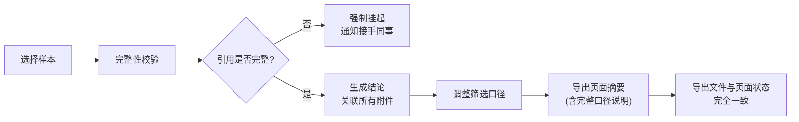

## 1. 产品概述

信贷评分指标看板是一个面向风控、算法工程师的决策支持工具，解决当前依赖人工兜底、线上工单数据零散、阈值调整后结论追溯困难的痛点。通过统一的数据口径、完整的审计链路和可追溯的结论体系，让评分结果可解释、可验证、可沟通。

- 核心解决问题：人工兜底效率低、阈值变更后结论说不清、附件与结论脱节、数据导出与页面不一致
- 目标用户：算法工程师、风控分析师、业务审批人员
- 产品价值：建立可追溯的评分决策链路，降低沟通成本，提升决策可信度

## 2. 核心功能

### 2.1 用户角色

| 角色 | 登录方式 | 核心权限 |
|------|----------|----------|
| 算法工程师 | 内部账号 | 查看所有指标、调整筛选条件、导出报告、标记挂起 |
| 风控分析师 | 内部账号 | 查看评分结果、对比模型版本、确认挂起结论 |
| 审批人员 | 内部账号 | 查看最终结论、下载沟通用页面摘要 |

### 2.2 功能模块

1. **指标看板主页**：实时评分分布、核心指标概览、筛选条件面板、页面摘要区域
2. **样本详情页**：单样本评分明细、新旧模型对比、改判解释、附件关联
3. **导出中心**：页面摘要导出、数据明细导出、筛选口径自动嵌入
4. **挂起管理**：引用缺失检测、挂起列表、接手同事确认流程

### 2.3 页面详情

| 页面名称 | 模块名称 | 功能描述 |
|-----------|-------------|---------------------|
| 指标看板主页 | 筛选条件面板 | 支持按时间范围、评分阈值、模型版本、客户分层多维度筛选，筛选条件实时同步到页面摘要 |
| 指标看板主页 | 页面摘要区域 | 固定显示当前筛选口径、数据时间范围、核心指标数值、数据完整性状态，不可隐藏 |
| 指标看板主页 | 指标可视化区 | 评分分布直方图、通过率趋势、坏账率对比、模型PSI稳定性指标 |
| 指标看板主页 | 样本列表区 | 展示当前筛选条件下的样本列表，支持点击查看详情 |
| 样本详情页 | 评分时间线 | 按时间顺序展示该样本的所有评分记录、阈值变更、附件上传、结论调整 |
| 样本详情页 | 模型对比区 | 展示旧模型评分、新模型评分、特征差异、改判原因解释 |
| 样本详情页 | 附件关联区 | 展示所有关联附件（含晚到补录），支持上传、预览、与结论绑定 |
| 样本详情页 | 完整性校验 | 自动检测引用缺失，缺失时强制挂起并提示接手同事确认 |
| 导出中心 | 页面摘要导出 | 导出PDF包含完整筛选口径、页面状态、核心指标、结论说明，与页面显示完全一致 |
| 挂起管理 | 挂起列表 | 展示所有因引用缺失挂起的样本，支持接手确认、补充引用、解除挂起 |

## 3. 核心流程

### 3.1 查看与筛选流程

### 3.2 结论生成与导出流程

### 3.3 模型改判解释流程

## 4. 用户界面设计

### 4.1 设计风格

- **主色调**：深邃藏青 `#1a365d` 作为专业底色，搭配克制的琥珀金 `#d69e2e` 作为强调色
- **辅助色**：数据正常使用苔绿 `#38a169`，数据异常/挂起使用锈红 `#c53030`，待确认使用湛蓝 `#3182ce`
- **字体**：标题使用 `Noto Serif SC` 营造专业权威感，正文使用 `JetBrains Mono` 保证数字可读性
- **布局风格**：严格的栅格系统，左侧固定筛选面板，顶部固定页面摘要栏，右侧主体内容区采用卡片式模块化布局
- **按钮风格**：方角矩形，2px边框，hover时背景色半透明填充，按下时有细微凹陷效果
- **视觉细节**：微妙的噪点纹理背景，细虚线分隔线，数据卡片左上角增加分类色标

### 4.2 页面设计概述

| 页面名称 | 模块名称 | UI元素 |
|-----------|-------------|-------------|
| 指标看板主页 | 顶部摘要栏 | 固定定位，背景半透明毛玻璃效果，显示筛选口径、时间范围、核心指标KPI、完整性状态标签 |
| 指标看板主页 | 左侧筛选面板 | 可折叠，分组筛选条件，每个条件变更即时反映到顶部摘要 |
| 指标看板主页 | 指标卡片区 | 4列网格，每个卡片左上角有色标，底部有微趋势图，hover时有上浮阴影 |
| 指标看板主页 | 样本列表 | 斑马纹表格，状态列使用彩色圆点，挂起样本整行浅红背景 |
| 样本详情页 | 时间线 | 左侧垂直时间轴，每个节点有图标和状态色，按时间倒序排列 |
| 样本详情页 | 模型对比 | 左右分栏对比，中间箭头指示变化方向，差异特征高亮显示 |
| 导出弹窗 | 导出预览 | 实时预览导出内容，明确标注"与页面显示一致" |

### 4.3 响应式

- 桌面端优先（1440px+），保证数据密度和专业感
- 平板端（1024px）：筛选面板改为顶部横向展开
- 移动端（<768px）：仅保留核心指标查看和样本浏览功能

### 4.4 动效设计

- 页面加载：指标卡片按顺序淡入上移，间隔80ms
- 筛选变更：数据区域先淡出模糊，加载后清晰淡入，总时长300ms
- 挂起提示：红色边框脉冲呼吸动画，每秒一次，持续3秒
- 数字变化：数值滚动动画，从旧值平滑过渡到新值
