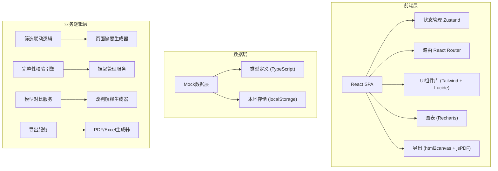
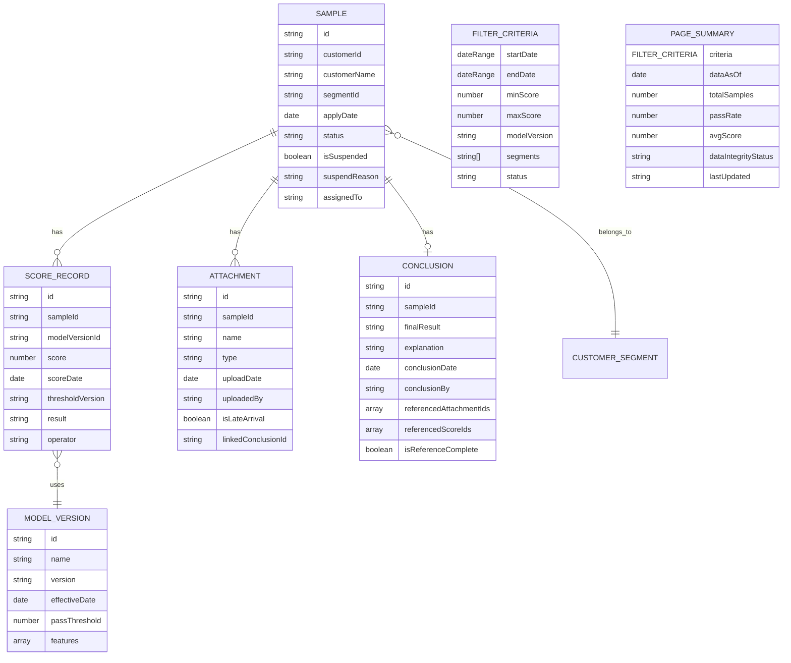

## 1. 架构设计



## 2. 技术描述

- **前端框架**：React@18 + TypeScript@5
- **构建工具**：Vite@5
- **样式方案**：TailwindCSS@3
- **状态管理**：Zustand@4
- **路由管理**：React Router DOM@6
- **图表库**：Recharts@2
- **图标库**：Lucide React@0.344
- **导出功能**：html2canvas + jsPDF + xlsx
- **数据方案**：Mock数据 + TypeScript类型定义，无后端
- **初始化工具**：vite-init

## 3. 路由定义

| 路由 | 页面 | 说明 |
|-------|------|------|
| `/` | 指标看板主页 | 默认首页，展示筛选面板、页面摘要、指标卡片、样本列表 |
| `/sample/:id` | 样本详情页 | 展示单样本的评分时间线、模型对比、附件关联、完整性校验 |
| `/suspended` | 挂起管理页 | 展示所有挂起样本列表，支持确认和解除挂起 |

## 4. 数据模型

### 4.1 数据模型定义



### 4.2 类型定义（TypeScript）

```typescript
// 筛选条件
interface FilterCriteria {
  startDate: string;
  endDate: string;
  minScore: number | null;
  maxScore: number | null;
  modelVersion: string;
  segments: string[];
  status: string;
}

// 页面摘要
interface PageSummary {
  criteria: FilterCriteria;
  dataAsOf: string;
  totalSamples: number;
  passRate: number;
  avgScore: number;
  dataIntegrityStatus: 'complete' | 'partial' | 'suspended';
  lastUpdated: string;
}

// 样本
interface Sample {
  id: string;
  customerId: string;
  customerName: string;
  segmentId: string;
  segmentName: string;
  applyDate: string;
  status: 'pending' | 'approved' | 'rejected' | 'suspended';
  isSuspended: boolean;
  suspendReason?: string;
  assignedTo?: string;
  latestScore: number;
  latestResult: string;
  modelVersion: string;
}

// 评分记录
interface ScoreRecord {
  id: string;
  sampleId: string;
  modelVersion: string;
  modelName: string;
  score: number;
  scoreDate: string;
  threshold: number;
  thresholdVersion: string;
  result: 'pass' | 'fail';
  operator: string;
  features: { name: string; value: number; weight: number }[];
}

// 附件
interface Attachment {
  id: string;
  sampleId: string;
  name: string;
  type: 'document' | 'image' | 'data';
  uploadDate: string;
  uploadedBy: string;
  isLateArrival: boolean;
  linkedConclusionId?: string;
}

// 结论
interface Conclusion {
  id: string;
  sampleId: string;
  finalResult: 'approve' | 'reject' | 'suspend';
  explanation: string;
  conclusionDate: string;
  conclusionBy: string;
  referencedAttachmentIds: string[];
  referencedScoreIds: string[];
  isReferenceComplete: boolean;
  missingReferences: string[];
}

// 模型对比结果
interface ModelComparison {
  sampleId: string;
  oldModel: {
    version: string;
    score: number;
    result: string;
    topFeatures: { name: string; value: number; weight: number }[];
  };
  newModel: {
    version: string;
    score: number;
    result: string;
    topFeatures: { name: string; value: number; weight: number }[];
  };
  scoreDiff: number;
  changedFeatures: {
    name: string;
    oldWeight: number;
    newWeight: number;
    impact: 'positive' | 'negative' | 'neutral';
  }[];
  explanation: string;
}
```

## 5. 核心模块设计

### 5.1 筛选联动模块

- **位置**：`src/hooks/useFilterSync.ts`
- **功能**：筛选条件变更时自动更新页面摘要，确保筛选口径与显示数据一致
- **关键机制**：使用 Zustand store 统一管理筛选状态，任何筛选条件变更触发 `updatePageSummary()` 方法

### 5.2 导出服务模块

- **位置**：`src/services/exportService.ts`
- **功能**：导出页面摘要时捕获当前页面完整状态（筛选条件、指标数值、结论），确保导出文件与页面显示完全一致
- **关键机制**：导出前先调用 `capturePageState()` 生成状态快照，嵌入到导出文件的元数据和页眉中

### 5.3 完整性校验引擎

- **位置**：`src/services/integrityService.ts`
- **功能**：生成结论前自动检测引用完整性（关联评分记录、关联附件），缺失时强制挂起
- **关键机制**：`checkReferences()` 方法返回缺失引用列表，非空时调用 `suspendSample()` 并通知接手人

### 5.4 模型对比服务

- **位置**：`src/services/modelComparison.ts`
- **功能**：对比新旧模型对同一样本的评分结果，生成改判解释
- **关键机制**：`compareModels()` 分析特征权重变化，`generateExplanation()` 生成自然语言改判原因

### 5.5 附件关联机制

- **位置**：`src/services/attachmentService.ts`
- **功能**：支持晚到附件补录，并与结论强绑定
- **关键机制**：`linkAttachmentToConclusion()` 建立关联，`getConclusionAuditTrail()` 返回完整审计链路

## 6. 状态管理设计

```typescript
// Zustand Store
interface AppState {
  // 筛选状态
  filters: FilterCriteria;
  setFilters: (filters: Partial<FilterCriteria>) => void;
  resetFilters: () => void;
  
  // 页面摘要
  pageSummary: PageSummary | null;
  updatePageSummary: () => void;
  
  // 样本数据
  samples: Sample[];
  filteredSamples: Sample[];
  selectedSample: Sample | null;
  selectSample: (id: string) => void;
  
  // 挂起管理
  suspendedSamples: Sample[];
  suspendSample: (id: string, reason: string, assignee: string) => void;
  confirmSuspendedSample: (id: string) => void;
  
  // 导出状态
  isExporting: boolean;
  exportPageSummary: () => Promise<void>;
}
```
