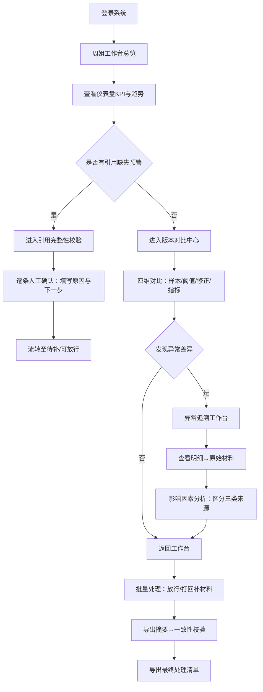

## 1. 产品概述

工业视觉人工改判质检管理平台，用于解决标注团队在人工改判流程中过度依赖标注负责人周姐人工兜底、引用缺失但报告过度自信、不同版本数据混合影响结论追溯等核心痛点。平台提供从总览图表到明细再到原始材料的全链路追溯能力，引入引用完整性校验关卡，支持新旧版本样本/阈值/人工修正/指标的差异对比，最终输出面向标注负责人的可操作清单（哪条需补材料、哪条可放行）。

## 2. 核心功能

### 2.1 用户角色

| 角色 | 注册方式 | 核心权限 |
|------|----------|----------|
| 标注负责人（周姐） | 系统分配 | 全盘视图、放行/打回决策、导出清单、配置规则 |
| 接手同事 | 系统分配 | 查看总览图表、追溯异常明细、查看原始材料、提交人工修正 |
| 系统管理员 | 系统分配 | 版本管理、阈值配置、数据源接入 |

### 2.2 功能模块

1. **总览仪表盘**：改判趋势KPI、异常分布图表、引用缺失预警、当前版本状态
2. **异常追溯工作台**：从图表点击深入→明细记录→原始材料，完整链路可回溯
3. **影响因素分析**：区分旧版人工修正、正常记录、口头备注三类来源对结论的独立影响
4. **引用完整性校验**：自动检测缺失引用的记录，触发人工确认关卡并标注原因与下一步
5. **版本对比中心**：前一版 vs 当前版的样本、阈值、人工修正、核心指标四维度对比
6. **导出与一致性校验**：页面摘要导出、页面状态与导出文件一致性自动核对
7. **周姐工作台**：待补材料清单、可放行清单、逐条原因说明与建议下一步

### 2.3 页面详情

| 页面名称 | 模块名称 | 功能描述 |
|----------|----------|----------|
| 总览仪表盘 | KPI指标卡 | 展示总样本数、已改判数、通过率、引用缺失数、待处理数等核心指标 |
| 总览仪表盘 | 改判趋势图 | 时间轴折线图，支持按天/周查看，点击数据点跳转明细 |
| 总览仪表盘 | 异常分布图 | 饼图/条形图展示缺陷类型分布，支持下钻 |
| 总览仪表盘 | 引用缺失预警条 | 醒目标红展示缺失引用记录数及严重程度，一键跳转处理 |
| 异常追溯工作台 | 筛选与搜索 | 按批次、时间、缺陷类型、来源类型、引用状态多维筛选 |
| 异常追溯工作台 | 明细列表 | 展示记录ID、图像缩略图、原始结论、改判结论、来源标签、引用状态 |
| 异常追溯工作台 | 材料详情抽屉 | 点击记录展开：原始图像、标注文件、改判日志、引用材料清单 |
| 影响因素分析 | 来源贡献卡片 | 三列并排：旧版人工修正/正常记录/口头备注各自影响的样本数与结论走向 |
| 影响因素分析 | 影响链路图 | 可视化展示每条结论由哪些来源因素共同作用形成 |
| 引用完整性校验 | 校验结果列表 | 逐条展示引用缺失项、缺失类型、风险等级、当前状态 |
| 引用完整性校验 | 人工确认面板 | 触发确认时展示原因说明、建议下一步操作、填写备注后流转 |
| 版本对比中心 | 版本选择器 | 下拉选择前一版与当前版进行对比 |
| 版本对比中心 | 四维对比面板 | 样本分布、阈值参数、人工修正记录、核心指标四大板块并排对比，差异高亮 |
| 导出与一致性校验 | 摘要导出配置 | 选择导出范围、格式、字段 |
| 导出与一致性校验 | 一致性核对报告 | 自动比对页面状态与导出文件内容，标注不一致项 |
| 周姐工作台 | 待补材料清单 | 需补充引用/佐证材料的记录列表，含缺失说明、截止建议 |
| 周姐工作台 | 可放行清单 | 审核通过可放行的记录列表，含放行依据 |
| 周姐工作台 | 批量操作 | 勾选批量放行、批量打回补材料、批量导出清单 |

## 3. 核心流程

标注负责人周姐日常操作流程：登录进入周姐工作台 → 先查看总览仪表盘把握整体态势 → 发现引用缺失预警，点击跳转引用完整性校验模块 → 对缺失引用记录进行人工确认，系统自动记录原因与下一步 → 进入版本对比中心，对比前一版与当前版在样本、阈值、人工修正、指标上的差异 → 对疑似异常点击进入异常追溯工作台，从明细一路追溯到原始图像与标注材料 → 在影响因素分析中区分旧版修正、正常记录、口头备注各自的贡献 → 返回周姐工作台批量处理：对缺材料项打回补录、对完整项放行 → 导出摘要并触发一致性校验，确保页面与文件说法一致 → 导出最终处理清单交付执行。

## 4. 用户界面设计

### 4.1 设计风格

- **主色调**：工业蓝 `#1E40AF` 作为主色，搭配警示橙 `#EA580C`（预警）和确认绿 `#059669`（放行），辅以中性灰阶。整体传达专业、可信、工业级质检的氛围。
- **辅助色**：引用缺失用深红 `#B91C1C`，版本差异用琥珀 `#D97706`，来源标签用柔和的蓝绿紫三色区分。
- **按钮风格**：圆角 6px 的实心/描边按钮，主按钮带轻微阴影与悬停上浮效果，危险按钮用红底白字。
- **字体**：标题使用"思源黑体 SemiBold"，正文使用"思源黑体 Regular"，数据数字使用等宽字体"JetBrains Mono"以提升可读性。字号层级：主标题 24px、模块标题 18px、正文 14px、辅助文字 12px。
- **布局风格**：顶部导航栏 + 左侧功能菜单的经典后台布局，卡片式模块容器，卡片间统一 24px 间距，内容区 1200px 最大宽度居中。
- **图标风格**：使用线性 SVG 图标，统一 1.5px 线条粗度，颜色跟随模块语义色。
- **背景层次**：浅灰渐变顶栏（深蓝→工业蓝），主内容区米白底 `#FAFAF9`，卡片白色配 1px 浅灰边框与极细投影。

### 4.2 页面设计概述

| 页面名称 | 模块名称 | UI 元素 |
|----------|----------|---------|
| 总览仪表盘 | KPI指标卡 | 6 张卡片横排，每张配语义色左侧条、数据大字、环比变化小箭头，点击下钻 |
| 总览仪表盘 | 改判趋势图 | 双折线（改判数+通过率），ECharts 渲染，悬停显示详情气泡，点击数据点跳转 |
| 总览仪表盘 | 异常分布图 | 横向条形图+缺陷类型图标，鼠标悬停高亮，点击下钻明细 |
| 总览仪表盘 | 引用缺失预警条 | 顶部红底警示带，闪烁边框动画，配感叹号图标与数字，一键跳转按钮 |
| 异常追溯工作台 | 明细列表 | 表格+缩略图形式，每行右侧悬浮"查看材料"按钮，引用缺失行整行淡红底色 |
| 异常追溯工作台 | 材料详情抽屉 | 右侧滑出 480px 抽屉，分 Tab：图像/标注/改判日志/引用材料，点击遮罩关闭 |
| 影响因素分析 | 来源贡献卡片 | 三列等宽卡片，每卡顶部彩色标签（蓝=旧版修正/绿=正常记录/紫=口头备注），下方数据+迷你柱状图 |
| 影响因素分析 | 影响链路图 | 桑基图样式，左侧三类来源→中间样本→右侧最终结论，线宽代表影响权重 |
| 引用完整性校验 | 校验结果列表 | 每行含状态徽章（缺失/已补/待确认）、风险等级圆点（高红/中橙/低黄）、处理按钮组 |
| 引用完整性校验 | 人工确认面板 | 模态弹窗，左半部分展示缺失详情，右半部分表单：原因下拉+下一步建议+备注文本域+确认/打回按钮 |
| 版本对比中心 | 四维对比面板 | 左右分栏双版本，各面板中间竖线标注差异箭头，差异内容用琥珀色底色高亮闪烁 |
| 导出与一致性校验 | 一致性核对报告 | 逐条对比行，左侧页面数据右侧文件数据，不一致行红底并显示 diff 标记 |
| 周姐工作台 | 待补/可放行清单 | 双 Tab 切换，每行含快速处理按钮，顶部批量操作栏（全选/放行/打回/导出），支持拖拽排序优先级 |

### 4.3 响应式

桌面端优先设计，主内容区 1200px 宽度。平板端（≥768px）左侧菜单折叠为图标式，卡片改为自适应两列布局。移动端（<768px）顶部导航变为汉堡菜单，列表缩略图缩小，抽屉改为全屏覆盖。所有可点击元素在移动端保证 ≥44px 触控区域。

### 4.4 动画与交互细节

- 页面加载：顶部导航先出现，随后各模块卡片按 80ms 间隔错峰淡入上浮（translateY 16px → 0，opacity 0→1）
- 预警条：呼吸灯式背景色透明度变化动画（0.7↔1，2s 循环）
- 卡片悬停：y 轴 -4px 位移 + 阴影加深，过渡 200ms ease
- 抽屉/弹窗：从右/中心滑入+缩放+半透明遮罩淡入，300ms cubic-bezier(0.4,0,0.2,1)
- 差异高亮：首次加载琥珀色闪烁 3 次（2s 内），引导用户注意
- 数据刷新：数字滚动动画（从旧值到新值，800ms）
- 表格行操作：悬停右侧浮出操作按钮组，离开时淡出
