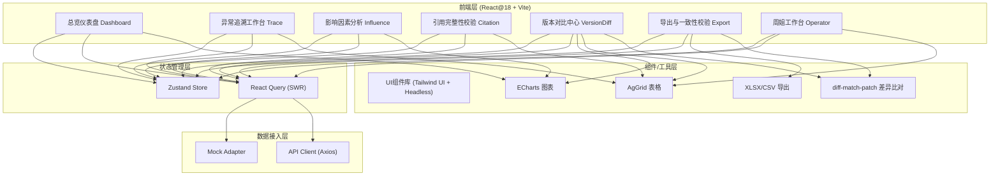
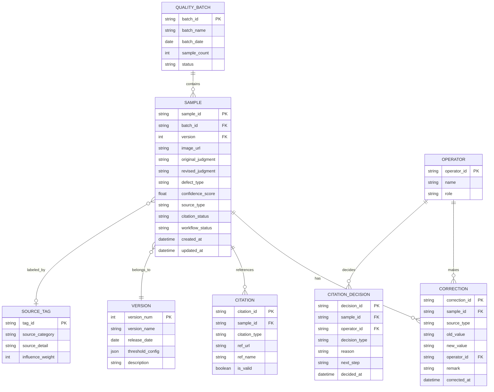

## 1. 架构设计



## 2. 技术描述

- **前端框架**：React@18 + TypeScript@5 + Vite@5
- **初始化工具**：`npm create vite@latest` 选择 react-ts 模板
- **样式方案**：TailwindCSS@3 + CSS Variables 主题系统 + PostCSS
- **路由**：React Router@6（BrowserRouter，路径式路由）
- **状态管理**：Zustand 管理全局 UI 状态（当前版本、筛选条件、工作台选中项），React Query (TanStack Query) 管理服务端数据缓存与刷新
- **图表库**：ECharts@5（趋势折线、分布条形、桑基影响链路图）
- **表格**：AG Grid Community（明细列表、对比表格，支持虚拟滚动、筛选、排序）
- **导出**：SheetJS (xlsx) 导出 Excel，jsPDF 导出 PDF，FileSaver 下载
- **差异比对**：diff-match-patch（版本内容对比、页面与文件一致性核对）
- **图标**：Lucide React（线性 SVG 图标库）
- **UI 基础**：Headless UI（模态框、抽屉、下拉菜单等无样式交互组件）+ 自定义 Tailwind 组件
- **日期处理**：dayjs
- **后端**：无后端，全部使用 Mock 数据（`src/mock/` 目录 + MSW 拦截器或直接导出函数）
- **数据来源**：本地 Mock 数据生成器，模拟多个批次、两个版本、三类来源的工业视觉质检记录

## 3. 路由定义

| 路由 | 页面组件 | 用途 |
|------|----------|------|
| `/` | `Navigate` → `/dashboard` | 根路径重定向到仪表盘 |
| `/dashboard` | `DashboardPage` | 总览仪表盘：KPI、趋势图、分布图、预警条 |
| `/trace` | `TracePage` | 异常追溯工作台：筛选、明细列表、材料详情抽屉 |
| `/influence` | `InfluencePage` | 影响因素分析：三类来源贡献卡片 + 桑基影响链路 |
| `/citation` | `CitationPage` | 引用完整性校验：校验结果列表 + 人工确认弹窗 |
| `/version-diff` | `VersionDiffPage` | 版本对比中心：四维对比面板 |
| `/export` | `ExportPage` | 导出与一致性校验：导出配置 + 一致性报告 |
| `/operator` | `OperatorPage` | 周姐工作台：待补材料 / 可放行双 Tab 清单 + 批量操作 |

## 4. 数据模型

### 4.1 数据模型定义



### 4.2 Mock 数据结构示例

```typescript
// src/mock/types.ts
export type SourceType = 'old_correction' | 'normal_record' | 'verbal_note';
export type CitationStatus = 'complete' | 'missing' | 'partial';
export type WorkflowStatus = 'pending' | 'approved' | 'need_material' | 'recheck';

export interface QualitySample {
  sampleId: string;
  batchId: string;
  batchName: string;
  version: number;
  imageUrl: string;
  originalJudgment: string;
  revisedJudgment: string;
  defectType: string;
  confidence: number;
  sourceType: SourceType;
  citationStatus: CitationStatus;
  workflowStatus: WorkflowStatus;
  corrections: CorrectionRecord[];
  citations: CitationItem[];
  createdAt: string;
  updatedAt: string;
}

export interface CorrectionRecord {
  id: string;
  sourceType: SourceType;
  field: string;
  oldValue: string;
  newValue: string;
  operator: string;
  remark: string;
  timestamp: string;
}

export interface CitationItem {
  id: string;
  type: 'standard_doc' | 'reference_image' | 'spec_sheet';
  name: string;
  url: string;
  isValid: boolean;
}

export interface VersionConfig {
  version: number;
  name: string;
  releaseDate: string;
  thresholds: Record<string, number>;
  description: string;
}

export interface KPIData {
  totalSamples: number;
  revisedCount: number;
  passRate: number;
  citationMissing: number;
  pendingCount: number;
  trend: Array<{ date: string; revised: number; passRate: number }>;
  defectDistribution: Array<{ type: string; count: number }>;
}
```

### 4.3 Mock 数据生成策略

- 生成 2 个完整批次（`BATCH-2026-0610`、`BATCH-2026-0615`），每批次 60 条样本
- 两个版本（v1=前一版、v2=当前版），同一样本在两版中存在阈值差异与人工修正差异
- 三类来源均匀分布：35% 旧版人工修正、45% 正常记录、20% 口头备注
- 引用状态：70% 完整、15% 缺失（其中 8 条高风险触发周姐确认关卡）、15% 部分缺失
- 阈值配置：v1 与 v2 在 5 个核心缺陷类型阈值上各有 ±5%~15% 的调整
- 核心指标对比：两版通过率差异 3.2%，改判数差异 11 条，引用缺失率差异 2.1%

## 5. 核心页面与目录结构

```
src/
├── assets/                 # 静态资源（图标、字体、占位图）
├── components/
│   ├── common/            # 通用组件：KpiCard, AlertBar, ConfirmModal, DiffViewer
│   ├── dashboard/         # 仪表盘子组件：TrendChart, DefectBar, WarningBar
│   ├── trace/             # 追溯子组件：SampleTable, MaterialDrawer, FilterBar
│   ├── influence/         # 影响分析子组件：SourceCard, SankeyChart
│   ├── citation/          # 引用校验子组件：CitationTable, ConfirmCitationDialog
│   ├── version-diff/      # 版本对比子组件：VersionSelector, DiffPanel, MetricCompare
│   ├── export/            # 导出子组件：ExportConfig, ConsistencyReport
│   └── operator/          # 工作台子组件：TodoTabs, BatchToolbar, ActionButtons
├── mock/
│   ├── data/              # 生成的 JSON 数据
│   ├── generators/        # 数据生成脚本
│   └── index.ts           # Mock 数据 API
├── pages/                 # 路由页面组件
├── store/                 # Zustand store
├── hooks/                 # 自定义 hooks（useBatchFilter, useCitationCheck...）
├── utils/                 # 工具函数（diff, exportFormatter, dateUtils）
├── types/                 # 全局 TypeScript 类型
├── styles/                # 全局样式、主题变量
├── router/                # 路由配置
├── App.tsx
└── main.tsx
```

## 6. 关键实现要点

1. **全链路追溯**：所有图表数据点、KPI 数字、列表行均携带 `sampleIds` 数组，点击时通过路由参数传递到 Trace 页并自动筛选高亮对应记录，再从记录行进入 MaterialDrawer 展示图像/标注/引用完整链条。
2. **引用完整性校验引擎**：`utils/citationChecker.ts` 实现规则：缺陷类型匹配标准文档≥1条、图像比对样本≥2条、规格书必填；不满足则标记 `missing`/`partial` 并计算风险等级（涉及安全缺陷=高）。
3. **版本对比差异高亮**：使用 `diff-match-patch` 对两版样本的 `corrections`、`thresholds`、指标值生成结构化 diff，在 UI 上用琥珀色背景 + 左右箭头（`↑`旧值/`↓`新值）标注，支持"仅看差异"筛选。
4. **一致性校验机制**：导出前对页面当前状态快照（`JSON.stringify(pageState)`），导出文件内嵌入快照哈希；导出后读回文件内容反序列化，与快照逐项比对，生成不一致清单。
5. **工作台状态驱动**：所有页面的操作（确认引用、放行、打回）统一通过 Zustand `useOperatorStore` 驱动 `workflowStatus` 流转，确保仪表盘数字、列表状态、工作台清单实时同步，无需刷新。
6. **影响因素桑基图**：按 `sourceType` 聚合样本流向（来源→样本→最终结论），`influence_weight` 决定边宽，点击高亮对应节点并在 Trace 页筛选该来源的全部样本。
