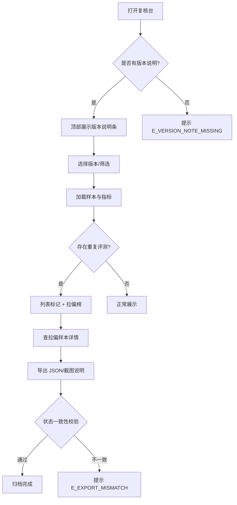

# PRD — 工业视觉误判回放

## 1. 产品概述
工业视觉误判回放是一个面向产线质检的误判复核台，供 AI 产品（阿宁）与现场老师在评审会前后快速回放某版本视觉模型的判断结果，定位「同一样本被重复评测」与「拉偏整体结论的关键样本」，并保证参数名、失败提示、导出状态在版本间稳定，以便纳入日常脚本运行。
- 解决问题：版本说明难翻、重复评测难筛、坏材料来了不知该看哪里、导出与页面状态不一致。
- 目标用户：AI 产品经理（阿宁）、现场质检老师、评审会参会者。
- 市场价值：把每次评审从「翻版本说明」压缩到「看一眼拉偏榜」，降低误判复盘成本、稳定脚本契约。

## 2. 核心功能

### 2.1 用户角色
| 角色 | 进入方式 | 核心权限 |
|------|----------|----------|
| AI 产品（阿宁） | 直接打开复核台 | 评审前补版本说明备注、编辑「本版改变的判断」清单、触发导出 |
| 现场老师 | 日常脚本 / 浏览器 | 按版本筛选、查重复样本、追问拉偏样本、导出截图说明 |
| 评审参会者 | 只读链接 | 查看总指标、拉偏样本榜、导出报告 |

### 2.2 功能模块（页面）
1. **复核台（主页）**：版本说明条 + 指标卡 + 样本列表与筛选 + 拉偏样本榜
2. **样本详情抽屉**：单样本回放、重复评测标记、对结论的影响
3. **版本说明面板**：新增/编辑备注、「本版改变的判断」清单
4. **导出中心**：JSON / 截图说明导出，状态一致性校验

（页面数 ≤ 3 主页面，每页增强功能密度与信息量）

### 2.3 页面详情
| 页面 | 模块 | 功能描述 |
|------|------|----------|
| 复核台 | 版本说明条 | 顶部固定，显示版本号/日期/作者/本版改变判断数，点击展开备注全文与改变判断清单 |
| 复核台 | 指标卡 | 总样本、OK/NG、TP/TN/FP/FN、准确率/精确率/召回率；提供「去重前/去重后」对比 |
| 复核台 | 样本列表与筛选 | 按材料类型/真值/预测/是否重复/版本筛选；重复样本行带醒目标记与同组计数 |
| 复核台 | 拉偏样本榜 | 按对误判率贡献排序的 Top N 样本，标注影响值与方向 |
| 样本详情 | 回放区 | 图像 + 真值 + 预测 + 置信度 + 时间戳 + 评测批次 + 版本标签 |
| 样本详情 | 重复标记 | 同组重复样本列表、是否跨版本重复、首次出现记录 |
| 样本详情 | 影响分析 | 该样本对误判率/准确率的量化影响值 |
| 版本说明 | 备注编辑 | 临时补一条备注（存 localStorage）、改变判断清单（样本ID/旧判断/新判断） |
| 导出中心 | JSON 导出 | 导出当前筛选结果，保留重复标记与影响值字段 |
| 导出中心 | 截图说明 | 导出页面可见状态，文件内「状态字段」与页面显示一致并自动校验 |

## 3. 核心流程
**评审前补备注流程**：阿宁打开版本说明面板 → 新增/编辑备注与「本版改变的判断」清单 → 保存（localStorage）→ 复核台版本说明条即时刷新。

**评审复盘流程**：现场老师打开复核台 → 选择版本 → 看指标卡去重对比 → 筛选「仅重复」→ 查拉偏样本榜 → 点开拉偏样本详情 → 导出截图说明归档。

**日常脚本流程**：脚本以稳定 URL 参数（`?version=&filter=duplicate&export=report`）触发筛选与导出；失败时按稳定错误码返回，不依赖界面文案。

## 4. 用户界面设计

### 4.1 设计风格
工业监控控制台美学（industrial / utilitarian control room）：
- 主色：深石墨灰底（`#0E1116`）+ 钢蓝面板；状态色琥珀 `#F5A623`（告警/重复）/ 绿 `#3DD68C`（通过）/ 红 `#FF5C5C`（误判/失败）。
- 字体：显示字体用工业风等宽 `JetBrains Mono`/`Space Mono` 作数据，标题用 `Oswald` 压缩体增强工业感；正文用 `IBM Plex Sans`。
- 按钮：直角/微圆角、硬边框、带状态色条；表格行紧凑、单色描边。
- 布局：网格化密集仪表盘，左列表 + 右详情/榜，顶部固定版本说明条。
- 图标/标记：用几何符号（◆ 重复、▲ 拉偏、● 状态点）替代通用 emoji。

### 4.2 页面设计概述
| 页面 | 模块 | UI 元素（样式/布局/颜色/字体/动效） |
|------|------|------|
| 复核台 | 版本说明条 | 顶栏琥珀描边、版本号大字、点击展开备注抽屉、加载时滑入 |
| 复核台 | 指标卡 | 4×2 卡片网格、大数字+小标签、去重对比用副数字与箭头 |
| 复核台 | 样本列表 | 紧凑表格、重复行左侧琥珀竖条 + ◆ 图标 + 组计数 |
| 复核台 | 拉偏样本榜 | 右侧侧栏、横向影响条、Top3 加重 |
| 样本详情 | 回放区 | 左图像右数据、置信度条、时间戳等宽字 |
| 导出中心 | 导出卡 | 双卡 JSON/截图说明、一致性校验状态灯 |

### 4.3 响应式
桌面优先（≥1280px 双栏；1024–1280 单列降级；<1024 仅保留列表+指标，详情改为抽屉）。触控：表格行点击区放大。

### 4.4 3D 场景
不适用。

## 5. 稳定契约（脚本可依赖）
- URL 参数（命名稳定不改）：`version`、`run`、`filter`、`sample`、`export`、`lang`。
- 错误码（稳定不改）：`E_VERSION_NOT_FOUND`、`E_SAMPLE_NOT_FOUND`、`E_DUPLICATE_GROUP_BROKEN`、`E_EXPORT_MISMATCH`、`E_FILTER_INVALID`、`E_VERSION_NOTE_MISSING`。
- 失败提示格式：`[ERROR_CODE] 可读说明`，文案可变、错误码不变。
- 导出文件状态字段与页面显示字段一一对应，导出前自动一致性校验。
