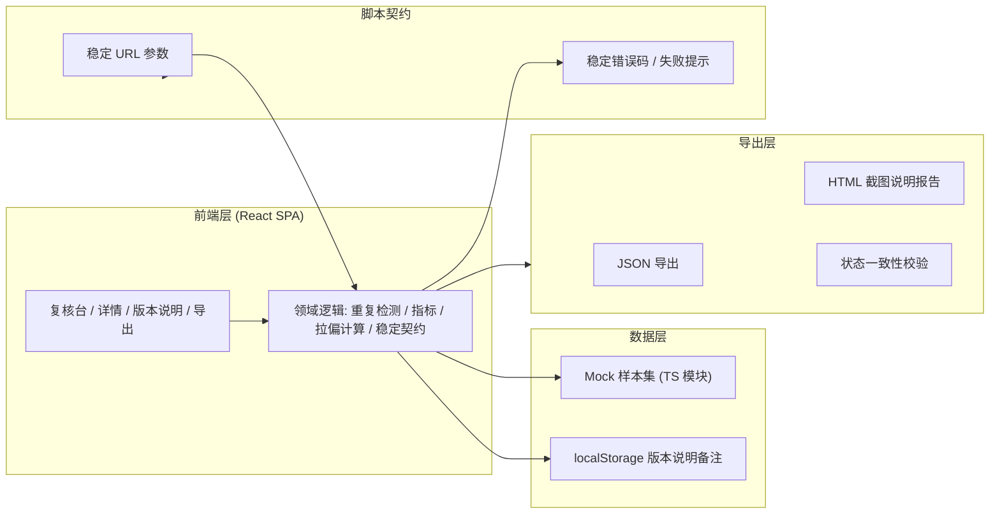
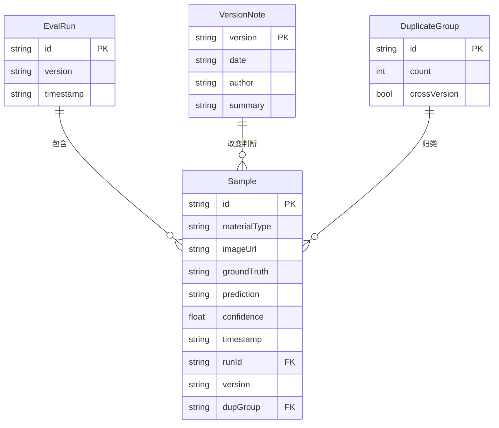

# 技术架构 — 工业视觉误判回放

## 1. 架构设计
纯前端单页应用，无后端服务；数据为内置 Mock 工业视觉样本集，版本说明备注持久化于 localStorage。导出层生成 JSON 与 HTML 截图说明报告。日常脚本通过稳定 URL 参数驱动筛选与导出，失败按稳定错误码返回。



## 2. 技术说明
- 前端：React@18 + tailwindcss@3 + vite
- 初始化工具：vite-init（react-ts 模板）
- 后端：无（纯前端 + Mock 数据；版本说明存 localStorage）
- 数据库：无；Mock 数据以内置 TS 模块提供，可后续替换为接口
- 字体：`Oswald`（显示）+ `IBM Plex Sans`（正文）+ `JetBrains Mono`（数据），均通过 Google Fonts 引入

## 3. 路由定义
| 路由 | 用途 |
|------|------|
| `/` | 复核台主页（版本说明条 + 指标卡 + 样本列表 + 拉偏榜） |
| `/` `?sample=<id>` | 打开样本详情抽屉 |
| `/` `?version=&run=&filter=&export=` | 脚本驱动筛选与导出 |
| 版本说明面板、导出中心 | 以面板/模态形式叠加在主页，不单独占路由，保持 URL 参数稳定 |

## 4. API 定义
无后端 API。领域函数签名（前端模块）：

```ts
type Judge = 'OK' | 'NG';
interface Sample {
  id: string;              // 稳定样本ID
  materialType: string;    // 材料类型
  imageUrl: string;        // 样本图像
  groundTruth: Judge;      // 真值
  prediction: Judge;       // 模型预测
  confidence: number;      // 置信度 0..1
  timestamp: string;       // 评测时间
  runId: string;           // 评测批次
  version: string;         // 模型版本
  dupGroup?: string;       // 重复组ID（无则未重复）
}
interface VersionNote {
  version: string;
  date: string;
  author: string;
  summary: string;
  changedJudgments: { sampleId: string; from: Judge; to: Judge }[];
}
```

## 5. 服务端架构
不适用（无后端）。

## 6. 数据模型
### 6.1 数据模型定义


### 6.2 数据定义语言（前端 TS 常量与索引）
- 内置 Mock：约 40 条样本，覆盖 TP/TN/FP/FN、重复组（同图跨批次/同批次）、拉偏样本。
- 重复检测：按 `materialType + groundTruth + 图像指纹（用 id 前缀模拟）` 聚类生成 `dupGroup`，跨 `version` 记 `crossVersion`。
- 指标：TP/TN/FP/FN、准确率、精确率、召回率；去重后指标仅取每组首条。
- 拉偏贡献：单样本对「误判率」的边际贡献 = 该样本是否误判(0/1) × 权重，按贡献降序排榜。

## 7. 稳定契约（脚本依赖，版本间不改名）
- URL 参数：`version`、`run`、`filter`（all|duplicate|misjudged|skewed）、`sample`、`export`（json|report）、`lang`。
- 错误码：`E_VERSION_NOT_FOUND`、`E_SAMPLE_NOT_FOUND`、`E_DUPLICATE_GROUP_BROKEN`、`E_EXPORT_MISMATCH`、`E_FILTER_INVALID`、`E_VERSION_NOTE_MISSING`。
- 失败提示格式：`[ERROR_CODE] 可读说明`。
- 导出文件字段名与页面显示字段一一对应；导出前调用一致性校验，不一致则阻断并返回 `E_EXPORT_MISMATCH`。
