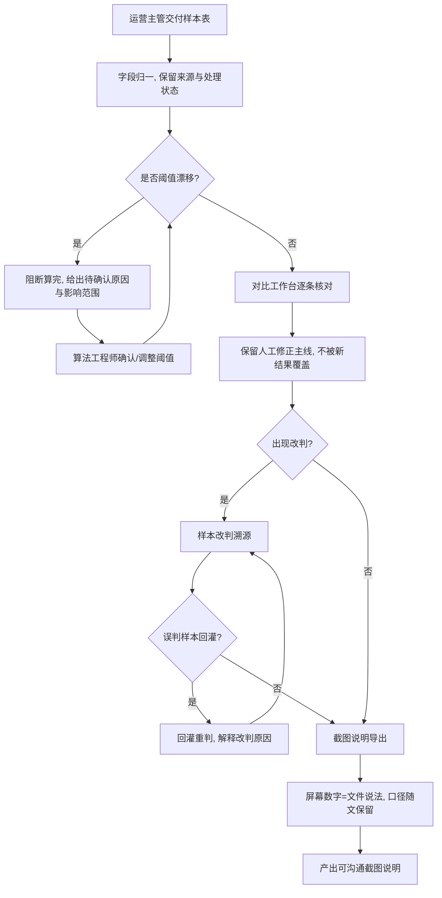

# 作文批改灰度对比 · 产品需求文档

## 1. 产品概述

"作文批改灰度对比"是面向算法团队与运营团队的灰度对比工具，在新旧作文批改模型灰度上线期间，逐条核对样本判定差异、保留人工修正主线、监控阈值漂移，并产出可直接用于跨团队沟通的"截图说明"。

- 解决问题：样本材料来源断续、字段命名前后不一、人工修正被新结果覆盖、阈值漂移被忽略、导出口径与屏幕数字对不上。
- 目标用户：算法工程师（小乔，负责主线核对与改判溯源）、运营主管（交付样本表）、沟通方（阅读截图说明）。
- 价值：把碎片化样本拼成可解释的改判主线，让灰度结论可追溯、可沟通、可对账。

## 2. 核心功能

### 2.1 用户角色
| 角色 | 进入方式 | 核心权限 |
|------|----------|----------|
| 算法工程师 | 内部账号 | 核对样本、改判溯源、误判样本回灌重判、阈值确认、导出截图说明 |
| 运营主管 | 内部账号 | 交付样本表、查看样本来源与处理状态 |
| 沟通方 | 链接查看 | 阅读导出的截图说明 |

### 2.2 功能模块
1. **对比工作台**：样本总表、口径筛选、改判/一致/漂移/待确认汇总、人工修正主线保留（不被新结果覆盖）。
2. **样本改判溯源**：单样本版本时间线（旧模型→人工修正→新模型）、改判原因解释、误判样本回灌重判。
3. **阈值漂移监控**：阈值带与分布漂移检测、待确认原因与影响范围、阻断"算完"。
4. **截图说明导出**：按当前口径生成沟通用截图说明、口径随文保留、屏幕数字与文件说法一致校验。

### 2.3 页面详情
| 页面名称 | 模块名称 | 功能描述 |
|----------|----------|----------|
| 对比工作台 | 口径筛选条 | 按来源、改判状态、处理状态、年级、阈值带筛选；筛选口径以可读文本形式记录，随导出保留 |
| 对比工作台 | 汇总数字条 | 实时展示改判/一致/漂移待确认/待处理条数，与导出文件数字同源 |
| 对比工作台 | 样本总表 | 逐行展示样本编号、来源、作文题目、旧模型分/档、新模型分/档、人工修正徽标、改判状态、处理状态；人工修正作为独立保留层，不被新结果覆盖 |
| 对比工作台 | 漂移阻断横幅 | 检测到阈值漂移时置顶提示，阻断"算完"，跳转漂移监控 |
| 样本改判溯源 | 作文正文与评分维度 | 以易读排版展示作文正文与各评分维度（内容/结构/语言/书写）得分 |
| 样本改判溯源 | 版本时间线 | 旧模型判定→人工修正→新模型判定 的主线时间线，标注每步动因；人工修正始终保留 |
| 样本改判溯源 | 改判原因解释 | 展示新模型对改判的解释，标注"能否解释改判" |
| 样本改判溯源 | 误判样本回灌 | 将一条旧模型误判样本放回，触发新模型重判，对比并解释为何改判 |
| 阈值漂移监控 | 阈值带与分布 | 展示分数阈值带（如一类/二类/三类文）及新旧模型分布对比 |
| 阈值漂移监控 | 漂移样本清单 | 列出跨阈值带翻转的样本，给出待确认原因与影响范围 |
| 阈值漂移监控 | 算完阻断 | 漂移未确认前禁止标记"算完"，需先确认原因与影响范围 |
| 截图说明导出 | 口径随文 | 将当前筛选口径以文字写入截图说明，确保导出与屏幕数字不分家 |
| 截图说明导出 | 一致性校验 | 校验页面状态与文件说法一致，给出"已核对一致"徽标 |
| 截图说明导出 | 导出 | 产出可直接沟通的截图说明（打印/下载），而非功能清单 |

## 3. 核心流程

主流程：运营主管交付样本表 → 字段归一并保留来源与处理状态 → 检测阈值漂移（若漂移则阻断算完，先给待确认原因与影响范围）→ 对比工作台逐条核对并保留人工修正主线 → 出现改判则进入改判溯源（可回灌误判样本解释改判）→ 按当前口径导出截图说明，屏幕数字与文件说法一致、口径随文保留。

## 4. 用户界面设计

### 4.1 设计风格
- 风格定位：编辑式数据台（editorial × analytical）。以纸感暖白为底，文学衬线字体承载作文正文，工业感无衬线承载数据，等宽字体承载编号/分数/阈值，呼应"人写的作文 vs 机器的判定"的核心张力。
- 主色：暖白纸 `#F7F4EE`、墨黑 `#171511`；强调色：改判琥珀 `#B45309`、一致森绿 `#15803D`、漂移警示红 `#9F1239`、待确认姜黄 `#A16207`、人工修正青 `#0F766E`。
- 按钮：低圆角（4–6px）、细边框、墨色填充主按钮、强调色描边次按钮；hover 轻微下沉与底色加深。
- 字体：标题/作文正文用 Fraunces（可变衬线），UI 正文用 Schibsted Grotesk，数据/编号用 JetBrains Mono。
- 布局：顶部窄导航 + 左侧口径筛选 + 主体宽表/卡片区，密度高但留白克制，状态以徽标与左侧色条呈现。
- 图标/emoji：统一使用 lucide-react 线性图标，状态徽标以图标+文字组合，不滥用 emoji。

### 4.2 页面设计概览
| 页面名称 | 模块名称 | UI 元素 |
|----------|----------|----------|
| 对比工作台 | 口径筛选条 | 纸感背景、分段下拉、口径可读文本、强调色徽标 |
| 对比工作台 | 汇总数字条 | 大号等宽数字、改判/一致/漂移/待确认四块色卡 |
| 对比工作台 | 样本总表 | 紧凑行高、左侧状态色条、旧/新分档对比列、人工修正青色徽标 |
| 对比工作台 | 漂移阻断横幅 | 警示红描边、阻断算完提示、跳转链接 |
| 样本改判溯源 | 作文正文 | Fraunces 衬线、舒适行距、评分维度条形 |
| 样本改判溯源 | 版本时间线 | 竖向时间轴、旧→人工→新三节点、动因标注 |
| 样本改判溯源 | 回灌重判 | 主按钮+结果对比卡、"能否解释改判"徽标 |
| 阈值漂移监控 | 阈值带分布 | 水平阈值带、新旧分布堆叠条、跨带翻转高亮 |
| 阈值漂移监控 | 漂移样本清单 | 紧凑表、待确认原因与影响范围列、确认按钮 |
| 截图说明导出 | 截图说明卡 | 通信级排版、口径随文、一致性徽标、导出按钮 |

### 4.3 响应式
- 桌面优先（1280px+ 为主设计宽度），平板自适应折叠侧栏，移动端仅保留只读摘要与截图说明查看；触控目标 ≥ 40px。

### 4.4 3D 场景指引
- 不适用（纯数据型界面，无 3D 场景）。
