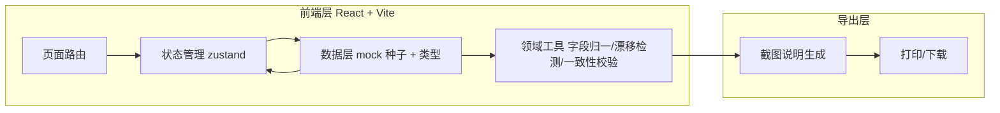
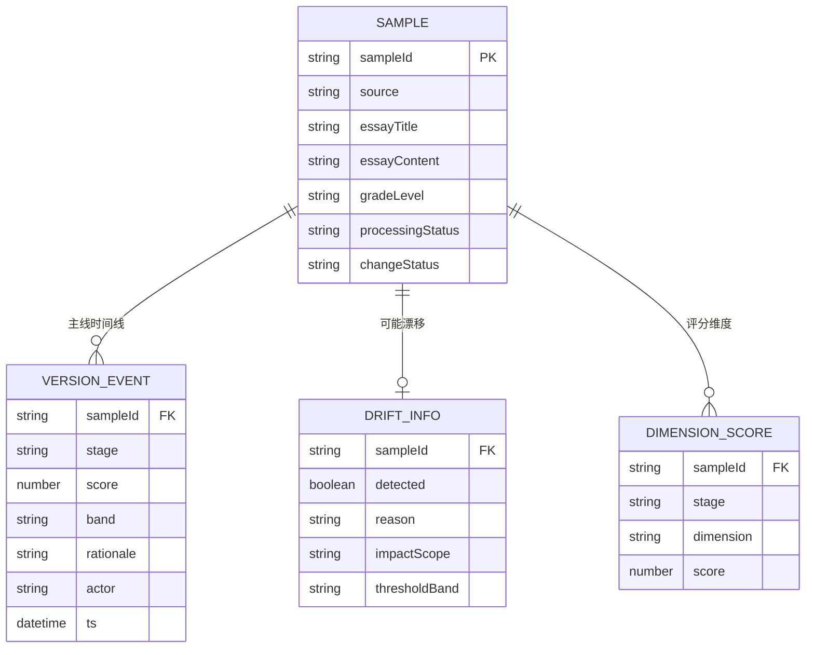

# 作文批改灰度对比 · 技术架构文档

## 1. 架构设计

纯前端单页应用，数据以本地 mock 种子承载，导出（截图说明）在浏览器端完成打印/下载。无后端服务，最小化外部依赖。



## 2. 技术说明
- 前端：React@18 + tailwindcss@3 + Vite（TypeScript）
- 状态管理：zustand
- 路由：react-router-dom@6
- 图标：lucide-react
- 字体：Fraunces（衬线，作文正文/标题）、Schibsted Grotesk（UI）、JetBrains Mono（数据/编号），经 Google Fonts / Fontsource 引入
- 初始化工具：vite-init（react-ts 模板）
- 后端：无（mock 数据，必要时可后续接入）
- 数据：本地 mock 种子，字段归一与漂移检测在前端领域工具内完成

## 3. 路由定义
| 路由 | 用途 |
|------|------|
| `/` | 对比工作台：样本总表、口径筛选、汇总数字、漂移阻断横幅 |
| `/sample/:id` | 样本改判溯源：版本时间线、改判原因解释、误判回灌重判 |
| `/drift` | 阈值漂移监控：阈值带分布、漂移样本、待确认原因与影响范围 |
| `/report` | 截图说明导出：口径随文、一致性校验、打印/下载 |

## 4. API 定义
不适用（纯前端，使用本地 mock 数据）。如未来接入后端，将提供 `/samples`、`/samples/:id/rejudge`、`/drift`、`/report/export` 等接口。

## 5. 服务端架构图
不适用（无后端）。

## 6. 数据模型

### 6.1 数据模型定义



### 6.2 数据定义（TypeScript 类型与 mock 种子）

```ts
export type Stage = "old" | "manual" | "new";
export type ChangeStatus = "改判" | "一致" | "漂移待确认";
export type ProcessingStatus = "待处理" | "已对比" | "已人工修正" | "已回灌" | "待确认";

export interface VersionEvent {
  stage: Stage;
  score: number;       // 满分 50
  band: string;        // 一类/二类/三类/四类文
  rationale: string;   // 判定理由（新模型含改判解释）
  actor: string;       // 旧模型v1.2 / 小乔 / 新模型v2.0 等
  ts: string;          // ISO 时间
}

export interface DriftInfo {
  detected: boolean;
  reason: string;       // 待确认原因
  impactScope: string;  // 影响范围
  thresholdBand: string;
}

export interface Sample {
  sampleId: string;
  source: string;            // 来源（保留）
  essayTitle: string;
  essayContent: string;
  gradeLevel: string;
  processingStatus: ProcessingStatus;  // 处理状态（保留）
  changeStatus: ChangeStatus;
  storyline: VersionEvent[];  // 旧→人工→新 主线，人工修正永不被覆盖
  drift: DriftInfo;
  dimensions: { stage: Stage; 内容: number; 结构: number; 语言: number; 书写: number }[];
}
```

mock 种子（节选）将放在 `src/data/samples.ts`，覆盖：一致样本、改判样本（含人工修正）、漂移待确认样本、可回灌的旧模型误判样本。字段归一映射表（处理运营主管字段命名前后不一）放在 `src/utils/fieldMap.ts`，至少保留 `source` 与 `processingStatus`。漂移检测逻辑放在 `src/utils/drift.ts`，一致性校验（屏幕数字 vs 文件说法）放在 `src/utils/consistency.ts`。
