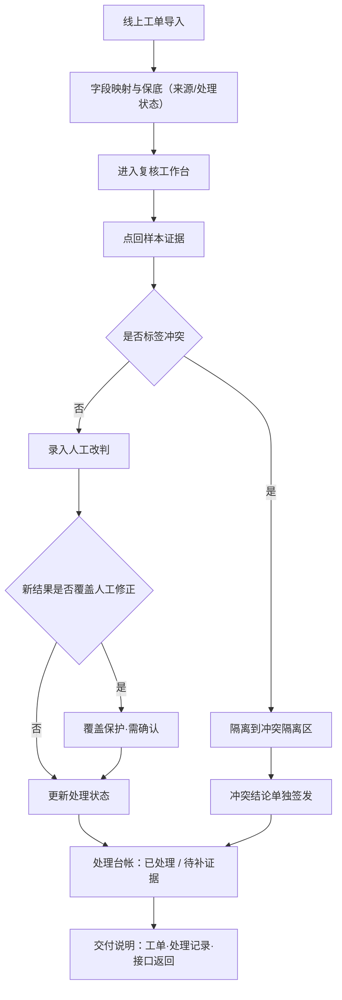

# 作文批改人工改判 — 产品需求文档（PRD）

## 1. 产品概述

「作文批改人工改判」是面向风控运营的内部复核工具，解决自动批改结果与人工改判结果之间的冲突、覆盖与证据追溯问题。目标用户为风控运营「老唐」与改判负责人：让复核从线上工单出发、人工修正不被新结果盖掉、标签冲突单独隔离，最终交付一份能让老唐把「线上工单 / 处理记录 / 接口返回」对给别人看的证据链。

## 2. 核心功能

### 2.1 用户角色

| 角色 | 进入方式 | 核心权限 |
|------|----------|----------|
| 风控运营（老唐） | 内部账号 | 导入工单、逐条复核改判、补录证据、查看交付说明 |
| 改判负责人 | 内部账号 | 查看总指标、样本级下钻、签发标签冲突隔离结论 |

### 2.2 功能模块

1. **复核工作台**：工单列表与导入、样本证据详情、人工改判面板、覆盖保护。
2. **改判评审**：总指标看板、样本级影响下钻、标签冲突隔离区。
3. **处理台帐与交付**：已处理 / 待补证据台帐、可分享的交付说明（工单·处理记录·接口返回）。

### 2.3 页面详情

| 页面 | 模块 | 功能描述 |
|------|------|----------|
| 复核工作台 | 工单列表与导入 | 按线上工单翻阅；字段名前后不一时，至少保住「来源」与「处理状态」两个字段；支持来源筛选 |
| 复核工作台 | 样本证据详情 | 点击可回溯样本证据（作文原文、题目、学生作答、机器评分），不只看一个分数 |
| 复核工作台 | 人工改判面板 | 录入人工修正分数与理由；当新结果会覆盖人工修正时给出保护提示，防止「人工修正被新结果盖掉」 |
| 复核评审 | 总指标看板 | 改判总数、覆盖数、冲突数、已处理 / 待补证据比例 |
| 复核评审 | 样本级下钻 | 回答「哪几条样本把结论拉偏了」，按影响度排序，可点回样本证据 |
| 复核评审 | 标签冲突隔离区 | 把标签冲突记录单独拎出，不揉进正常结果 |
| 处理台帐与交付 | 处理台帐 | 最终看到「哪些已处理、哪些还要补证据」，而非功能表 |
| 处理台帐与交付 | 交付说明 | 精简交付：线上工单、处理记录、接口返回三段证据链，可对给别人看 |

## 3. 核心流程

1. 老唐从线上工单进入复核工作台，逐条查看样本证据。
2. 在样本证据详情中比对机器评分与人工改判，必要时录入人工修正与理由。
3. 当系统检测到新结果将覆盖既有的人工修正时，触发覆盖保护，要求确认。
4. 字段名前后不一的工单，系统至少保住「来源」与「处理状态」，其余字段进入原始字段映射区。
5. 标签冲突记录被自动隔离到冲突隔离区，不进入正常结果统计。
6. 负责人在改判评审页查看总指标，并下钻到「把结论拉偏」的具体样本。
7. 老唐在处理台帐确认已处理 / 待补证据状态，导出交付说明（工单·处理记录·接口返回）给外部对齐。

## 4. 用户界面设计

### 4.1 设计风格

- **美学方向**：案卷档案 / 取证工作台（Forensic Dossier）。界面像一份严谨的案卷：纸感米白底、墨黑正文、关键状态用「取证红 / 验证绿 / 待补琥珀」三色印章式强调。
- **主色**：纸感米白 `#F4EFE3` 背景，墨黑 `#1A1814` 正文；结构色靛蓝 `#28415B`。
- **强调色**：取证红 `#B23A48`（冲突 / 覆盖告警）、验证绿 `#2F6B4F`（已处理 / 证据齐备）、待补琥珀 `#C8862E`（待补证据 / 待处理）。
- **按钮**：克制直角描边按钮，主操作用靛蓝实底；印章式状态徽标用圆角方块。
- **字体**：标题用衬线体（思源宋体 / Noto Serif SC）营造编辑式权重，正文用无衬线（思源黑体 / Noto Sans SC），ID、字段名、接口返回用等宽体（JetBrains Mono）。
- **布局**：左侧案卷式导航 + 右侧数据密集主区；详情用抽屉与卡片堆叠。
- **图标 / 印章**：用编号徽标与图章式标记，避免通用 emoji。

### 4.2 页面设计概览

| 页面 | 模块 | UI 元素 |
|------|------|---------|
| 复核工作台 | 工单列表 | 案卷式表头、来源徽标、处理状态印章、字段映射折叠区 |
| 复核工作台 | 样本证据详情 | 证据卡片、作文原文对照、机器分 vs 人工分对比条 |
| 复核工作台 | 覆盖保护 | 警示横幅 + 确认对话框，取证红强调 |
| 改判评审 | 总指标 | 大数字指标卡、影响度条形 |
| 改判评审 | 样本级下钻 | 影响度排序列表、点回证据链接 |
| 改判评审 | 冲突隔离区 | 独立区块、红色描边、不进正常统计 |
| 处理台帐与交付 | 台帐看板 | 已处理 / 待补证据双栏看板 |
| 处理台帐与交付 | 交付说明 | 三段证据链：工单 · 处理记录 · 接口返回 |

### 4.3 响应式

桌面优先（1280px+ 为最佳工作宽度），平板自适应收起抽屉，触控优化状态徽标与按钮命中区。

### 4.4 3D 场景

不适用（纯数据型工作台，无 3D 场景需求）。
