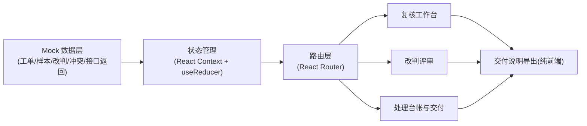
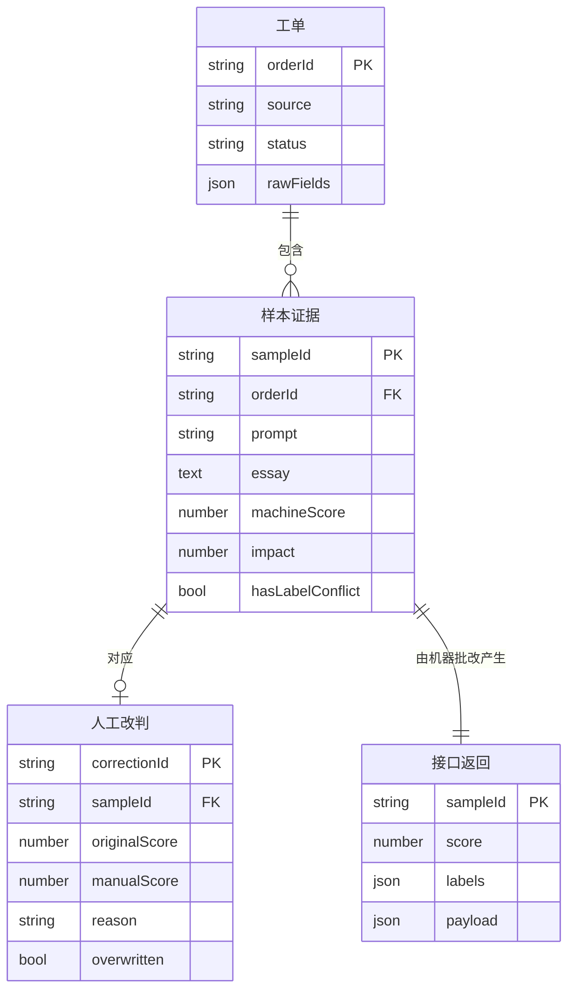

# 作文批改人工改判 — 技术架构文档

## 1. 架构设计

本项目为前端纯展示型内部工具，数据来自前端 mock 数据层，模拟「线上工单导入 → 处理记录 → 接口返回」的完整证据链，无需后端服务。



## 2. 技术说明

- **前端**：React 18 + TailwindCSS 3 + Vite
- **初始化工具**：`npm create vite@latest`（react-ts 模板）
- **路由**：react-router-dom 6
- **图标**：lucide-react
- **后端**：无（mock 数据模拟线上工单与接口返回）
- **数据库**：无（前端 mock，模拟接口返回 JSON）

## 3. 路由定义

| 路由 | 用途 |
|------|------|
| `/workbench` | 复核工作台：工单列表、样本证据详情、人工改判、覆盖保护 |
| `/analytics` | 改判评审：总指标、样本级下钻、标签冲突隔离区 |
| `/ledger` | 处理台帐与交付：已处理/待补证据台帐、交付说明 |
| `/` | 重定向至 `/workbench` |

## 4. 接口定义（Mock 模拟）

前端通过 mock 模块模拟以下「接口返回」，供「交付说明」对外对齐：

```typescript
// 处理状态枚举（工单/样本至少保住这两个字段）
type ProcessStatus = "pending" | "processed" | "needs_evidence" | "conflict";

// 线上工单（字段名前后不一，归一化后至少保住来源与处理状态）
interface WorkOrder {
  orderId: string;            // 归一化工单ID
  rawFields: Record<string, string>; // 原始字段映射（字段名前后不一的原始快照）
  source: string;             // 来源（保底字段）
  status: ProcessStatus;      // 处理状态（保底字段）
  importedAt: string;
}

// 接口返回（机器批改）
interface GradeResponse {
  sampleId: string;
  score: number;
  labels: string[];
  payload: Record<string, unknown>; // 原始接口返回，供交付对齐
  returnedAt: string;
}

// 人工改判记录
interface ManualCorrection {
  correctionId: string;
  sampleId: string;
  originalScore: number;
  manualScore: number;
  reason: string;
  reviewer: string;
  createdAt: string;
  overwritten: boolean;       // 是否被新结果盖掉
}

// 样本证据
interface SampleEvidence {
  sampleId: string;
  orderId: string;
  prompt: string;             // 题目
  essay: string;              // 作文原文（学生作答）
  machineScore: number;
  manualCorrection?: ManualCorrection;
  response: GradeResponse;
  impact: number;             // 对结论的拉偏影响度
  hasLabelConflict: boolean;
  conflictNote?: string;
}
```

## 5. 服务端架构图

不适用（无后端，纯前端 mock）。

## 6. 数据模型

### 6.1 数据模型定义



### 6.2 数据定义语言

不适用（无数据库；mock 数据以 TypeScript 模块形式提供，包含若干工单、样本证据、人工改判记录、标签冲突记录与接口返回，覆盖「覆盖保护」「标签冲突隔离」「待补证据」等场景）。
