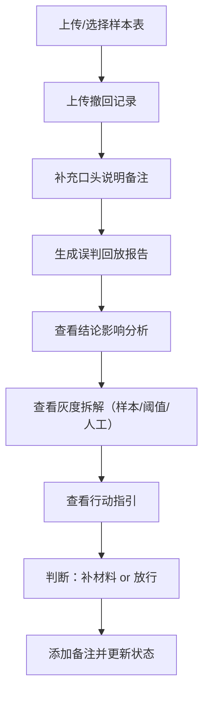

## 1. 产品概述

作文批改误判回放工具是面向算法工程师的诊断分析平台，解决人工修正被新结果覆盖、误判原因说不清的核心痛点。通过样本表版本追踪、撤回记录影响分析、灰度结果拆解三大核心能力，让算法工程师快速定位问题、判断材料补漏、做出放行决策。

- 核心问题：人工修正被新结果盖掉、撤回记录影响结论说不清、灰度变化拆不开
- 目标用户：算法工程师（小乔为代表）
- 产品价值：从"技术说明"转向"行动指引"，告诉工程师哪条材料该补、哪条可以放行

## 2. 核心功能

### 2.1 用户角色

| 角色 | 登录方式 | 核心权限 |
|------|----------|----------|
| 算法工程师 | 内部账号登录 | 查看样本、上传撤回记录、生成回放报告、添加备注 |

### 2.2 功能模块

1. **样本表管理**：样本列表、版本对比、口径变更标记、泄漏检测
2. **撤回记录分析**：撤回记录详情、影响范围评估、原因链路追踪
3. **误判回放报告**：结论影响说明、样本变化拆解、阈值变化拆解、人工改判拆解
4. **历史时间线**：版本变更记录、备注留存、状态流转、重启后时间线对齐
5. **行动指引**：材料补漏建议、放行列项、待确认项

### 2.3 页面详情

| 页面名称 | 模块名称 | 功能描述 |
|----------|----------|----------|
| 总览仪表盘 | 统计卡片 | 误判数、撤回数、待处理数、样本泄漏预警 |
| 总览仪表盘 | 最近活动 | 时间线式展示最近的样本变更、撤回、备注 |
| 样本表页面 | 样本列表 | 表格展示所有样本，支持筛选、搜索、版本筛选 |
| 样本表页面 | 版本对比 | 同一作文的多版本并排对比，高亮口径变更处 |
| 样本表页面 | 泄漏检测 | 自动标记疑似泄漏样本，提供处理步骤指引 |
| 撤回记录页面 | 撤回列表 | 所有撤回记录卡片，按时间倒序，显示影响范围 |
| 撤回记录页面 | 撤回详情 | 单条撤回记录展开，显示影响的样本、结论变化链路 |
| 回放报告页面 | 结论影响 | 清晰说明"为什么这条撤回影响了最终结论" |
| 回放报告页面 | 灰度拆解 | 三栏对比：样本变化 / 阈值变化 / 人工改判 各自贡献度 |
| 回放报告页面 | 行动指引 | 明确列出：需补充材料、可放行、待确认三项 |
| 历史时间线 | 时间线视图 | 纵向时间线，展示所有版本、备注、状态变更 |
| 历史时间线 | 备注管理 | 添加、编辑历史备注，重启后留存对齐 |
| 历史时间线 | 状态追踪 | 当前状态、历史状态流转记录 |

## 3. 核心流程

### 3.1 误判回放主流程

算法工程师小乔收到样本表、撤回记录和口头说明后，上传或选择数据，生成回放报告，查看结论影响原因和行动指引。

### 3.2 版本追踪与时间线流程

每次样本表更新、撤回记录添加、人工改判时，自动记录时间线节点，重启后历史数据完整留存。

## 4. 用户界面设计

### 4.1 设计风格

- **整体调性**：专业分析工具感，冷静克制，数据驱动
- **主色调**：深海蓝 #0F2A4A 作为主色，搭配青蓝 #2196F3 强调色
- **辅助色**：
  - 警告橙 #FF9800（待确认、疑似泄漏）
  - 通过绿 #4CAF50（可放行）
  - 驳回红 #F44336（需补充、误判）
  - 信息灰 #607D8B（历史记录）
- **字体**：
  - 标题：思源宋体 / Noto Serif SC（专业感、稳重）
  - 正文：JetBrains Mono + 思源黑体（数据表格易读、代码感）
- **布局风格**：左侧导航 + 主内容区 + 右侧详情抽屉
- **卡片风格**：细边框 + 微阴影 + 8px圆角，hover时阴影加深
- **图标风格**：线性图标，粗细一致，搭配单色填充

### 4.2 页面设计概览

| 页面名称 | 模块名称 | UI元素 |
|----------|----------|--------|
| 总览仪表盘 | 统计卡片 | 四个大数字卡片，带趋势箭头和小图表，深蓝渐变背景 |
| 总览仪表盘 | 最近活动 | 纵向时间线，彩色圆点标记不同类型事件 |
| 样本表页面 | 样本列表 | 斑马纹表格，行悬停高亮，版本标签彩色角标 |
| 样本表页面 | 版本对比 | 左右分栏，中间diff高亮带，联动滚动 |
| 撤回记录页面 | 撤回卡片 | 卡片列表，左绿右红对比条，显示影响数量 |
| 回放报告页面 | 结论影响 | 大号结论卡片 + 因果链路图，箭头连接原因节点 |
| 回放报告页面 | 灰度拆解 | 三栏等高卡片，底部进度条显示各自贡献占比 |
| 回放报告页面 | 行动指引 | 三色分区卡片：红（待补）、绿（放行）、橙（待确认） |
| 历史时间线 | 时间线 | 左侧竖线，右侧节点卡片，可展开/收起，带状态标签 |

### 4.3 响应式

- 桌面端优先设计（1280px+），适配算法工程师大屏工作场景
- 平板端（768-1279px）：右侧抽屉改为底部抽屉
- 移动端（<768px）：简化为列表视图，核心功能优先

### 4.4 动效设计

- 页面加载：卡片错落淡入（staggered fade-in），延迟50ms递增
- 时间线滚动：节点逐个滑入，配合进度条动画
- 对比高亮：diff区域平滑闪烁一次，引导注意力
- 状态变更：状态标签颜色渐变过渡，带轻微缩放动效
- 悬停反馈：卡片上移2px + 阴影加深，150ms缓动
