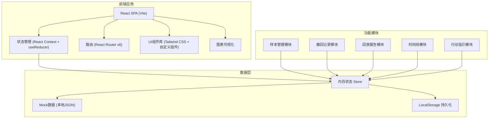
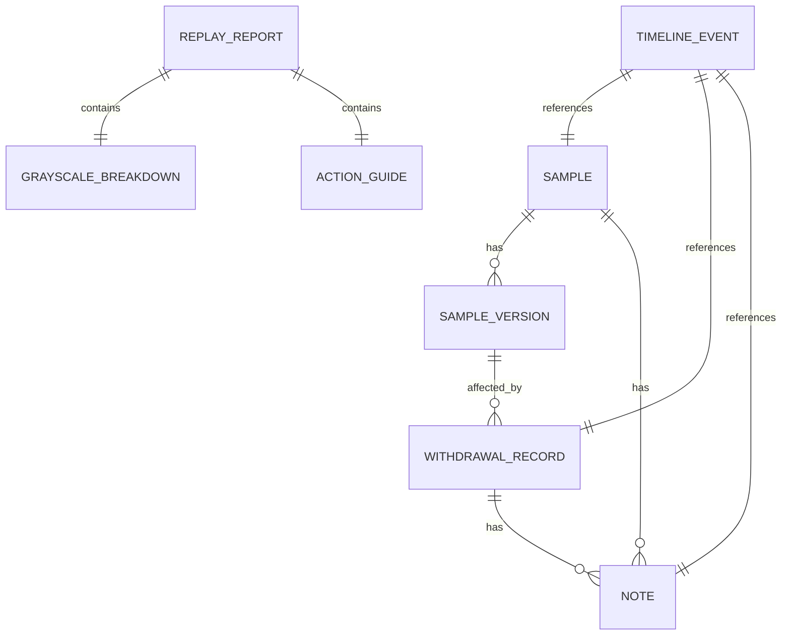

## 1. 架构设计



## 2. 技术描述

- **前端框架**：React@18 + TypeScript
- **构建工具**：Vite@5
- **样式方案**：Tailwind CSS@3
- **路由**：React Router DOM@6
- **状态管理**：React Context + useReducer（轻量级，避免过度设计）
- **图表**：Recharts（React友好的图表库）
- **图标**：Lucide React（线性图标，符合设计风格）
- **数据持久化**：LocalStorage（保存历史备注、状态、时间线，重启后对齐）
- **Mock数据**：本地JSON数据模拟后端返回

## 3. 路由定义

| 路由 | 页面 | 用途 |
|------|------|------|
| / | 仪表盘 | 总览统计、最近活动时间线 |
| /samples | 样本表 | 样本列表、版本对比、泄漏检测 |
| /samples/:id | 样本详情 | 单样本多版本对比、口径变更标记 |
| /withdrawals | 撤回记录 | 撤回列表、影响范围展示 |
| /withdrawals/:id | 撤回详情 | 单条撤回的影响链路分析 |
| /report | 回放报告 | 结论影响、灰度拆解、行动指引 |
| /timeline | 历史时间线 | 全量时间线、备注管理、状态追踪 |

## 4. 数据模型

### 4.1 数据模型定义



### 4.2 核心数据结构

```typescript
// 样本
interface Sample {
  id: string;
  title: string;
  studentId: string;
  grade: string;
  currentVersion: number;
  status: 'pending' | 'approved' | 'rejected' | 'leak_suspected';
  createdAt: string;
  updatedAt: string;
  versions: SampleVersion[];
  isLeakSuspected: boolean;
  leakReason?: string;
}

// 样本版本
interface SampleVersion {
  version: number;
  content: string;
  score: number;
  gradeResult: string;
  changedBy: 'algorithm' | 'human' | 'threshold';
  changeDescription: string;
  createdAt: string;
  diffHighlights: DiffHighlight[];
}

// Diff高亮
interface DiffHighlight {
  type: 'added' | 'removed' | 'modified';
  field: string;
  oldValue: string;
  newValue: string;
}

// 撤回记录
interface WithdrawalRecord {
  id: string;
  title: string;
  reason: string;
  affectedSampleCount: number;
  affectedSampleIds: string[];
  conclusionChange: string;
  impactLevel: 'high' | 'medium' | 'low';
  createdAt: string;
  createdBy: string;
  oralNotes?: string;
  status: 'active' | 'reverted' | 'resolved';
}

// 回放报告
interface ReplayReport {
  id: string;
  title: string;
  generatedAt: string;
  conclusionImpact: ConclusionImpact;
  grayscaleBreakdown: GrayscaleBreakdown;
  actionGuide: ActionGuide;
}

// 结论影响
interface ConclusionImpact {
  originalConclusion: string;
  newConclusion: string;
  changeReason: string;
  evidenceChain: EvidenceNode[];
}

// 证据链节点
interface EvidenceNode {
  id: string;
  type: 'sample_change' | 'threshold_change' | 'human_review' | 'withdrawal';
  title: string;
  description: string;
  timestamp: string;
}

// 灰度拆解
interface GrayscaleBreakdown {
  sampleChange: {
    contribution: number; // 百分比
    description: string;
    details: string[];
  };
  thresholdChange: {
    contribution: number;
    description: string;
    details: string[];
  };
  humanReview: {
    contribution: number;
    description: string;
    details: string[];
  };
}

// 行动指引
interface ActionGuide {
  toSupplement: ActionItem[];    // 需补充材料
  toApprove: ActionItem[];       // 可放行
  toConfirm: ActionItem[];       // 待确认
}

// 行动项
interface ActionItem {
  id: string;
  title: string;
  description: string;
  priority: 'high' | 'medium' | 'low';
  relatedSampleId?: string;
}

// 时间线事件
interface TimelineEvent {
  id: string;
  type: 'sample_version' | 'withdrawal' | 'note' | 'status_change' | 'report';
  title: string;
  description: string;
  timestamp: string;
  relatedId?: string;
  status?: string;
}

// 备注
interface Note {
  id: string;
  content: string;
  author: string;
  createdAt: string;
  updatedAt: string;
  targetType: 'sample' | 'withdrawal' | 'report';
  targetId: string;
}
```

## 5. 核心模块划分

### 5.1 目录结构

```
src/
├── assets/           # 静态资源
├── components/       # 通用组件
│   ├── layout/       # 布局组件（Sidebar、Header）
│   ├── ui/           # 基础UI组件（Card、Button、Badge...）
│   └── charts/       # 图表组件
├── pages/            # 页面组件
│   ├── Dashboard/
│   ├── Samples/
│   ├── Withdrawals/
│   ├── Report/
│   └── Timeline/
├── context/          # React Context
│   ├── SampleContext.tsx
│   ├── WithdrawalContext.tsx
│   └── TimelineContext.tsx
├── data/             # Mock数据
│   ├── samples.ts
│   ├── withdrawals.ts
│   └── timeline.ts
├── types/            # TypeScript类型定义
│   └── index.ts
├── utils/            # 工具函数
│   ├── storage.ts    # LocalStorage封装
│   ├── date.ts       # 日期处理
│   └── diff.ts       # 对比计算
├── hooks/            # 自定义Hooks
├── App.tsx
├── main.tsx
└── index.css
```

### 5.2 状态管理策略

- 使用 **React Context + useReducer** 管理全局状态
- 按领域划分 Context：SampleContext、WithdrawalContext、TimelineContext
- LocalStorage 持久化关键状态：备注、用户标记、时间线
- 初始化时从 LocalStorage 恢复，确保重启后数据对齐

### 5.3 组件设计原则

- 原子化设计：基础组件 → 业务组件 → 页面
- 单一职责：每个组件只做一件事
- 受控组件：所有表单和交互状态可控
- 可组合：通过组合而非继承扩展功能
