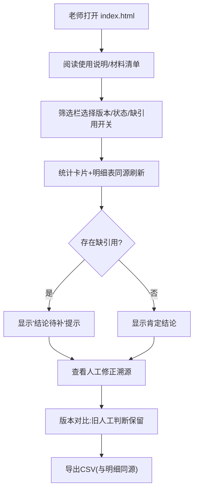

# 作文批改指标看板 — 产品需求文档 (PRD)

## 1. 产品概述

面向作文批改模型评测复盘的"作文批改指标看板"，供标注负责人（周姐）与现场老师在第二天复盘前自服务查看。核心解决：筛选条件、统计数字、明细表、CSV 明细必须从同一套结果生成；泄漏样本单独隔离；模型换版本后旧的人工判断不被覆盖；坏数据可溯源到原始行/具体对象；缺引用时不被当作肯定结论。
- 目标用户：标注负责人（周姐）、现场评测老师、复盘评审
- 价值：复盘前老师可自己跑一遍，交付顺，标注负责人不再临时解释数据口径

## 2. 核心功能

### 2.1 用户角色

| 角色 | 说明 | 核心权限 |
|------|------|----------|
| 标注负责人 | 周姐，对数据口径负责 | 查看全部、导出 CSV、看人工修正溯源 |
| 现场老师 | 评测执行者 | 自助筛选、对照两版本差异、导出 |
| 复盘评审 | 第二天复盘参会 | 查看统计与结论可信度提示 |

### 2.2 功能模块

1. **看板单页**：使用说明与材料清单 + 筛选栏 + 统计卡片 + 明细表 + 人工修正区 + 版本对比 + CSV 导出

### 2.3 页面详情

| 模块 | 功能说明 |
|------|----------|
| 使用说明/材料清单 | 顶部固定说明：如何使用、各材料位置，避免"材料在哪"提问 |
| 筛选栏 | 模型版本、年级、题目类型、数据状态（全部/正常/泄漏/边界/坏数据/已修正）、缺引用开关；所有视图共用同一筛选结果 |
| 统计卡片 | 总数、正常、泄漏、边界、坏数据、已修正、平均分、缺引用数、模型-人工一致性；缺引用数 > 0 时标注"结论待补" |
| 明细表 | 按筛选结果展示：原始行号、状态标签、模型分、人工分、引用状态、修正说明；可排序、可定位 |
| 人工修正区 | 列出人工修正，指向原始行号 + 具体对象；点击可定位到明细行 |
| 版本对比 | 两版本并排；旧版本人工判断保留显示，不被新版本覆盖 |
| CSV 导出 | 导出当前筛选结果，与明细表同源 |
| 泄漏隔离 | 泄漏样本默认排除出"正常"统计，单独区段展示 |

## 3. 核心流程

老师打开看板 → 顶部看使用说明与材料清单 → 在筛选栏选择模型版本/数据状态 → 查看统计卡片（注意缺引用"结论待补"提示）→ 浏览明细表 → 查人工修正区溯源到原始行 → 版本对比看差异（旧人工判断保留）→ 导出 CSV。

## 4. 用户界面设计

### 4.1 设计风格

- 风格：编辑式数据看板（editorial data dashboard），克制、可信、信息密度高，区别于通用 AI 风格
- 主色：暖纸底（warm paper）+ 墨黑文字；强调色：牛血红 oxblood（修正/告警/泄漏）+ 沉稳青 slate-teal（正常数据）
- 字体：标题衬线 Noto Serif SC；正文无衬线 Noto Sans SC；数字等宽 JetBrains Mono
- 布局：卡片式分区，清晰边框，4 的倍数间距，紧凑表格
- 图标：线性图标（lucide 风格）

### 4.2 页面设计概览

| 模块 | UI 要素 |
|------|---------|
| 筛选栏 | 顶部粘性栏，下拉与开关，暖纸底，状态色点 |
| 统计卡片 | 网格卡片，大号等宽数字，状态色点，缺引用黄底"结论待补" |
| 明细表 | 紧凑表格，状态标签徽章，缺引用行黄底，坏数据行删除线标记 |
| 人工修正区 | 卡片列表，原始行号可点击链接，具体对象标签 |

### 4.3 响应式

桌面优先，笔记本投屏为主；平板自适应；最小宽度下表格横向滚动。

### 4.4 交互细节

- 状态标签：正常(青)、泄漏(红)、边界(琥珀)、坏数据(灰删除线)、已修正(牛血红)
- 缺引用：行级黄底 + 徽章"缺引用"；统计区显示"其中 N 条缺引用，结论待补"
- 版本对比：左右两列，旧版本人工判断加"保留(v1.2)"锁标，新版本未覆盖

## 5. 不变量与口径（交付底线）

1. **同源**：统计、明细表、CSV 全部由同一 `getFilteredRecords(filterState)` 产出
2. **泄漏隔离**：`status=leakage` 默认不进入"正常"统计与平均分
3. **版本不可覆盖**：`human_judged_version` 锁定；对比时旧判断保留显示
4. **坏数据溯源**：人工修正含 `original_row` + `target_object`，指向原始行/具体对象
5. **缺引用不肯定**：缺引用数 > 0 时统计标注"结论待补"，不展示无保留肯定结论
