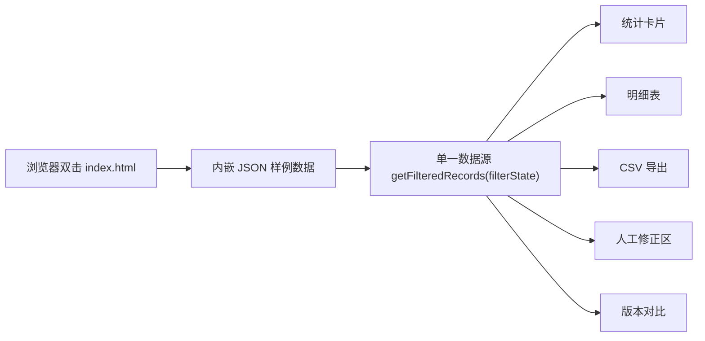

# 作文批改指标看板 — 技术架构文档

## 1. 架构设计

单文件自包含前端：`index.html` 内嵌 CSS + JS + 样例数据，浏览器直接双击打开即可运行，无需 Node、无需服务器、无需构建步骤。

**选型理由**：用户明确要求"自包含""现场老师自己跑一遍""交付够顺"。现场老师为非技术人员，React+Vite 方案需要 `npm install` 与 dev server/build，不满足"自包含"与"交付顺"。单文件方案让老师双击即用，最贴合场景。未来如需多人协作可平滑迁移至 React。



## 2. 技术说明

- 前端：原生 HTML5 + CSS3 + 原生 JavaScript (ES2020)，零运行时依赖、零构建
- 数据：内嵌 JSON 代表样例数据，覆盖人工修正、边界样本、泄漏样本、坏数据、两个模型版本
- 状态管理：单一 `filterState` 对象 + 单一 `getFilteredRecords(filterState)` 纯函数作为唯一数据源
- 不引入 React/Vite：为保证"自包含"与零安装交付；设计质量（字体/色彩/排版/动效）仍按 web-dev 设计准则执行
- 图标：内联 SVG（线性风格），不依赖外部图标库

## 3. 锚点分区（单页）

| 锚点 | 用途 |
|------|------|
| `#guide` | 使用说明与材料清单 |
| `#filters` | 筛选栏 |
| `#stats` | 统计卡片 |
| `#detail` | 明细表 |
| `#corrections` | 人工修正区 |
| `#version-compare` | 版本对比 |
| `#export` | CSV 导出 |

## 4. 数据模型

### 4.1 记录结构 EssayGradingRecord

```ts
interface EssayGradingRecord {
  row_id: number;              // 原始行号（溯源用）
  essay_id: string;           // 作文ID
  student_label: string;      // 学生标识（脱敏）
  grade: string;              // 年级，如"七年级"
  prompt_type: string;        // 题目类型，如"记叙文"|"议论文"|"应用文"
  model_version: string;      // 模型版本，如"v1.2"|"v1.3"
  model_total: number;         // 模型总分
  model_dim: {                 // 模型各维度分
    content: number; structure: number; language: number; handwriting: number;
  };
  has_citation: boolean;       // 是否有引用
  citation_snippet: string | null; // 引用片段，缺引用时为 null
  // 人工判断（版本锁定，不可覆盖）
  human_total: number | null;
  human_judged_version: string | null;  // 标注时所基于的模型版本
  judged_by: string | null;             // 标注人，如"周姐"
  judged_at: string | null;             // 标注时间
  // 数据状态分类
  status: "normal" | "leakage" | "boundary" | "bad_data" | "corrected";
  // 人工修正（溯源到原始行/具体对象）
  correction: {
    note: string;              // 修正说明
    original_row: number;      // 指向原始行号
    target_object: string;     // 具体对象，如"模型评分.语言维度"|"引用片段"
    corrected_by: string;
    corrected_at_version: string;
  } | null;
  supplement_note: string | null;  // 后补说明
}
```

### 4.2 关键不变量（口径底线）

1. **同源**：统计卡片、明细表、CSV 全部调用同一 `getFilteredRecords(filterState)`
2. **泄漏隔离**：`status === "leakage"` 默认排除出"正常"统计与平均分计算；单独区段展示
3. **版本不可覆盖**：`human_judged_version` 锁定标注所基于的版本；版本对比时旧版本人工判断保留显示，并加"保留(vX.X)"锁标，新版本不得覆盖
4. **坏数据溯源**：`correction.original_row` + `correction.target_object` 指向原始行号与具体对象，可在明细表定位高亮
5. **缺引用不肯定**：`has_citation === false` 的记录统计时标注"结论待补"；缺引用数 > 0 时不展示无保留的肯定结论

### 4.3 筛选状态 filterState

```ts
interface FilterState {
  model_version: "all" | string;     // 模型版本
  grade: "all" | string;             // 年级
  prompt_type: "all" | string;       // 题目类型
  status: "all" | "normal" | "leakage" | "boundary" | "bad_data" | "corrected";
  only_missing_citation: boolean;   // 仅看缺引用
}
```

### 4.4 统计口径

- 正常样本数 = `status === "normal"` 且非泄漏
- 平均分 = 仅正常 + 已修正 样本的模型总分均值（排除泄漏/坏数据）
- 缺引用数 = `has_citation === false` 的记录数
- 模型-人工一致性 = 有人工判断且非泄漏样本中 `|model_total - human_total| <= 阈值` 的占比
- 当缺引用数 > 0：统计区顶部显示"其中 N 条缺引用，结论待补"

## 5. 交付物清单

- `index.html`：自包含看板，双击打开即用
- 顶部"使用说明 + 材料清单"区：明确各材料位置，避免老师追问"材料在哪"
