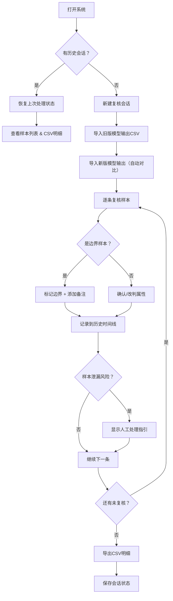

## 1. 产品概述

商品属性证据复核系统是一款面向算法工程师和标注审核人员的专业工具，用于对比多版本模型输出、追踪样本变化、记录人工复核过程，解决"指标涨了却不知道样本有没有变"的核心痛点。系统支持状态持久化、历史留痕、样本泄漏检测和改判解释，让每一次复核都有据可查、有迹可循。

## 2. 核心功能

### 2.1 用户角色

| 角色 | 核心职责 | 典型使用场景 |
|------|----------|--------------|
| 算法工程师（小乔） | 导入模型输出、标记边界样本、临时改判、查看历史 | 迭代模型后对比新旧版本输出 |
| 复核负责人 | 查看处理状态、导出CSV明细、确认最终结论 | 交接班时查看前一次处理进度 |

### 2.2 功能模块

1. **复核工作台**：样本列表、模型输出对比、属性标注、边界样本标记
2. **历史时间线**：操作记录、版本快照、小乔临时改判留痕
3. **数据导入导出**：CSV导入模型输出、导出复核明细
4. **样本分析**：改判解释、样本泄漏检测、处理指引
5. **状态中心**：持久化存储、上次处理状态恢复、会话管理

### 2.3 页面详情

| 页面名称 | 模块名称 | 功能描述 |
|----------|----------|----------|
| 复核工作台 | 顶部状态栏 | 当前版本号、样本总数、已复核数、边界样本数、持续保存状态 |
| 复核工作台 | 左侧样本列表 | 样本搜索、筛选（全部/边界/已改判/未复核）、样本卡片 |
| 复核工作台 | 中间详情区 | 商品信息展示、多版本模型输出对比表格、属性证据展示 |
| 复核工作台 | 右侧操作面板 | 人工标注、备注输入、标记边界样本、提交复核 |
| 历史时间线 | 时间线列表 | 按时间倒序展示所有操作，支持展开查看详情 |
| 历史时间线 | 版本快照 | 每个版本导入时的全量快照，支持对比 |
| 数据导入 | CSV导入 | 拖拽上传、列映射配置、预览、合并策略选择 |
| 数据导出 | CSV导出 | 选择导出字段、包含历史变更、一键下载 |
| 样本分析 | 改判解释 | 对比样本的历史判定，列出影响因素（模型版本/人工修改/边界标记） |
| 样本分析 | 泄漏检测 | 检测训练集样本泄漏风险，给出人工处理下一步指引 |
| 状态中心 | 会话管理 | 查看所有历史会话、恢复指定会话、新建会话 |

## 3. 核心流程

## 4. 用户界面设计

### 4.1 设计风格

- **主色调**：深海蓝 #0F172A（专业、沉稳），搭配青色 #06B6D4 作为强调色
- **辅助色**：琥珀色 #F59E0B（边界样本标记）、玫红色 #EC4899（改判/异常）、翠绿色 #10B981（已确认）
- **字体**：标题使用 Space Grotesk（现代几何感），正文使用 Inter（高可读性），等宽字体使用 JetBrains Mono（数据展示）
- **布局**：三栏式工作台布局，左侧样本列表（280px）、中间详情区（自适应）、右侧操作面板（320px）
- **视觉风格**：深色主题、玻璃拟态卡片、细边框分割、微妙的渐变背景、数据驱动的信息密度

### 4.2 页面设计概览

| 页面名称 | 模块名称 | UI元素 |
|----------|----------|--------|
| 复核工作台 | 顶部状态栏 | 半透明毛玻璃效果、状态徽章、实时保存指示灯 |
| 复核工作台 | 样本列表 | 卡片式列表、悬停微动效、状态角标、搜索框带筛选下拉 |
| 复核工作台 | 详情对比区 | 多列对比表格、版本标签、差异高亮、属性证据展开面板 |
| 复核工作台 | 操作面板 | 分组表单、备注输入框（支持@提及）、操作按钮组 |
| 历史时间线 | 时间线 | 左侧时间轴、右侧事件卡片、不同操作类型不同颜色、可展开详情 |
| 数据导入 | 导入面板 | 拖拽区域、文件预览表格、列映射选择器、合并策略开关 |
| 样本分析 | 改判解释 | 时间流对比图、影响因素列表、权重说明、置信度变化 |

### 4.3 响应式

桌面端优先设计，支持平板横屏适配（1024px+）。移动端简化为单页流式布局，优先保证数据可读性。

### 4.4 动效设计

- 页面加载：错落式入场动画，从状态栏到内容区依次显现
- 样本切换：淡入淡出 + 轻微位移
- 状态变更：颜色渐变过渡，避免突兀跳变
- 历史记录展开：平滑高度过渡 + 内容淡入
- 保存状态：脉冲呼吸灯效果表示正在保存，常亮表示已保存
