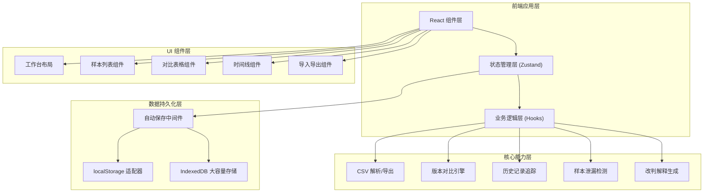
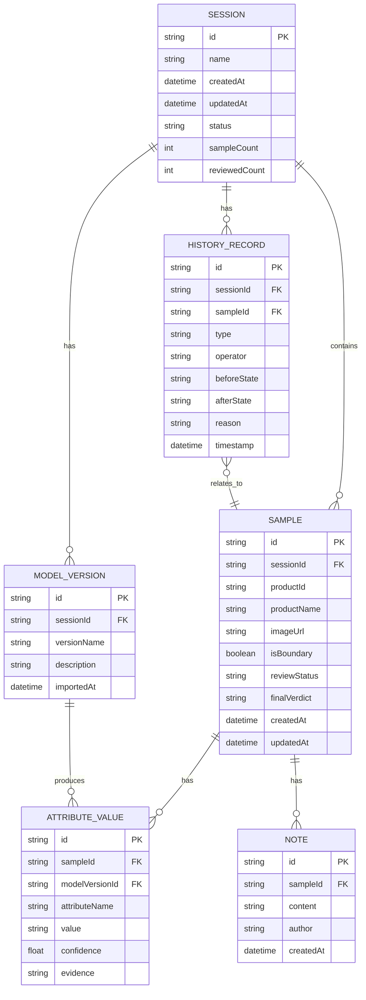

## 1. 架构设计



## 2. 技术描述

- **前端框架**：React 18 + TypeScript
- **构建工具**：Vite 5
- **样式方案**：TailwindCSS 3 + CSS Variables
- **状态管理**：Zustand（轻量、支持中间件、devtools）
- **路由**：React Router v6
- **图标库**：Lucide React
- **动画**：Framer Motion
- **CSV 处理**：Papa Parse
- **持久化**：localStorage（状态）+ IndexedDB（大容量样本数据）
- **无后端**：纯前端应用，所有数据本地存储

## 3. 路由定义

| 路由 | 页面名称 | 说明 |
|------|----------|------|
| / | 复核工作台 | 主工作界面，三栏布局 |
| /history | 历史时间线 | 全量操作历史记录 |
| /import | 数据导入 | CSV导入和列映射配置 |
| /sessions | 会话管理 | 历史会话列表和恢复 |

## 4. 数据模型

### 4.1 ER 图



### 4.2 状态存储结构

```typescript
// 会话状态
interface ReviewSession {
  id: string;
  name: string;
  createdAt: number;
  updatedAt: number;
  status: 'active' | 'completed' | 'archived';
  currentSampleId: string | null;
  modelVersions: ModelVersion[];
  samples: Sample[];
  history: HistoryRecord[];
}

// 模型版本
interface ModelVersion {
  id: string;
  name: string;
  description: string;
  importedAt: number;
  isBaseline: boolean;
}

// 样本
interface Sample {
  id: string;
  productId: string;
  productName: string;
  imageUrl: string;
  isBoundary: boolean;
  reviewStatus: 'pending' | 'reviewing' | 'confirmed' | 'disputed';
  attributes: Record<string, AttributeOutput>;
  notes: Note[];
  createdAt: number;
  updatedAt: number;
}

// 属性输出
interface AttributeOutput {
  name: string;
  versions: Record<string, {
    value: string;
    confidence: number;
    evidence: string;
  }>;
  manualValue?: string;
  finalValue?: string;
}

// 历史记录
interface HistoryRecord {
  id: string;
  type: 'import' | 'review' | 'boundary_mark' | 'note_add' | 'verdict_change' | 'leak_flag';
  sampleId?: string;
  operator: string;
  before: any;
  after: any;
  reason?: string;
  timestamp: number;
}
```

## 5. 核心模块设计

### 5.1 持久化中间件

- Zustand 自定义中间件，状态变更后自动保存到 localStorage
- 大容量样本数据使用 IndexedDB 存储，避免 localStorage 5MB 限制
- 节流保存（500ms），避免频繁写入
- 保存状态指示器（保存中/已保存/失败）

### 5.2 版本对比引擎

- 导入新模型版本时，自动与基线版本逐样本对比
- 识别新增、删除、属性值变化的样本
- 计算变更统计（准确率变化、召回率变化等）
- 支持多版本并排对比

### 5.3 历史记录系统

- 采用事件溯源模式，每次操作生成一条历史记录
- 记录操作前后的完整状态快照
- 支持按时间、操作类型、操作人筛选
- 支持撤销/重做（可选）

### 5.4 样本泄漏检测

- 基于样本ID哈希指纹检测重复样本
- 检测训练集/测试集重叠风险
- 泄漏风险分级（低/中/高）
- 生成人工处理指引（具体下一步操作）

### 5.5 改判解释生成

- 对比样本的历史判定链
- 识别影响因素：模型版本变更、人工修改、边界标记
- 计算各因素权重
- 生成自然语言解释
