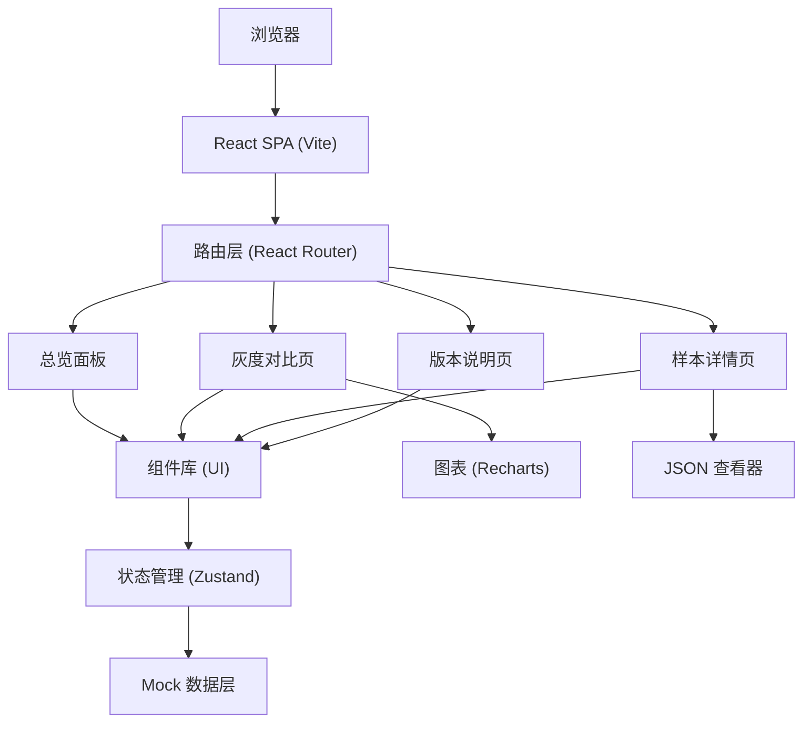
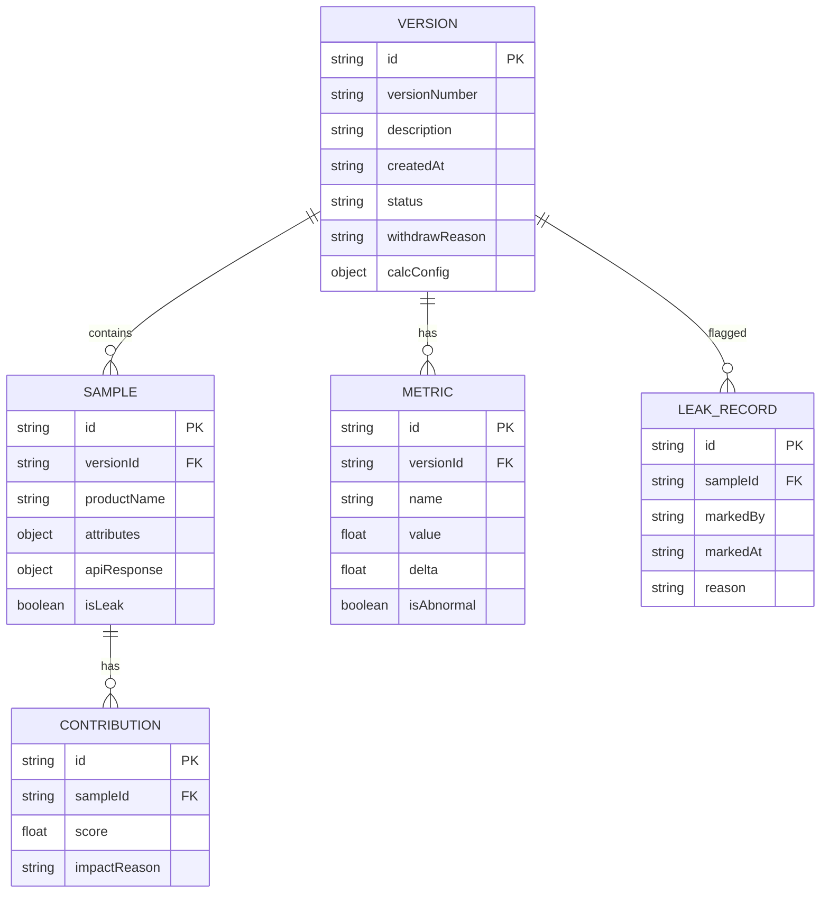

## 1. 架构设计


## 2. 技术说明
- **前端框架**：React@18 + TypeScript
- **构建工具**：Vite@5
- **样式方案**：TailwindCSS@3 + CSS 变量
- **路由管理**：react-router-dom@6
- **状态管理**：zustand@4（轻量型全局状态）
- **图表库**：recharts@2（雷达图、柱状图、折线图）
- **图标**：lucide-react
- **后端**：无（全量 Mock 数据）
- **数据持久化**：localStorage（用于标记样本泄漏、重跑状态）

## 3. 路由定义
| 路由路径 | 页面名称 | 说明 |
|-------|---------|------|
| `/` | 总览面板 | 版本时间线、指标趋势、异常告警 |
| `/compare/:baseVersion?/:targetVersion?` | 灰度对比页 | 双版本对比图表、泄漏专区 |
| `/samples/:versionId` | 样本详情页 | 拉偏样本清单、接口返回查看 |
| `/versions/:versionId` | 版本说明页 | 版本记录、计算口径、操作指南 |

## 4. 数据模型

### 4.1 数据模型 ER 图


### 4.2 TypeScript 类型定义
```typescript
// 版本状态
type VersionStatus = 'active' | 'withdrawn' | 'abnormal';

// 计算口径
interface CalcConfig {
  threshold: number;
  samplingRule: string;
  evaluationFormula: string;
  attributeWeights: Record<string, number>;
}

// 版本记录
interface Version {
  id: string;
  versionNumber: string;
  description: string;
  createdAt: string;
  status: VersionStatus;
  withdrawReason?: string;
  calcConfig: CalcConfig;
  metrics: Metric[];
  samples: Sample[];
}

// 指标
interface Metric {
  id: string;
  name: string;
  value: number;
  delta: number;
  isAbnormal: boolean;
}

// 样本
interface Sample {
  id: string;
  productName: string;
  attributes: Record<string, string>;
  apiResponse: Record<string, unknown>;
  isLeak: boolean;
  contribution: Contribution;
}

// 贡献度
interface Contribution {
  score: number;
  impactReason: string;
}

// 泄漏记录
interface LeakRecord {
  id: string;
  sampleId: string;
  markedBy: string;
  markedAt: string;
  reason: string;
}
```

## 5. Mock 数据规范
- 预置 5 个版本数据，其中 1 条为撤回状态
- 每个版本包含 8-10 个属性维度的指标
- 每个版本包含 20 条样本，其中 2-3 条标记为样本泄漏
- 拉偏样本贡献度按降序排列，Top 5 贡献度 > 10%
- 每个样本包含完整的模拟接口返回 JSON

## 6. 目录结构
```
src/
├── components/          # 通用组件
│   ├── Layout/
│   ├── Timeline/
│   ├── MetricCard/
│   ├── Chart/
│   ├── Alert/
│   └── Table/
├── pages/               # 页面组件
│   ├── Dashboard.tsx
│   ├── Compare.tsx
│   ├── Samples.tsx
│   └── Versions.tsx
├── store/               # 状态管理
│   └── useVersionStore.ts
├── data/                # Mock 数据
│   └── mockVersions.ts
├── types/               # 类型定义
│   └── index.ts
├── utils/               # 工具函数
│   └── helpers.ts
├── App.tsx
├── main.tsx
└── index.css
```
