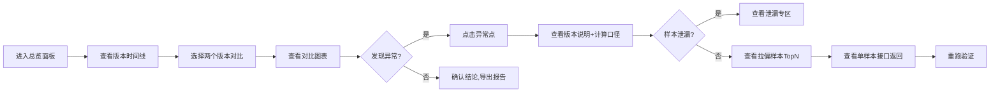

## 1. 产品概述
商品属性灰度对比平台，服务算法值班人进行版本效果复核。解决人工兜底效率低、阈值改动后结论追溯难、样本泄漏难发现、异常样本定位慢等问题。
- 核心用户：算法值班人、AI产品经理
- 核心价值：让灰度对比结论可追溯、可复核、可解释

## 2. 核心 Features

### 2.1 用户角色
| 角色 | 核心权限 |
|------|----------|
| 算法值班人 | 查看对比报告、定位异常样本、重跑对比、导出结果、标记样本泄漏 |
| AI产品经理 | 查看版本说明、复核结论、撤回版本记录 |

### 2.2 功能模块
1. **总览面板**：版本时间线、核心指标趋势、异常告警卡片
2. **灰度对比页**：双版本指标对比图表、异常点联动回溯、样本泄漏专区
3. **样本详情页**：拉偏样本清单、单样本贡献度分析、接口返回查看
4. **版本说明页**：版本记录（含撤回）、计算口径、操作指南

### 2.3 页面详情
| 页面名称 | 模块名称 | 功能描述 |
|-----------|-------------|---------------------|
| 总览面板 | 版本时间线 | 按时间倒序展示所有版本，高亮撤回记录和异常版本 |
| 总览面板 | 指标趋势卡 | 核心指标（准确率、召回率、F1）的多版本走势 |
| 总览面板 | 异常告警区 | 样本泄漏告警、指标突增突降告警 |
| 灰度对比页 | 双版本对比 | 左右两栏展示选中两个版本的详细指标 |
| 灰度对比页 | 雷达图/柱状图 | 多维度属性对比可视化 |
| 灰度对比页 | 异常点联动 | 点击图表异常点，自动跳转到对应版本说明和计算口径 |
| 灰度对比页 | 样本泄漏专区 | 独立卡片展示被标记为样本泄漏的记录，可标记/取消标记 |
| 样本详情页 | 拉偏样本清单 | 按贡献度排序展示影响结论的Top样本 |
| 样本详情页 | 接口返回查看 | 展示该样本的完整接口返回JSON |
| 样本详情页 | 重跑按钮 | 单样本或全量重新计算 |
| 版本说明页 | 版本记录 | 完整版本列表，含撤回标记（灰色+删除线） |
| 版本说明页 | 计算口径 | 本次对比的阈值、抽样规则、评估公式 |
| 版本说明页 | 操作指南 | 样例展示、重跑操作、接口返回查看三步说明 |

## 3. 核心流程

## 4. 用户界面设计

### 4.1 设计风格
- 主色：深科技蓝 `#0F172A`，强调专业严谨
- 辅助色：告警红 `#EF4444`、通过绿 `#10B981`、警告橙 `#F59E0B`、信息蓝 `#3B82F6`
- 字体：Display - Space Grotesk（标题），Body - JetBrains Mono（数据、代码）
- 风格：暗色科技风，数据密集型界面，卡片化布局，荧光边框点缀
- 图标：线性图标 + 状态色点组合

### 4.2 页面设计概要
| 页面名称 | 模块名称 | UI 元素 |
|-----------|-------------|----------|
| 总览面板 | 版本时间线 | 垂直时间轴，节点含版本号、状态色点、指标摘要 |
| 灰度对比页 | 对比图表 | 双栏雷达图，鼠标悬停显示属性详情，异常点闪烁动画 |
| 灰度对比页 | 泄漏专区 | 红边警示卡片，带斜纹背景，记录可展开/折叠 |
| 样本详情页 | 拉偏清单 | 表格按贡献度降序，进度条可视化影响程度 |
| 版本说明页 | 撤回记录 | 灰色背景 + 删除线 + 撤回原因标签 |

### 4.3 响应式
- 桌面端优先设计（1440px+）
- 平板端双栏折叠为单栏
- 移动端表格横向滚动，图表自适应

### 4.4 交互细节
- 图表异常点呼吸动画（opacity 0.6-1 循环）
- 时间线节点悬停上浮效果
- 表格行悬停高亮
- 标签页切换滑入动画
- 模态框背景模糊效果
