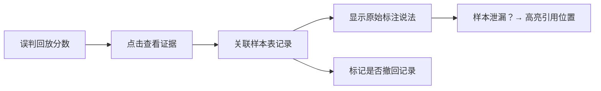

## 1. 产品概述

商品属性误判回放系统，解决标注团队靠人工记忆追踪误判案例的痛点。系统将样本表、误判报告、证据链三者关联，让排班同事能从回放结果直接追溯到原始样本证据，标注负责人周姐能清晰知道哪些材料该补、哪些可以放行。

- **核心价值**：把"靠人记"变成"靠系统留痕"，建立样本→误判→处理的完整证据链
- **目标用户**：标注负责人（周姐）、排班同事、评审人员

## 2. 核心功能

### 2.1 用户角色

| 角色 | 核心权限 |
|------|----------|
| 标注负责人（周姐） | 查看处理状态看板、审批放行/要求补证、管理样本表 |
| 排班同事 | 执行误判回放、查看证据链、标记处理状态 |
| 评审人员 | 查看总指标及明细、分析哪条样本拉偏结论 |

### 2.2 功能模块

1. **样本表管理页**：样本列表、撤回记录标记、原始说法留存
2. **误判回放页**：自动判断+分数展示、点击追溯样本证据
3. **证据链追踪页**：样本泄漏追踪、原始说法引用、问题定位
4. **评审分析页**：总指标仪表盘、明细钻取、拉偏样本高亮
5. **处理状态看板**：已处理/待补证/可放行三色状态、周姐视角

### 2.3 页面详情

| 页面名称 | 模块名称 | 功能描述 |
|-----------|-------------|---------------------|
| 样本表管理 | 样本列表 | 展示商品属性样本，支持筛选、搜索 |
| 样本表管理 | 撤回记录 | 专门标识已撤回的样本，不与正常记录混同 |
| 样本表管理 | 原始说法 | 留存样本标注时的原始描述，不可篡改 |
| 误判回放 | 自动判断 | 执行误判检测，输出置信度分数 |
| 误判回放 | 证据追溯 | 每条判断结果可点击跳转对应样本证据 |
| 误判回放 | 缺引用告警 | 报告肯定但缺样本引用时，明确关联缺失样本 |
| 证据链追踪 | 泄漏溯源 | 样本泄漏不是含糊警告，能追到样本表原始说法 |
| 评审分析 | 指标总览 | 准确率、召回率、误判率等核心指标 |
| 评审分析 | 明细钻取 | 点击指标能看到是哪几条样本拉偏了结论 |
| 处理状态看板 | 三色状态 | 已处理（绿）/待补证（黄）/可放行（蓝） |
| 处理状态看板 | 周姐视角 | 只展示需要决策的：哪条该补、哪条放行 |

## 3. 核心流程

### 3.1 业务主流程

### 3.2 证据链追溯流程

### 3.3 评审分析流程

## 4. 用户界面设计

### 4.1 设计风格

- **主色调**：深海蓝 `#1e3a5f`（专业、稳重）
- **辅助色**：警示橙 `#f59e0b`（待补证）、放行绿 `#10b981`（可放行）、处理蓝 `#3b82f6`（已处理）、撤回红 `#ef4444`（撤回记录）
- **字体**：标题用 Noto Serif SC（宋体类，正式感），正文用 Noto Sans SC（清晰易读）
- **布局**：左侧导航 + 右侧内容区，卡片式布局，信息密度高但不拥挤
- **图标**：使用 lucide-react，风格统一线性图标

### 4.2 页面设计概述

| 页面名称 | 模块名称 | UI元素 |
|-----------|-------------|-------------|
| 样本表管理 | 样本列表 | 表格布局，撤回记录红边标记，原始说法可展开 |
| 误判回放 | 结果卡片 | 大字号置信度分数，点击卡片展开证据链 |
| 证据链追踪 | 溯源面板 | 时间线布局，从回放结果→样本→原始说法层层递进 |
| 评审分析 | 指标卡片 | 数值+趋势箭头，点击可下钻明细 |
| 评审分析 | 拉偏样本 | 红榜高亮，按影响程度排序 |
| 处理状态看板 | 三色泳道 | 三列布局，卡片可拖拽流转状态 |

### 4.3 响应式

- 桌面端优先（1280px+），三列看板布局
- 平板端（768px-1279px）：两列布局，状态看板堆叠
- 移动端（<768px）：单列滚动，导航折叠为汉堡菜单
- 表格支持横向滚动，关键列固定

### 4.4 交互细节

- 点击回放结果卡片：平滑展开证据链面板
- 鼠标悬停样本：预览原始说法气泡
- 状态变更：卡片颜色渐变动画
- 撤回记录：始终带红色边框和删除线视觉提示
- 缺引用告警：不是toast，而是在行内显示"⚠ 缺样本引用，点击查看缺失哪条"
