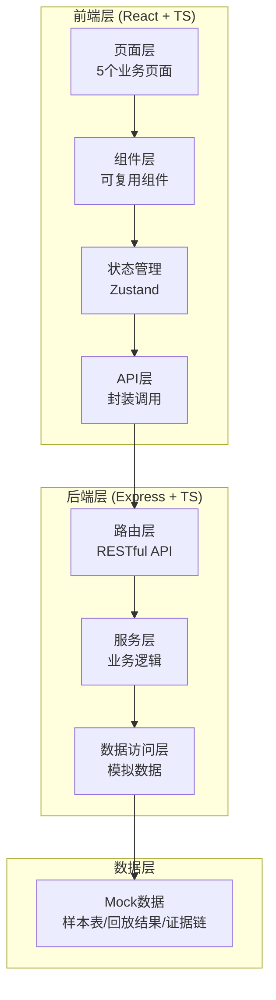
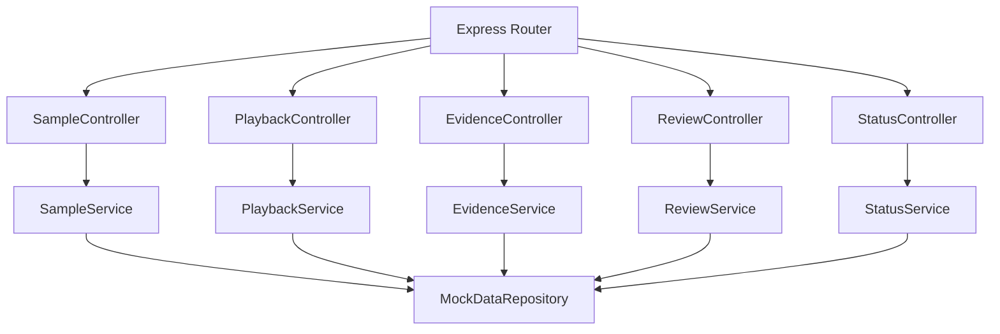
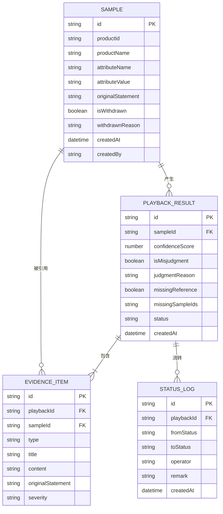

## 1. 架构设计



## 2. 技术描述

- **前端**：React@18 + TypeScript + tailwindcss@3 + vite + zustand + react-router-dom + lucide-react
- **后端**：Express@4 + TypeScript + ESM
- **初始化工具**：vite-init
- **数据库**：使用Mock数据（内置10条样本，含1条撤回记录）
- **包管理器**：npm

## 3. 路由定义

| 路由 | 页面 | 用途 |
|-------|------|------|
| / | 处理状态看板 | 周姐视角：待补证/可放行/已处理 |
| /samples | 样本表管理 | 样本列表、撤回记录、原始说法 |
| /playback | 误判回放 | 自动判断、置信度分数、证据追溯 |
| /evidence/:playbackId | 证据链追踪 | 样本泄漏溯源、原始说法引用 |
| /review | 评审分析 | 总指标、明细钻取、拉偏样本 |

## 4. API 定义

```typescript
// 样本类型
interface Sample {
  id: string;
  productId: string;
  productName: string;
  attributeName: string;
  attributeValue: string;
  originalStatement: string;
  isWithdrawn: boolean;
  withdrawnReason?: string;
  createdAt: string;
  createdBy: string;
}

// 回放结果类型
interface PlaybackResult {
  id: string;
  sampleId: string;
  confidenceScore: number;
  isMisjudgment: boolean;
  judgmentReason: string;
  missingReference: boolean;
  missingSampleIds: string[];
  evidenceChain: EvidenceItem[];
  status: 'pending' | 'processing' | 'approved' | 'need_evidence';
  createdAt: string;
}

// 证据链项
interface EvidenceItem {
  id: string;
  type: 'sample' | 'rule' | 'leak';
  title: string;
  content: string;
  originalStatement?: string;
  sampleId?: string;
  severity: 'low' | 'medium' | 'high';
}

// 评审指标
interface ReviewMetrics {
  totalSamples: number;
  accuracy: number;
  precision: number;
  recall: number;
  misjudgmentRate: number;
  topBiasingSamples: { sampleId: string; impactScore: number; reason: string }[];
}
```

### API 端点

| 方法 | 路径 | 描述 |
|------|------|------|
| GET | /api/samples | 获取样本列表（含撤回记录） |
| GET | /api/samples/:id | 获取单条样本详情 |
| GET | /api/playback | 执行误判回放，返回结果列表 |
| GET | /api/playback/:id | 获取单条回放结果及证据链 |
| GET | /api/evidence/:playbackId | 获取证据链详情（含泄漏追踪） |
| GET | /api/review/metrics | 获取评审总指标 |
| GET | /api/review/metrics/:metricName/details | 指标下钻明细 |
| PUT | /api/playback/:id/status | 更新处理状态 |

## 5. 服务器架构



## 6. 数据模型

### 6.1 ER图



### 6.2 Mock 初始数据

- **样本表**：10条样本数据，其中第7条标记为撤回记录
- **回放结果**：8条回放结果，3条标记为"缺引用"
- **证据链**：每条回放结果关联3-5条证据项，含样本泄漏标记
- **状态数据**：3条待补证、2条可放行、3条已处理

## 7. 关键技术决策

1. **状态管理**：使用 Zustand 轻量管理回放结果和处理状态
2. **路由设计**：证据链页面使用动态路由 `/evidence/:playbackId` 支持直接跳转
3. **撤回记录处理**：`isWithdrawn` 字段 + 视觉双重标记，不做物理删除
4. **证据链追溯**：从 `playbackResult.evidenceChain` 直接关联到 `sample.originalStatement`
5. **指标下钻**：前端计算影响因子，点击指标时过滤出 `topBiasingSamples`
6. **样式方案**：Tailwind CSS + CSS Variables 实现主题色统一
