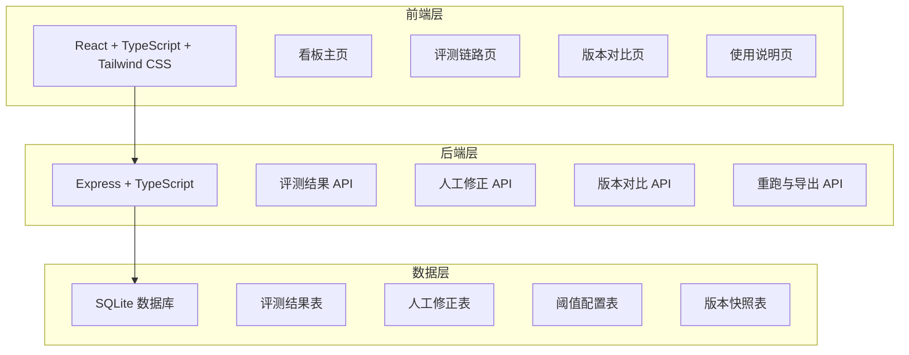
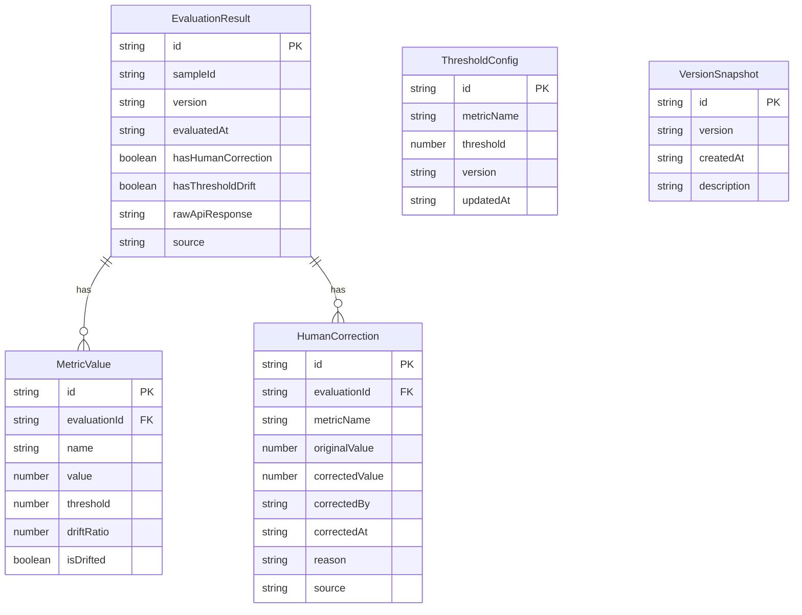

## 1. 架构设计



## 2. 技术说明

- 前端：React@18 + TypeScript + Tailwind CSS@3 + Vite
- 状态管理：Zustand
- 初始化工具：vite-init (react-express-ts 模板)
- 后端：Express@4 + TypeScript (ESM)
- 数据库：SQLite (better-sqlite3)
- 图标：lucide-react
- 图表：recharts

## 3. 路由定义

| 路由 | 用途 |
|------|------|
| / | 看板主页：筛选条件、统计卡片、样本明细表 |
| /sample/:id | 样本评测链路页：评测时间线、人工修正、阈值漂移、接口返回 |
| /compare | 版本对比页：前一版 vs 当前版 |
| /guide | 使用说明页：样例、重跑、接口返回 |

## 4. API 定义

### 4.1 评测结果相关

```typescript
interface EvaluationResult {
  id: string
  sampleId: string
  version: string
  evaluatedAt: string
  metrics: MetricValue[]
  hasHumanCorrection: boolean
  hasThresholdDrift: boolean
  rawApiResponse: string
  source: string
}

interface MetricValue {
  name: string
  value: number
  threshold: number
  driftRatio: number | null
  isDrifted: boolean
}

interface EvaluationFilter {
  version?: string
  dateFrom?: string
  dateTo?: string
  metricType?: string
  hasHumanCorrection?: boolean
  hasThresholdDrift?: boolean
  page?: number
  pageSize?: number
}

interface EvaluationListResponse {
  total: number
  statistics: EvaluationStatistics
  items: EvaluationResult[]
}

interface EvaluationStatistics {
  totalSamples: number
  evaluatedCount: number
  humanCorrectionCount: number
  thresholdDriftCount: number
  metricSummaries: MetricSummary[]
}

interface MetricSummary {
  name: string
  mean: number
  median: number
  min: number
  max: number
}
```

GET /api/evaluations - 获取评测结果列表（支持筛选）
GET /api/evaluations/:id - 获取单条评测结果详情（含接口返回原文）
GET /api/evaluations/:sampleId/chain - 获取同一样本的完整评测链路

### 4.2 人工修正相关

```typescript
interface HumanCorrection {
  id: string
  evaluationId: string
  metricName: string
  originalValue: number
  correctedValue: number
  correctedBy: string
  correctedAt: string
  reason: string
  source: string
}
```

POST /api/corrections - 录入人工修正
GET /api/corrections?evaluationId=xxx - 查询某条评测的修正记录

### 4.3 版本对比相关

```typescript
interface VersionComparison {
  previousVersion: string
  currentVersion: string
  metricDiffs: MetricDiff[]
  sampleChanges: SampleChanges
  thresholdChanges: ThresholdChange[]
  correctionDiffs: CorrectionDiff[]
}

interface MetricDiff {
  name: string
  previous: number
  current: number
  change: number
  changePercent: number
}

interface SampleChanges {
  added: string[]
  removed: string[]
  changed: SampleChangeDetail[]
}

interface SampleChangeDetail {
  sampleId: string
  metricName: string
  previousValue: number
  currentValue: number
}

interface ThresholdChange {
  metricName: string
  previousThreshold: number
  currentThreshold: number
  driftDirection: "up" | "down" | "none"
  driftMagnitude: number
}

interface CorrectionDiff {
  added: HumanCorrection[]
  removed: HumanCorrection[]
  modified: CorrectionModification[]
}

interface CorrectionModification {
  correctionId: string
  previousValue: number
  currentValue: number
  modifiedAt: string
}
```

GET /api/compare?previous=v1&current=v2 - 获取两个版本的对比数据

### 4.4 重跑与导出相关

```typescript
interface RerunRequest {
  version: string
  sampleIds?: string[]
  metricTypes?: string[]
}

interface RerunResponse {
  rerunId: string
  status: "queued" | "running" | "completed" | "failed"
  message: string
}

interface ExportRequest {
  filter: EvaluationFilter
  format: "csv" | "json"
  includeRawResponse: boolean
}
```

POST /api/rerun - 触发重跑
GET /api/rerun/:rerunId - 查询重跑状态
POST /api/export - 导出筛选结果

## 5. 服务端架构图

```mermaid
graph LR
    "Controller 层" --> "Service 层"
    "Service 层" --> "Repository 层"
    "Repository 层" --> "SQLite 数据库"
```

## 6. 数据模型

### 6.1 数据模型定义



### 6.2 数据定义语言

```sql
CREATE TABLE version_snapshots (
  id TEXT PRIMARY KEY,
  version TEXT NOT NULL,
  created_at TEXT NOT NULL,
  description TEXT
);

CREATE TABLE evaluation_results (
  id TEXT PRIMARY KEY,
  sample_id TEXT NOT NULL,
  version TEXT NOT NULL,
  evaluated_at TEXT NOT NULL,
  has_human_correction INTEGER NOT NULL DEFAULT 0,
  has_threshold_drift INTEGER NOT NULL DEFAULT 0,
  raw_api_response TEXT,
  source TEXT NOT NULL,
  FOREIGN KEY (version) REFERENCES version_snapshots(version)
);

CREATE INDEX idx_eval_sample ON evaluation_results(sample_id);
CREATE INDEX idx_eval_version ON evaluation_results(version);

CREATE TABLE metric_values (
  id TEXT PRIMARY KEY,
  evaluation_id TEXT NOT NULL,
  name TEXT NOT NULL,
  value REAL NOT NULL,
  threshold REAL NOT NULL,
  drift_ratio REAL,
  is_drifted INTEGER NOT NULL DEFAULT 0,
  FOREIGN KEY (evaluation_id) REFERENCES evaluation_results(id)
);

CREATE INDEX idx_metric_eval ON metric_values(evaluation_id);

CREATE TABLE human_corrections (
  id TEXT PRIMARY KEY,
  evaluation_id TEXT NOT NULL,
  metric_name TEXT NOT NULL,
  original_value REAL NOT NULL,
  corrected_value REAL NOT NULL,
  corrected_by TEXT NOT NULL,
  corrected_at TEXT NOT NULL,
  reason TEXT,
  source TEXT NOT NULL,
  FOREIGN KEY (evaluation_id) REFERENCES evaluation_results(id)
);

CREATE INDEX idx_correction_eval ON human_corrections(evaluation_id);

CREATE TABLE threshold_configs (
  id TEXT PRIMARY KEY,
  metric_name TEXT NOT NULL,
  threshold REAL NOT NULL,
  version TEXT NOT NULL,
  updated_at TEXT NOT NULL
);

CREATE UNIQUE INDEX idx_threshold_unique ON threshold_configs(metric_name, version);
```
